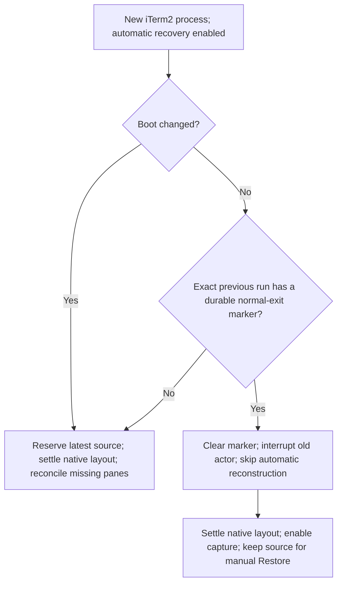
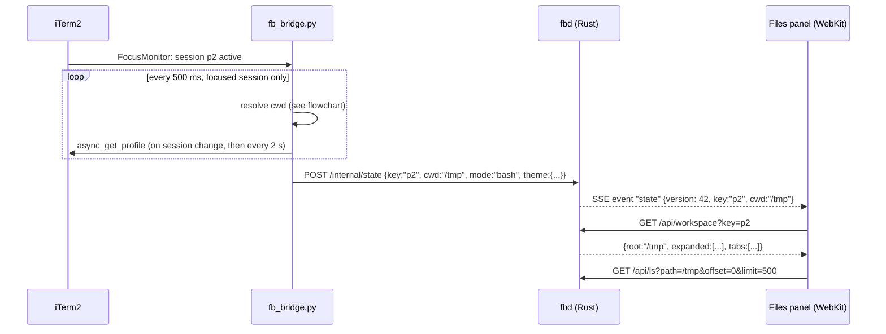
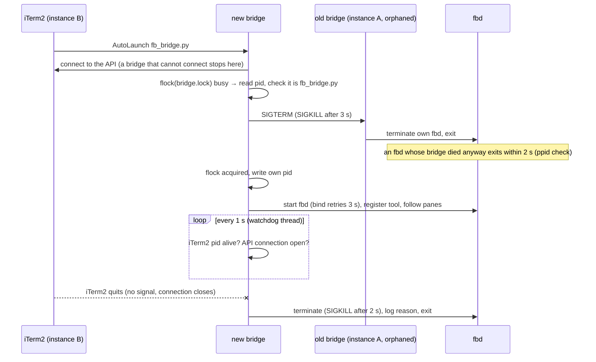
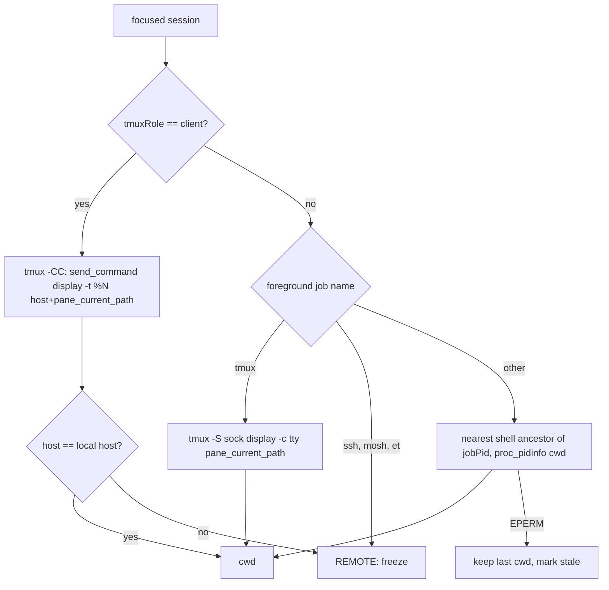
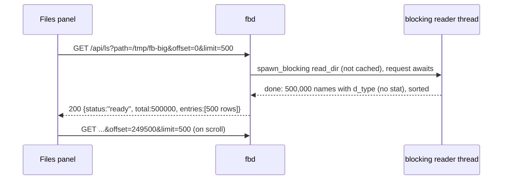
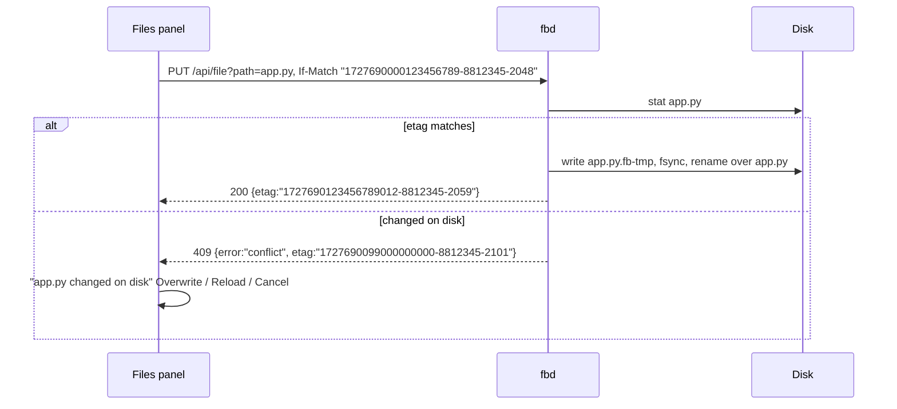

# iterm-enhancer — Specification

## 0. Metadata

| Field | Value |
|---|---|
| Version | 0.35.0 |
| Date | 2026-10-10 |
| Status | draft |
| Author | Project maintainers |

Change log:

| Version | Date | Change |
|---|---|---|
| 0.35.0 | 2026-10-10 | AC-52, from the owner: holding a key (an arrow, the space bar) was very slow, as if every key waited for the network. The owner's latency trace (2026-10-09, 893 keys): in a tmux pane on a host an arrow went to tmux as "send-keys", whose answer comes over ssh (median 135 ms a key, up to 1.4 s), and the bridge handled the next key only after it; a key repeats about 30 times a second, so the keys queued up and came out at the network's pace. The bridge now types from a queue of its own: keys that arrive while it waits for iTerm2 or tmux go together in the next batch (arrows as one "send-keys" with several names, text as one piece, in order), so a held key comes out at the rate it repeats whatever the network takes. And a hot key held down (arrows, Backspace, PgUp…) repeats as a keyboard's does |
| 0.34.4 | 2026-10-10 | AC-30, from the owner: after the isolated iTerm2 checks closed their window, no iTerm2 window had the focus, the bridge pushed nothing and fbd showed it not connected until the owner clicked a window ("it shall recover automatically"). The bridge pushed only the focused pane's state, or the last pane's while its window was open. With no terminal pane in focus it now follows the pane it followed last, while it is open, else the current pane of an open terminal window. Checked live: with no window in focus the restarted bridge was connected within 3 s; `bridge/tests/test_follow.py` 3 |
| 0.34.3 | 2026-10-10 | AC-56, from the owner: a Markdown file a coding agent's tool printed was a widget that showed it as one block of code: the agent indents its tools' output by 5 spaces, and Markdown takes text indented 4 for code. A region's text is now taken without the indentation all its lines share, an indented "## heading" counts as a heading, and a coding agent's next message or tool result (⏺, ⎿) ends a region |
| 0.34.2 | 2026-10-10 | AC-56, from the owner: a coding agent's subagent pane showed its input box's top rule ("──── @critic-rebound ─") over and over. iTerm2's own history holds 151 copies of it (Claude Code redrew the box in a narrow pane and each copy scrolled off), with blank and "-" lines between, so no run of nearly equal lines reached 20. One line repeated 5 or more times, with only blank or 1-3 character lines between, now folds to its first copy and "⋯ 64 more copies of this line": 132 of the 151 folded in that pane |
| 0.34.1 | 2026-10-10 | AC-56, from the owner: the 4,391-line file listing in the owner's ssh pane folded only about 20%. Two causes: names with "error" in them (errors.js) were taken for lines saying something failed and cut the run into 50 pieces, and a run going on across the 1000-line pages the page asks for overlapped the fold told with the newer page, so the older part was dropped, and looked unfinished at the end of its look-ahead window. Now only words outside paths count, the older part of such a run folds by itself, a run of data or nearly equal lines is whole at the end of a window that newer lines follow, and the page shows back-to-back folds of nearly equal lines as one (the bridge sends their lines together). The listing: 99% folded, 441 KB to 32 KB; all the owner's panes: 45% fewer bytes of history (5.5 MB to 3.0 MB), a coding agent's pane as before |
| 0.34.0 | 2026-10-10 | AC-56, from the owner: compact what else takes room in a history, and before it reaches the browser, to save traffic. Measured on the owner's 10 panes (about 70,000 lines, counts and shapes only): in a coding agent's history about a third of the lines were the diffs of its edits, a fifth the commands it ran (scripts of up to 131 lines), and more its tools' output, the conversation itself under a tenth; another pane held a 4,391-line file listing. The bridge now folds a history (fold.py): an edit's diff under its "⎿ Updated …" line, a command's lines after its first two, a tool's output after its first eight, rows of encoded data, and 20 or more nearly equal lines (their first three and last two stay). Opening a pane or loading older lines, a folded line is sent as null and the fold as {n, to, label}; Show asks the bridge for those lines (only a fold it told, in the pane's history). Lines that scrolled off the screen were sent with it: their folds come in a "folds" message, at most every second. The browser's own blob folding (0.33.0) went: the bridge's does it. Measured on the owner's panes, in the order the page asks (the newest 1000 lines, then older pages): 38% fewer bytes of history in all (5.4 MB to 3.4 MB), 27 to 53% in a coding agent's pane. The live screen stays as iTerm2 shows it. Pragmatic review, accepted: a cleared scrollback (/clear, ⌘K) takes the page's folds along (new lines reuse the numbers and were hidden under old folds), rows of data are counted as rows again (a long base64 line iTerm wrapped is many), "unfold" answers for any part of a fold told and otherwise says why (shown, never silent), lines read before a clear are not sent, Copy of lines not here uses the clipboard's own promise in the click where there is one and else asks to press Copy again, a line saying something failed ("error", "fail", "denied"…) is never one of many nearly equal lines, fold lists dropped with their lines and the page's open folds per pane; recorded: output streaming over 1000 lines a second between two looks folds only in part (it was sent already) |
| 0.33.0 | 2026-10-10 | AC-56, from the owner: a coding agent's tool printed a whole base64 image (a logo embedded in CSS) over dozens of rows. A run of three or more rows of encoded data (base64, base64url, hex: one unbroken run of their characters, digits and letters mixed, 40 or more) is now one line "⋯ 3.2 KB of base64 · 41 lines" with Show and Copy; its rows stay in the page (a selection across them copies them), the rows around it (the start of a data: URL, its end) stay in sight; only runs near the view are looked at, and a row a code or Markdown widget has is left to it |
| 0.32.4 | 2026-10-10 | AC-56, from the owner: images and diagrams centered in the view, Markdown full width. A Markdown widget's text was capped at 80 characters, and an image was centered in its row, which in Grid is only as wide as the row's text; now the text takes the widget's width and images are centered across the terminal's width (measured on the owner's demo: 0 px off center for the image, the pie and the flowchart, the Markdown widget as wide as the terminal, desktop and phone, Wrap and Grid) |
| 0.32.3 | 2026-10-10 | AC-56, from the owner: an image button opened "No such file or directory" (a file name in prose, taken from the pane's folder where it is not), and the message opened inside a table drawn with box lines. An image button now shows only once the file is known to be there (its folder listed with its name as the filter, so no image is read; asked again after 10 s when it was not), and rows of a drawn box or table, an agent's input box and its footer get none |
| 0.32.2 | 2026-10-10 | AC-56, from the owner's demo: files printed by cat stayed text under a Starship prompt (a colored line, then "at 12:21 ❯ "): the prompt did not start with a prompt mark, its clock changed between two prompts, and the colored line of the next prompt joined the file, and a colored line makes a region no widget. Now a prompt may be a short lead and a prompt mark (❯ ➜ ›), prompts are compared without their numbers, a printed file ends before the blank and colored lines of the next prompt, and Markdown and diagrams end at a colored line. The owner's demo replayed through the page (Chromium, desktop and phone, Wrap and Grid): all eight regions drawn in place and within the screen. Also Mermaid's dark pie slices (near black) get readable colors |
| 0.32.1 | 2026-10-10 | AC-56, from the owner: chats loaded slowly after the widgets came, an opened image moved the history, and the view jumped up while typing (Shift+Enter in a coding agent's input) and blinked on updates. Measured on a 10,000-line chat with about 200 regions (Chromium, desktop and phone sizes, against the build before AC-56): drawing every region on load added a 300 ms task and doubled a redraw of all rows (590 against 329 ms); and the view ended 663 px above the end after loading, because widgets were attached before their style sheet arrived and grew when it did. A third cause, found by the pragmatic review and confirmed by a test that fails without the fix: in a coding agent's pane the scan ran to the cursor, so the lines typed into its input box (starting with "> ", a Markdown quote) and its top rule joined a region just above the box into one Markdown document, hidden and drawn again on every key; the scan now ends at the input box. Now history regions are drawn only within two screens of the view (the rest stays text until scrolled near, the line in sight kept where it is), widgets wait for their style sheet, a diagram or an image is decoded before it is put in (it takes its size at once), the line the user acts on (an image opened under it, Raw, Markdown, ×) stays where it is on screen, a screen row drawn again gets its image buttons back at once, an image opened at the end of the output moves its line only as much as the image needs to be in sight, following the output is what the user left it as (a size change, a keyboard opening, is not a scroll away), positions are read before widgets change the page, a widget's own redraw keeps it in place, and images and diagrams are centered. After: load and redraw as before AC-56 (441 and 298 ms), the view at the end, the cursor's row still on Shift+Enter and while the agent streams, no image button missing in any frame |
| 0.32.0 | 2026-10-10 | AC-56 (new), from the owner: the web app's terminal output turns into widgets: an image file named in it gets a button that shows it in the history (at most half the terminal's width and height) and full screen with zoom; code is highlighted; Markdown is rendered with Raw / Markdown and Copy; a Mermaid diagram is drawn and opens full screen with zoom. The renderers are the panel's own (markdown-it with raw HTML off, the CodeMirror highlighter) plus Mermaid 11 (new dependency, MIT), bundled into fbd as `renderers.js` and loaded through the /fb proxy only when needed; a widget is a shadow root on its region's first row, so the rows' text, selection, copying, link underlines and the cursor's maths are untouched. Pragmatic review of the design: accepted: a shadow root on the region's first row (sibling elements would break the history's block and row counts), rows hidden by a widget kept out of the link underlines' search, a trimmed region's rows shown again, the reader's place kept when a widget above the view changes, the widget's taps kept from the terminal's tap handlers (but not from the touch that pauses updates) and a selection in a widget pausing updates, new screen regions rendered only once steady for 150 ms, image buttons only near the view, scanning only from where the history's regions are settled, output a program colored itself left alone (bat, glow, a coding agent's own rendering), diagrams without a fence only after a whole-line keyword, a guessed diagram that does not parse left as text, the renderers without the panel's token or API module, no navigation from a link in a widget, Mermaid's labels as SVG text in the page's system font, hashed chunks cached by the browser (`immutable`: a phone loads Mermaid's 3.6 MB once), Copy through the page's own copy (the copy command over plain HTTP). Pragmatic review of the code, accepted: a region printed twice gets a widget of its own (a copy of one still drawing stayed empty), a widget that failed is made again when the user presses Markdown or Diagram (a failed import is retried under another URL, as browsers keep the failure) and a failing diagram inside a document leaves only that diagram as source, the scan never goes back more than 2000 lines and streaming output is scanned at most every 100 ms, Copy's source kept on the widget (it grew with every state of a streamed document), finished regions not sliced again on every frame, rows a region no longer has shown again, widget changes wait while text is selected or a finger is down, an image whose lookup failed says so, the image alt text escaped, fbd's entry named `renderers.js` (the page has its own widgets.js), a threat-model row in SECURITY.md and unfenced diagrams drawn only on Diagram; not done: a sandboxed frame for Mermaid (recorded as a follow-up in SECURITY.md); an `npm audit` step (it needs the network; `security_check.sh` checks a running fbd); Markdown found by its look starts rendered, not in Raw, because the owner asked for rendered Markdown; the rules for it ask for a heading, a table or a fence and two kinds of signs instead |
| 0.31.0 | 2026-10-09 | AC-52, from the owner: ⌘C and ⌘V of a keyboard attached to a phone or a tablet did nothing, only the context menu worked. Measured in the iOS 26.3 Simulator (XCUITest key presses with ⌘): ⌘C copies a selection; after a long press to select, ⌘V reaches the page in no way (no key events without a focused field, also with the terminal focused), so a copy gives the keyboard field the focus back when a hardware keyboard is known. Then, from the owner on iOS 26.6.1 with the installed build: ⌘C still copied nothing; not reproduced in the Simulator (iOS 26.3 only, with and without a hardware keyboard ⌘C copies), so ⌘C with terminal text selected is now taken by the page wherever the focus is, the keyboard field also comes back when the user was typing before the selection (a lowercase typist never pressed a modifier alone), and the trace records copy and paste events to find out more. The owner's trace from an iPad with a Magic Keyboard then showed: no ⌘C key and no copy event after a trackpad selection (a touch selection's menu copy worked), and a new tmux window that got no key for 44 s (no "in" at all: the keyboard field had no focus, given only for a fine main pointer or a finger's tap); held backspace repeats looked 13 s slow (iOS gives repeats the first press's time). So a trackpad's clicks count as a computer's, a trackpad selection is held in the keyboard field, repeats are timed when they come, and the trace notes what the page takes the device for. Pragmatic review: accepted: no holding on a touch screen laptop (its Ctrl+C would send ^C), text arriving with no key drops the held selection, the screen waits while it is held; recorded: shift-click no longer extends a held selection, and an iPad with a trackpad but no keyboard raises the on-screen keyboard on a click. On the iPad the first try (focus on pointerup) failed: a click took the focus from the field and gave it back to nothing, and a selection vanished; so focus moves to mouseup and click, a selection moves only once the field has the focus, and the trace notes each trackpad mouseup and click with the focus after it. Its next trace: focus came back on every click, but every trackpad selection was empty and the owner saw the page and the keyboard bar jump: the press hid the bar, the page refitted under the pointer; so the page keeps its size during a press. That made it worse on the iPad: a selection worked once and then not at all, and the input panel slid under the footer (the press's end seemingly never reached the page, so it never fitted again). At the owner's request all trackpad handling was taken back (focus on a trackpad click, the held selection, the size kept during a press): a trackpad selection is the browser's again and is copied by a tap; ⌘C after a trackpad selection and typing after a trackpad click without a tap stay open. Then, from the owner's traces ("the other fix"): keys handled while the session list's poll ran took 2–3 times as long (median 144–361 ms against 47–128 ms; the poll itself 146–455 ms median, up to 36 s): it sent iTerm2 every request at once (9 variables a pane, an agent's whole screen), so a key queued behind them. The poll now has at most 4 requests in flight and waits while the user types (10 s at most). Measured against the owner's live iTerm2 (all windows polled back to back while typing into an own window): key to frame p50 30–36 → 10–11 ms, p90 48–68 → 34–42 ms, the poll 152 → 156 ms; waiting while typing changed little more at that load (max 140 → 63 ms in one run). The Hub moved from mirror.py to hub.py (mirror.py was at the 500-line cap). Also from the owner: a page open on the Mac and on the iPad read the screen each; on a computer a page out of focus now pauses as a hidden one does (not on a phone or tablet, where a hidden page pauses already and the page's focus is not known to be reliable). Then, from the owner ("the interface is wildly slow"): the bridge ran at 100% CPU in waves and iTerm2's requests timed out (the panel's poll, recovery checkpoints). A sampling profile (`kill -USR1` on the bridge writes profile-<time>.txt to the log folder: the main thread's busiest functions and stacks for 15 s, and the sockets it writes to) put 89% in asyncio's `_write_sendmsg` on the bridge's connections to fbd, each holding one empty part: the proxy wrote a request's head and its body with `writelines`, a GET's body is empty, and asyncio (3.12 to 3.14 at least) keeps an empty part in the buffer and writes 0 bytes for as long as the connection lasts, which for a Files panel's event stream is minutes. Since web access came (0.23.0). Writes now leave empty parts out (httpd.write_parts, also used for WebSocket frames, whose payload can be empty). Also from the owner: a coding agent's subagents in panes of its tab were six rows each titled after the tab with "pane n of 6"; the others now go under the first as children with their own titles. AC-55 (new), from the owner: typing in the web app often lags (a letter at a time, or text seconds later), and nothing tells whether the page, the connection, the bridge, iTerm2 or tmux is slow. `?trace=1` records, for 15 minutes, every key's way to its echo, every session opened, round trips and stalls, into a log on the Mac, and `scripts/trace_report.py` sums it up by stage and mode. Pragmatic review: accepted: time the bridge's sends (one lock serializes them, so a large frame to a slow phone holds up the rest), the input path (iOS holds composed text until it ends), every iTerm2 call the bridge makes and the window poll, a tmux round trip probe, an echo counted only when the cursor moved or its row changed (a spinner would fake fast echoes), the badge redrawn once a second, every page record checked by the bridge and the 15 minutes kept there; report p50, p90, max and the slowest 10, not p99; not done: a full breakdown of opening a session (three times suffice), in-page export (the file and the report do). Second pragmatic review (of the code), accepted: no hardware keyboard guessed from a viewport that did not shrink (Android resizes the layout too, so every phone would pass), no focus taken from another field after its copy, a failed trace write ends the trace and nothing else, a key joined only to a read that began after it, the first wake-up cause kept, a second page joins a running trace (10 files kept), the tmux probe every 6 s with a 2 s limit, the session's mode looked up only while tracing; recorded as a limit: a TUI redrawing its cursor row can answer a key early. Before release the investigation's own records went: the trace no longer records copy, paste, ⌘C/⌘V and the device's pointer kind, and the profile no longer reads asyncio's private socket buffers; the key, session, round-trip, stall, poll and tmux timings and the sampling profile stay for performance checks |
| 0.30.0 | 2026-10-09 | AC-52, from the owner: on a phone Claude Code's footer (folder, model, context, limits, permission mode) took a third of the screen below the input, and the input box's titled top rule wrapped over two rows of dashes. In a coding agent's pane the page now finds the input box (the nearest rules above and below the cursor, at most 12 rows away, with at most 12 rows below and no rule among them; a cursor gone for a frame keeps the box while its rules stay) and on a phone in Wrap draws it as a panel without its rules, the top one's title too (the owner: an agent's artefact; "──── Title ─" wrapped over three rows on a phone, as box drawing comes in cells, each with a text-form selector); the status lines it showed below while nothing was typed (numbers aside) wait behind an ⓘ button beside the keyboard button (remembered per browser), and anything else there (a "/" or "@" list, a new notice) stays in sight; in such a pane whole-line key hints ("(ctrl+b to run in background)") go, and a notice pushed to the right edge by spaces loses them. Computers and Grid are unchanged. Also, from the owner: a pane after a clear opened as an empty view (its prompt at the top of a 64-row screen, the view at its end): the empty rows below the last text and the cursor are left out everywhere; a new terminal (prompt in the first rows) too. On a phone the input panel is at least two rows high (owner). Pragmatic review: accepted: only learnt status lines hide (the "/" list lives there), the box kept through a frame without cursor, the titled-rule pattern narrowed to Claude Code's (progress bars matched),  right alignment only for lines reaching the edge (deep indents kept), key hints only in an agent's pane, the 12-row reach exact, hidden footers out of the underline search; not done: one rule for "a box between rules" shared with the tap's vertical moves (cursor.js). Checked in the iOS 26.3 Simulator: typing with the keyboard up and after closing it keeps the input panel in sight. Noticed: XCUITest types characters in pairs 1 ms apart and iOS drops the second of each pair; typed one at a time, every character arrives |
| 0.29.0 | 2026-10-09 | AC-52, AC-53, from the owner: (1) the password was asked again after every restart of the bridge: sign-ins lived in memory; now web-sessions.json (0600) keeps each sign-in's SHA-256 and expiry under the password's salt, at most 100, written atomically under one lock; a new password, a sign-out or `web off` (the CLI too) ends them; SameSite stays Strict (the page loads without the cookie, every signed-in request comes from it). (2) The list's profile dots read as unread messages: a bar as tall as the row's two lines, full for the shown session, half otherwise, breathing while its agent works; the header has the same bar; the iTerm2-focus ring and the layout's `focused` field went (it also sent a layout on every focus change). (3) The second line names the program, the folder, then titles; a title that is only a program's name is dropped (a tmux pane titled "ssh" now running claude showed "ssh · claude" where its twin showed "claude"); tmux's `automatic-rename` and live window name replace guessing from the name. (4) Waiting is a bright, blinking badge, and another session waiting 2.5 s gets a reminder over the terminal (side on a computer, a line under the tabs on a phone) until ×, a click that opens it, or 2.5 s after it stops waiting. (5) Addresses and paths have a faint dotted underline (CSS Custom Highlight API with static ranges, near-screen paragraphs only, one `tokens()` for underline and click); a mouse opens them with ⌘ (Ctrl elsewhere) only; a tap still opens. (6) View (renamed from File) goes back to the terminal when its last file closes, and has a Terminal button on phones. (7) Files dropped on the page upload one by one, their paths pasted; drops over Files and View do not leave the page. (8) Separators at least half of iTerm's width are drawn across the view. (9) After renaming, and when the page or a new session opens, the terminal has the keys on a computer (reverses the 0.26.0 choice to refocus the pencil, at the owner's request). (10) A tap right of the cursor stops where the typed text ends, so Claude Code's faint suggestion is not taken; a tap on the cursor's row moves the cursor before opening a path there (shell and agent panes). Also: placeKbd threw a TypeError on every redraw on a computer. Pragmatic review (plan and code): accepted: the salt binding, one lock, Strict kept, tmux's own flag, time-based reminder debounce (the bridge sends layouts only on change; a count of layouts never fired), Highlight API instead of wrapping spans, Cmd on a Mac, sequential uploads with a lasting failure message, drops refused over the panels, the CLI deleting the store, `Site` taking the store path (tests never touch the real one), binary search and static ranges for underlines; not done: see Noticed, not fixed in the delivery |
| 0.28.1 | 2026-10-09 | AC-52, from the owner: on the owner's iPhone (iOS 26.6.1) a long press in the terminal showed the loupe but no highlight, handles or Copy menu; the page had made the selection (DOM Range, Copy button shown), iOS did not show it. The Simulator (iOS 26.3) shows it, so the cause was bisected on the owner's iPhone with a temporary trace (no text) to the bridge log: selection showed with every line a block or every paragraph a block, not with the history and screen wrappers as blocks, inline or inside another block, nor with the hard line end as an empty block, a line break or nothing; so iOS 26.4+ shows no selection inside a long run of inline lines. Now each paragraph is a block of its own, in the history (before: blocks of 100 to 400 lines) and on the screen (before: none); the paragraph that goes on from the history into the screen stays loose so re-joined prose is not cut there; a hard line end is a line break (`\A`); a tap finds its screen row through the blocks. Also: a lifted finger's 400 ms timer ended the next touch's pause, so 1000 lines were redrawn under a long press. Pragmatic review: accepted: one history slice per trim, older lines of a huge soft-wrapped line become a block of their own instead of a block over 400 lines, a screen row not yet received is skipped, a second finger keeps the pause, tests of row updates; open: whether iOS shows a selection inside a 400-line block (a line iTerm wrapped hundreds of times); lower the cap if not |
| 0.28.0 | 2026-10-08 | AC-52, from the owner: [+] on a window opens the new session right below the selected one, in its folder, and shows it. The selected pane is the shown one when it is in that window, else the window's current pane. A plain window gets a tab at the next index with the pane's profile and its folder on this Mac (as the panel resolves it); a tmux window gets tmux's "new-window -a" after the pane's tmux window with "-c" its pane_current_path (also on a remote tmux host), placed as the next tab. This replaces iTerm2's "New Tmux Tab" menu item, which brought iTerm2 to the front and opened in the profile's folder. Probe in iTerm2 3.7.3: create_tab's index places the tab; a tmux window from "new-window -a -t" opened as a tab of the same window in 0.11 s; a folder named with quotes, `#(…)` and `$` reached both kinds and ran nothing. Pragmatic review: accepted: a folder name with a control character never goes on tmux's line-based command channel (no "-c", a note), no "-c" for an empty path, the note travels with "created" so the new pane's notice shows it, a tmux window that iTerm2 does not show within 5 s is named in the error (no second press making two), tmux window ids compared without "@"; rejected: iTerm2's typed directory setters (the raw keys are what the recovery code uses). Not solved: a remote ssh session's folder (the new tab opens in its profile's folder, with a note); a tmux window that iTerm2 opens as a window of its own is moved into place but shows for a moment (not seen with the owner's setting). Noticed, not fixed: iTerm2 drops a tmux -CC connection when a tmux window opens in a folder whose name holds a line break (found by scripts/e2e_web_new.py) |
| 0.27.0 | 2026-10-08 | AC-52, from the owner: the iTerm2 windows are in the way while working from the browser; "Merge windows" under the session list moves every plain tab into one iTerm2 window and each tmux -CC session's tabs into one window of their own (the owner's tmux setting opens each tmux window as a window), without raising iTerm2. Probe in iTerm2 3.7.3 on windows of its own: `Window.async_set_tabs` moves tabs between windows and closes an emptied window; a tmux tab moves into a plain window, a plain tab into a tmux window is ignored without an error; iTerm2's "Merge All Windows" is a menu item, disabled while iTerm2 is not the active app (AS-10). Choices: one window per kind, because the session list shows a window holding a tmux tab as that tmux session (its [+] opens tmux tabs); the target is the window of the shown pane, else the one with most tabs of the kind; the Files viewer (a browser profile) stays apart; the bridge marks each group's pool so the page shows the button only when a tab would move. Pragmatic review: accepted: a confirmation (no undo), one merge at a time across browsers, the button from the bridge's pools, tmux windows counted before and after in the e2e check, tabs re-read before each move (fail loud when one closed); rejected: selecting iTerm2's menu item after activating iTerm2 (it raises iTerm2 and switches Spaces on the Mac, the very disturbance asked to remove). Not solved: a closing window's Files panel loses unsaved edits (neither fbd nor the bridge knows a panel's unsaved state): the question says to save first; a hotkey window is not recognized and would be merged |
| 0.26.0 | 2026-10-07 | AC-52, from the owner: (1) a browser showed iTerm2's raw "SESSION_NOT_FOUND" over a live pane: a failed action sent the exception's text and logged nothing, and restoring the size of a resized pane that had closed stopped the next pane from opening; now the action is named in words and logged, and a closed pane's size is skipped. A phone showed "This session has closed" over a live pane: the page opened the pane it remembered (gone after an iTerm2 restart), fell back to the first one, and the error stayed; the error now names its pane and clears when another pane is shown. (2) Images pasted in the web app reach the pane: saved where the pane's shell runs (this Mac, or a host with its helper enabled) and their path pasted (owner's choice over putting them on the Mac's clipboard). Choice: the bridge writes the file, not fbd (fbd saves text only; a binary write would need fbd and every host's helper to change; the bridge already copies files over ssh for the helper's install). (3) [+] on each group of the session list opens a new tab with the window's current profile, or a new window of the tmux session. The pencil names a pane (tab, session; tmux window and pane title), as plain text: names are escaped for iTerm2's interpolation and for tmux's parser and formats (checked against tmux 3.6a, and in real iTerm2 by scripts/e2e_web_rename.py); clearing restores the user's own tmux automatic-rename. Rows of panes running Claude Code or Codex show its mark. Web addresses and file paths in the terminal open on click or tap: addresses in a new tab, paths in File, from the pane's folder and its user's home (read once per host over ssh). Pragmatic review of rename: accepted: tmux tabs are named through tmux only, non-text names and unknown panes refused, C1, separators and bidi marks refused, focus returns to the pencil; rejected: making the header title a button again (the pencil belongs beside the title text; the session list stays reachable through ☰ and the filter). An open page of another build reloads itself after an upgrade, but not over unsaved edits (the Files panel offers its busy check to the web page). Large signed-in bodies get 300 s to arrive (heads and small bodies keep 10 s). Pragmatic review: accepted: ssh off the bridge's loop with a 30 s timeout, the host prints the saved path, at most 2 uploads in memory, PNG/JPEG/GIF/WebP only with their bytes checked, [+] labelled with the profile it uses, tmux through its connection, the list updated before the page shows the new pane, one new session a second per browser. Not covered: a pane whose shell moved to another machine after it started (a second ssh, sudo, a container) gets a path on the first one. Noticed, not fixed: a second sign-in for Files and File seen on an iPhone over Tailscale; not reproduced in Chrome or WebKit over the same address. iOS Safari showed no Copy menu on a long press in Wrap: all lines formed one inline paragraph (found in Simulator by bisecting; any short paragraph shows it); a hard line end now closes its paragraph, and copying rebuilds line ends that CSS drew (copies had lost them). Also: with the keyboard up the long press tapped instead (the owner's phone): a held finger now closes the keyboard and selects a word. Wrap joined an agent's tool line to its ⎿ result and numbered code lines; such lines now start anew (checked on two live Claude Code sessions: 8 of 86 joins were wrong). A long press then a tap on the selection froze an iPhone for seconds and lost the taps that followed: iOS reads the whole block a selection lies in, and Wrap's history was one block (7.4 s at 3000 lines in Simulator); the history is now kept in blocks that end at paragraph ends, a touch screen keeps about 2000 lines while following the output, and showing Files or File clears a terminal selection (it stayed, kept the terminal paused and left Copy floating over Files); the "Paused while you select" notice covered the view tabs on a phone and took their taps. On the owner's iPhone a long press with the keyboard up still gave a haptic tick but no selection or menu: reproduced in Simulator with its on-screen keyboard (earlier runs had a hardware keyboard, so none showed): the word was selected, but the keyboard closing scrolled it away and iOS offers no menu for a selection the page made; now the word stays put and a Copy button appears. Pragmatic review: accepted: the button copies the text taken while selected, not the selected range (the terminal catching up moved the lines and the range copied nothing; reproduced), a browser check of that, "in sight" at the end of the output (no room to scroll there); rejected: selecting on iOS's touchcancel (dropped: unproven, and a slow scroll could select). Pragmatic review: accepted: no cap while older lines are on their way (it left a gap) and older lines with a gap refused, no cap behind Files or File, blocks cut at 400 lines, history placed without spreading 10000s of arguments, the last line kept loose after loading into an empty history, a browser check of the blocks (ui/test/e2e_web_term.mjs, in e2e_panel); rejected: dropping the cap after the measurement showed no touch delay (the owner asked for it; it keeps the page light) |
| 0.25.1 | 2026-10-07 | AC-33: a first install with iTerm2 running failed with "Script not found" and advice to turn on the Python API (it was on): iTerm2 lists AutoLaunch scripts when it starts, and listed the new one only later on the owner's Mac (a retry minutes later worked). The installer now asks again for 15 s, then says to restart iTerm2 |
| 0.25.0 | 2026-10-07 | From the owner: the project is renamed iterm-enhancer everywhere: the command `iterm-enhancer`, the root `~/.iterm-enhancer/` on the Mac and on hosts, the package `iterm-enhancer-macos.tar.gz`, the release signature namespace `iterm-enhancer-release`, the Toolbelt tool id, the viewer's dynamic profile, the recovery marker ("iterm-enhancer Restore …") and this spec's file name. Owner decision: a new setup with no backward compatibility, so the migrations from earlier layouts (the unversioned install, `~/.local/lib`, `~/.local/bin`, Application Support, Library/Logs; Stage 8's host helper) and the health check of builds from before fbd's socket are removed with their scenarios and tests; an install of the old name is removed with its own `uninstall` before the new setup (both use port 47821 and the AutoLaunch `fb_bridge.py`). The maintainer moved the release key to `~/.config/iterm-enhancer/release-key` and renamed the GitHub repository to `extractumio/iterm-enhancer` (GitHub redirects the old name). Kept: the earlier release notes (history). Change-log rows and evidence below name the new paths |
| 0.24.0 | 2026-10-07 | AC-52 and AC-53, from the owner: on touch screens and narrow windows the hot keys panel is hidden until asked and two floating buttons open and close the keyboard and the panel; hot keys ⇧Tab, ⇧← and ⇧↩; Shift+Enter (and Ctrl+Enter) are sent as their own key (CSI u `ESC[13;2u`), not as Enter; at 1400 px and wider Files is docked on the right like the session list, with × to close, and File is a window over the terminal; session groups collapse; fixed: Files and File wore the focused pane's colors instead of the shown pane's; Wrap/Grid/Fit is remembered per session and the last choice is the default for new session ids (they change when iTerm2 restarts or tmux -CC attaches again). Install: the PATH tip is cornflower blue (gray was unreadable). Choices: CSI u is how iTerm2 reports Shift+Enter to apps that ask for it (Claude Code, Codex, editors); a plain shell shows it as text, as in iTerm2 with that mode on |
| 0.23.0 | 2026-10-06 | AC-52 and AC-53 (P1), from the owner: work with the iTerm2 sessions and their files from a browser on another device (iPhone, iPad) on the local network or over Tailscale: every window, tab and pane, the profile's look, typing, scrollback, selection, and the Files panel with its viewer and editor, "links opening". Owner decisions: listen on every address (0.0.0.0, plain HTTP; HTTPS through `tailscale serve`), a password given in the command line now, a setting later; switched on and off from the panel's menu or the CLI. Reviews (pragmatic): accepted: the browser never holds fbd's token (the proxy adds it and passes only file work), the proxy repeats fbd's Origin check before it rewrites Host and Origin, the web panel keeps a workspace of its own (`web:`), per-address sign-in brake, sign-in as an HttpOnly cookie, fbd's CSP kept (only the panel page's framing and connections change), a hidden page pauses its stream; rejected: a web listener inside fbd (fbd stays loopback-only; one language for the web side), a second fbd access tier with per-route policy (the proxy allowlist is the boundary now), web-panel liveness by connection instead of a 15-minute window (later). Second /simplify pass: one pane-location rule for the bridge and the web (`Remotes.place`), the proxy proves fbd (`/api/hello`) before its token goes out, the CLI shows the bridge's real web status (`/health`), one clipboard helper, one at-the-Mac flag in the context menu; skipped: one screen stream per session for several browsers, fbd-owned web keys, the bridge pushing the web pane's folder, shared bridge-status helpers in fbd |
| 0.22.0 | 2026-10-06 | From the owner: (1) panel memory: iTerm2's WebKit processes holding Files panels showed 160–260 MB each; measured in Chromium against a private fbd: 3,000 state, recovery and file events and 300 open/close cycles of tabs, the dialog and the context menu leave the DOM flat (484 nodes) and the JS heap within 1.6 MB of the start (about 0.6 KB per tab cycle, CodeMirror's caches); a first count that grew was the test's own unreleased element handles; hours later the same WebKit processes held 40–90 MB without any action (reclaimable caches): no leak in the panel; the real cost is the hidden panels of earlier registrations (AC-41), counted by `status` (`panels:`). (2) Header: the mode badge moved to the second line, left of the path; the bridge's note on the pane moved to a footer. (3) Recovery dialog (AC-50): titled "Session Window Recovery" with an × button; "Automatic saving" and "Restore" are separate parts ("Save a new checkpoint now", "Restore selected"); the list hides unstable intermediates (stable ones, the newest of each run and the startup and job sources stay), groups by iTerm2 run and selects the newest checkpoint with a window, unless startup recovery is pending or a restore job is unfinished; it used fbd's `recommended`, which prefers the previous run's last stable checkpoint (crash recovery) and showed an old one. Pragmatic review: keep the crash's unstable last checkpoint and the job's, skip an empty newest one, keep seconds in labels and plurals right, no retention change at the source in this step |
| 0.21.0 | 2026-10-05 | AC-51 (P1), from the owner: how do users learn that a new version exists? The bridge asks GitHub once a day (one `HEAD` of `<releases>/latest`, the tag read from the redirect) and tells fbd when that tag is newer than the running release; panels show a small chip with a menu to copy the upgrade command, skip that version or stop checking. Implementation review: spec section order, wall-clock daily check, certificate failures logged and the system CA bundle, a lost post retried, an accessible chip. Pragmatic review: the bridge, not fbd, makes the request (fbd would need an HTTP/TLS client, CLAUDE.md §4) and the panel's CSP stays closed; the panel never installs or types the command (a click on the loopback page must not become code execution; the signature check stays in the CLI); only the tag, shown as text, reaches the panel (no URL from the network); a persistent opt-out, because the bridge's environment is iTerm2's, not the shell's; checked daily rather than every 12 h; cut: a settings toggle, a link to GitHub, a fixed key in prefs |
| 0.20.0 | 2026-10-05 | AC-36 (P0) again, from the owner: opening a window, starting `screen` or restarting iTerm2 re-read the Files panel in every window, not only the current one. Found in `fbd.log` after an upgrade: 11 of 16 panels ended with `level=Tentative holds=false` (their load guesses collided on the one key window), and an unbound panel took every state of every window, so each focus change re-rooted and re-read all of them. Fix: a panel without a binding keeps the window it first showed and says "Click here to follow this window" when another window's state arrives; a click binds it (AC-36 interaction); a bridge restart inside the same iTerm2 process (an upgrade) no longer re-registers the tool with an unchanged URL (that reloaded every panel as a new web view and dropped its binding); an iTerm2 restart still registers it, so its panels start unbound and rely on the first fix; a terminal command from a panel without a binding is refused (it may show another window's pane). Pragmatic review: rejected binding on hover or scroll (macOS delivers them to windows that are not key, the bridge would read the wrong key window and store it as sure), rejected resolving collisions by order or window size, no safe discriminator exists (AS-09). Accepted cost: after a burst, the panel of the window you switch to shows its older pane until you click in it |
| 0.19.0 | 2026-10-04 | AC-50 skips automatic reconstruction on the next same-boot launch after an observed, durably recorded normal iTerm2 exit; snapshots remain available manually, a new boot overrides the marker, and unknown/crash exits retain automatic recovery. |
| 0.18.0 | 2026-10-04 | AC-46–50 distinguish durably observed normal root exits and explicit pane/window closes from loss of iTerm2 or the machine; exact-ID retirement excludes closed panes from pinned sources and retries, Undo/restart re-enables a verified live identity, and controlled profiles close on process exit. |
| 0.17.0 | 2026-10-04 | AC-43 installation configures native restoration and supported shell profiles once; AC-44 authoritative inventory purges closed-window caches and continuously expires unused workspaces; AC-45 uses native Open Quickly. Pragmatic approved with conditions: no restart reconciliation, no purge during inventory uncertainty, live inactive panes retained, inventory never masks a silent follower. |
| 0.1.0 | 2026-09-30 | Initial draft, based on the working Python demo in `demo/` |
| 0.2.0 | 2026-09-30 | Pragmatic review + experiments: state keyed by session **and tmux pane**; AC-05 restart/scroll/GC split into AC-23 (P1); Markdown links split into AC-24 (P1); AC-02 progress row dropped (request waits); tab and pane caps removed; cache limit in MB; bridge secret for `/internal`; `Referrer-Policy`; etag = ns mtime + inode + size; SSE limit tested (14 streams OK); 500K read measured 0.8 s warm; OQ-07 (shortcuts) added |
| 0.3.0 | 2026-09-30 | Stage 1 + 2 + 3 implemented. Shortcuts that iTerm2 owns avoided (⌥N, ⌥⇧N, ⌥W instead of ⌘N, ⌘⇧N, ⌘W); rename is F2, Enter opens (AC-10, AC-15); filter applies inside shown folders (AC-16); `FB_APP_DIR` added for isolated tests; DoD updated with the actual test commands and results |
| 0.3.1 | 2026-09-30 | Prepared for open source: personal names, hosts and paths replaced by examples; the prototype in `demo/` removed (section 7 cites it as the starting point) |
| 0.4.0 | 2026-09-30 | Simplification pass: `fs-change` carries file etags and renames (`moved`); workspace events carry the writing panel (`X-FB-Client` → `by`); `/api/file` answers 304 to `If-None-Match`; listing pages carry `writable`, rows drop `m`; `insert` takes `paths` and fbd quotes them |
| 0.5.0 | 2026-10-01 | AC-25 (Toolbelt shown in new windows), AC-26 (⌘-click opens a viewer window; supersedes AC-20), AC-27 (layout defaults for new windows, own layout per open window), AC-28 (outdated panel link explained); Stage 4 |
| 0.6.0 | 2026-10-01 | AC-29: HTML documents render (sandboxed, no scripts) and links between Markdown and HTML documents open them, with `#anchor` |
| 0.7.0 | 2026-10-01 | AC-30 (P0): one bridge per iTerm2 — it exits with its iTerm2 or its API connection, a new bridge takes over from a leftover one (`bridge.lock`), a hung iTerm2 call cannot freeze the loop, and a panel nobody follows says so. Found when an iTerm2 restart left the old bridge and fbd running: the new bridge failed on the busy port, new windows got no Toolbelt and the panel showed an old directory as current. AS-08 added. Pragmatic review: lock taken only after the API connection is up, silence keyed on `bridge` (not `stale`), `make restart` exercises the takeover, Python unit tests join `make test`. Implementation review: a holder that exits during the takeover is not an error, a holder is judged again after 0.5 s, the silence event is sent under the state lock, a failing watchdog check is logged and the watch goes on; rejected: `make install` stopping a lockless bridge (no release has shipped one; the single local instance is stopped once by hand) |
| 0.8.0 | 2026-10-01 | AC-26: the viewer window opened as a terminal after an iTerm2 restart (iTerm2 3.7.3 loads dynamic profiles before its browser plugin, so "Files Viewer" was stored as a terminal profile); the bridge now checks and reloads the profile, closes a non-browser window, and every failed bridge command is shown in the panel that asked (`bridge-error`). The viewer window shows the file's full path with a copy button. AC-31 (expand and collapse all), AC-32 (file-type icons, Tabler Icons, MIT). Pragmatic review: failure message names no unverified cause, errors go only to the asking panel, expand all is cancelled by any re-root or collapse, icons vendored instead of an npm dependency; rejected: a profile "Title Components" change for the window title (iTerm2 browser windows compose their title themselves; not observable through the API). Implementation review: a window that fails its checks is never kept as the viewer; a folder dropped by a disk refresh no longer cancels expand all; expand all leaves folders the user had open; found and fixed: "Collapse all" left cached folders' children open (re-opening one showed them again) and a `/` root never restored its expanded folders |
| 0.9.0 | 2026-10-01 | Planned (Stage 7): AC-33 (one command installs or upgrades a versioned build and rolls back a build that does not come up), AC-34 (open panels and viewer windows move to the new build — at once when clean, after the save when dirty — with tree and tabs intact and no error flash for a short gap), AC-35 (rollback; older builds read newer state). Pragmatic review: cut the spare-port preflight (`fbd --version` instead), state format versioning (serde defaults suffice), tests inside install and a separate upgrade command; replaced stashing unsaved buffers in `sessionStorage` by reloading after the save; added migration from the unversioned layout, a build id covering the bridge, import-path pinning, prune only after health, no iTerm2 start, osascript permission errors, root refusal, an install lock and rollback without `previous`. Gaps found while reviewing the current upgrade: panels keep old code until reloaded, lazy chunks of an old panel may be gone, changes during the restart gap are missed, an old bridge may start a new fbd, no health check or rollback |
| 0.10.0 | 2026-10-01 | AC-36 (P0): a panel follows only the window it lives in. Found by the owner: switching to another window (with or without a Files panel) re-rooted the panel of the first window. Probes in iTerm2 3.7.3 (AS-09): a web view reports no window geometry (`screenX` 0, `outerWidth` 0), gets no focus/blur events, and neither browser sessions nor Toolbelt web views get `iterm2Invoke`; so the bridge marks the state of a window without a visible Toolbelt (`panel: false`) and panels ignore it; a panel claims the key window on load (dropped when two claims meet, as at launch) and binds for sure when the user acts in it (fbd asks the bridge for the key window after the request); the binding lives in `sessionStorage`; fbd keeps the last state per window. Pragmatic review: conflict rule instead of a 2 s load-burst rule, a pull through the bridge instead of waiting for the next push, the Toolbelt check on the bridge. Implementation review: a claim lives until the panel's last event stream closes (a late-closing old stream no longer drops it), a confirmed panel stops asking (clicks no longer delay terminal commands; `which-window` runs in its own bridge task), the per-window state cap drops the oldest window; live test: a load claim also asks the bridge (it used the last pushed state, which still named the previous window), the bridge answers from its cached Toolbelt state (re-reading the menu while a Toolbelt appears can say hidden), a claim needs an open event stream, and a window where load guesses collided stays contested until a user's action (a third guess no longer wins); accepted: a terminal command right after switching windows may be refused once (safe direction). Also observed: re-registering the tool reloads every open Files panel as new web views (input for AC-34: self-reload must use `location.reload()` to keep bindings) |
| 0.11.0 | 2026-10-01 | Stage 7 implemented (AC-33, AC-34, AC-35). The build id hashes the sources (bridge, fbd, UI sources and lockfiles), not `ui/dist`, because the UI bundle carries the id itself; the UI build writes it to `ui/.build-id` so the browser test runs its fbd as the same build; `FB_BUILD_ID` lets a test play another build. Panels reload in place with `location.reload()` (keeping token and window binding), once per build. AC-25: the menu is disabled while iTerm2 is not the active app (AS-10), so a new window stays pending and is retried while it is key, logged once; `e2e_windows.py` skips unless iTerm2 is in front. Step 0 (AS-10) was probed only as far as possible from inside a running iTerm2 session. Implementation review: the bridge says its build in its first post (a pane need not be focused), the wait is 30 s, `make` refuses root before building, the install lock lives outside what uninstall removes, the down-probe does not retry, a page still differing after its one reload says "Reload the panel to update". /simplify: one health check, one atomic link swap, one session-storage helper, the build id in one place (`build.rs` dropped: cargo tracks `option_env!`), the bridge's build sent once per fbd start; installer paths are read from the environment, not from `fbbridge.common` (an imported module kept the real paths under the test's temporary home, and a test run removed the live unversioned bridge copy, restored from the installed commit); the installer test now asserts every path it may delete is inside its temporary home |
| 0.12.0 | 2026-10-01 | Planned (Stage 8): AC-37 (browse the files of a remote host's tmux -CC pane through an fbd agent on that host, reached through ssh), AC-38 (one command makes a host ready: detects its platform, builds or takes the matching agent, installs it over ssh), AC-39 (one way to build the agent for macOS arm64/x86_64 and Linux x86_64/arm64, and a release built on the owner's own runner). The "remote file systems" non-goal is narrowed to hosts without an agent. Fable review (pragmatic agent): an explicit host on requests, workspaces and tabs instead of `//host` path prefixes (the prefix leaked into local file access: Rust collapses `//`), agents keyed by an agent id (fbd sources only), agent mode without desktop assumptions, host-name collisions refused, release hardened for a public repository, a trial tunnel at setup; kept against its advice: the release workflow and the macOS x86_64 build (owner's request). Implementation review (Fable): the agent takes no existing folder (removing it on exit could have wiped a home given by hand), a recorded host's pane always carries its host (a disconnected host must not read the same path on the Mac), a failed registration no longer leaves "connecting…" and a live ssh, hosts are registered again after fbd restarts, Trash on a macOS host uses the file manager (no Finder over ssh), an agent exits after 90 s without the Mac's event stream (sshd may not notice a dropped link), the runner keeps its toolchain and builds with 2 jobs, the relay buffer is capped, agent ids are checked before a remote shell sees them, banner lines are skipped, socket names are short; noticed, not fixed: the runner tarball is not checksum-verified, macOS hosts are not tested yet |
| 0.13.0 | 2026-10-01 | Planned (Stage 9), from the owner: a user who installs a package never runs `make` and should not need any step on the remote host. AC-38 becomes "enable a host from the panel": one click, once per host; the ssh destination comes from the command iTerm2's tmux gateway runs; the agent installs over that ssh into `~/.iterm-enhancer/bin/` and logs into `~/.iterm-enhancer/logs/` on the host (owner: easy to find). AC-40: a Mac package installed with one line, carrying fbd for both Mac architectures and the agents of all platforms, and a command `iterm-enhancer` for upgrade, rollback, uninstall and hosts. No pairing: ssh is the authentication. Fable review: exact ssh arguments from the kernel (sysctl), `-o` options by allowlist; hosts keyed by their ssh destination (the name a host reports only labels it; cloud images share names); "Not now" lasts until the bridge restarts (a permanent refusal would contradict its label; the menu enables later); four thin binaries instead of a universal one (no lipo on a fresh Mac; the Mac's fbd is the macOS agent); the installer and the command use iTerm2's Python when the Command Line Tools are missing; install.sh downloads and checks in a temp folder with stable asset names; the Mac builds and uploads the package. Implementation review (Fable): Enable cleans up only Stage 8's `agent` folder (the whole `~/.local/lib/iterm-enhancer` would have removed a Mac host's own install), the gateway cache checks the gateway session (iTerm2 reuses tmux connection ids), `host=` is percent-decoded and an unreadable host is refused (never local), Remove forgets at once and a connection finished meanwhile is dropped, one shape of `FB_RELEASE_URL`, Homebrew's python3 used when the Command Line Tools are missing, the Mac's architecture from `hw.optional.arm64` (Rosetta), `-o ""` and non-ASCII arguments handled |
| 0.14.0 | 2026-10-01 | From the owner: one root `~/.iterm-enhancer/` everywhere, on the Mac and on hosts, for the command, builds, logs and state (was `~/.local/lib`, `~/.local/bin`, `~/Library/Application Support`, `~/Library/Logs`). The host helper becomes `bin/fbd-agent`, so a Mac host's own `bin/fbd` is untouched, and Remove deletes only the helper's files. The earlier layout is moved on upgrade (the token survives; old folders stay as links while a kept build uses them). Pragmatic review (approved with conditions): fixed a state folder created before the move (by the install lock or a new fbd) skipping the move for good and leaving the token behind — the lock moved to the root, an existing folder is merged and a clash refused; the move runs under the lock and after the package check, and for rollback and uninstall too; move errors are messages; a log recreated mid-move is merged; only our own `~/.local/bin/fbd` is removed; the PATH tip comes from the installer; the command stays the newest build's after a rollback; a marker file, not source text, says a build came from the old layout. |
| 0.15.0 | 2026-10-01 | Planned (Stage 10), from the owner after a security audit (four independent reviewers: backend, remote, panel and bridge, supply chain): "Open Terminal Here" types `cd` without Enter (a half-typed line ran with it); quoting follows the pane's shell (fish broke out of POSIX quotes) and refuses names a shell cannot take safely, invisible characters and option-like names; an action confirmed after the pane switched hosts is dropped, a document saves to its own host; a tmux -CC pane with an ssh gateway is remote whatever its server calls itself; only regular files are read (a README `` grew fbd to 3 GB); saves up to the text limit; private file modes; `/internal` moves to a Unix socket and the token is renewed whenever another program may have held the port (a squatter on 47821 received the bridge secret and the token); the runner never writes to releases; releases are signed and built from the tag with locked dependencies; archive members other than files and folders are refused. Design review of the port fix (approved with changes): the server proof (`/api/hello`) is required, not optional, because the restart gap of an upgrade or a crash hands reconnecting panels' tokens to a spin-binding squatter; a handover is recognized by an fbd answering on the socket or a running bridge holding the lock (the first upgrade from a build without the socket must not renew the token, or open panels would be recreated and lose unsaved edits); the bridge registers again when fbd's token changed (a failed bind renews it); the first crash restart is immediate; fbd is the only writer of the token; a second fbd on the same app folder exits; the agent serves no `/internal`; a rollback to a build without the socket asks its health the old way. Rejected: the bridge holding the listening socket and passing it to fbd (an upgrade would still need passing it between two fbds), launchd socket activation (a LaunchAgent and a Background Items prompt for a gap of seconds), the token in the URL fragment (the squatter's page reads it). Left, documented: a panel that loads or reloads exactly while another program holds the port runs that program's page. Not verified live: whether `crypto.subtle` exists in the Toolbelt web view (the panel ships its own SHA-256, so it does not matter). Implementation review (approved with changes): a port another program held while fbd waited for it now renews the token (a crash, a squatter that lets go within fbd's 3 s wait, the user reopening the panel meanwhile); a second fbd on the same folder no longer deletes the running one's token; zsh's `=cmd` is quoted; a proof forgotten while it ran cannot mark the server proven; the latest reason decides the notice and retries back off to 2 s, and a panel that did not get a proof keeps asking (without its token) and comes back by itself; device files are refused before they are opened; the signed SHA256SUMS names its release (no older one as the latest); the trust in the first `curl \| sh` is stated in SECURITY.md; `make release` fetches main first. Left: a mosh or et gateway that reports this Mac's host name is still taken for local; an image drawn during a gap stays blank until the document is shown again |
| 0.16.0 | 2026-10-03 | AC-41 (P0), from the owner: after the upgrade to v0.15.0 a new window's Files panel stayed white; the owner keeps up to 100 windows open. Found: WebKit gives all of iTerm2's web views 6 HTTP/1.1 connections to fbd together, every panel held one with its SSE stream, and iTerm2 had kept 12 panels of tool re-registrations from 2026-10-01 running; the 7th page load failed after 71 s (`-1001`). AS-07 was wrong. A first fix (a panel hidden for 15 s lets its stream go) was measured not to scale: stacked windows report visible. Probe in iTerm2 with 100 Toolbelt windows: SSE stops at 6; 100 WebSockets stay open with requests answering in 1–3 ms; `BroadcastChannel`, Web Locks and `SharedWorker` reach every Toolbelt web view (a shared leader stream was rejected: claims, `unbind` and `bridge-error` are per panel and its stream); closing a window frees its web view, re-registering the tool does not. Panels take events over a WebSocket `/api/ws` (axum `ws`); SSE stays for the agent relay, scripts and panels of older builds. Pragmatic reviews: the Origin is checked in the handler and required (the guard checks it only on writes), a socket behind the bus is closed (the panel starts again from the current state, never silently stale), fbd raises its open-file limit (iTerm2 gives 256), sends time out after 10 s, the reconnect delay resets on the first message, the CSP names the socket. Noticed, not fixed: iTerm2 keeps web views of re-registered tools and reloads them at the next registration (12 held sockets after the upgrade; only an iTerm2 restart removes them); panels that load in a burst (100 windows in a minute, or restored at launch) collide on their window guess and, until the user clicks in them, follow the focused window instead of their own (AC-36) | AC-42 (P1), from the owner: helpers on remote hosts follow the Mac's build by themselves. The bridge already replaced an outdated helper when it connected for a focused pane; now it checks every open tmux -CC window's enabled host at its start (an upgrade restarts it) and every 30 s, and the panel says "updating the helper on <host>…", then shows a toast. Pragmatic review: two Macs of different builds on one host would copy their helpers over each other on every connect (the tunnel now runs its own build's file when the host has it), a failed copy would repeat every 30 s (now 10 minutes), a host removed during a copy came back (no longer), the sweep never costs the focused pane's update |

## 1. Overview

**Problem.** In iTerm2, reading the current directory means `ls`, `cat`, `less` or another app; trees, Markdown and code are hard to scan; IDE trees do not follow the terminal's `cd`; huge folders freeze GUI browsers.

**Who it affects.** Developers on macOS who work in iTerm2 with plain bash, local tmux, and tmux -CC, often with several panes per window. **Expected outcome.** A "Files" panel lives inside every iTerm2 window (the Toolbelt, right side). It always shows the directory of the pane that has focus. It works like the file tree of an IDE: browse, open, read with syntax highlighting, render Markdown nicely, edit and save, create, rename and delete files and folders. It stays responsive in a directory with 500,000 entries. It remembers, per pane, which folders were open, what was selected and which files were open.

**Scenario, before and after.**
- Before: Alex runs `cd ~/work/api/docs`, types `ls`, then `less ci-design.md`, reads raw Markdown with `**` and `|---|` noise, quits, `cd ../src`, `ls`, opens `vim` to fix a typo, then forgets which files they looked at when they come back to this pane an hour later.
- After: Alex runs `cd ~/work/api/docs`. Within one second the Files panel shows `docs/`. Alex clicks `ci-design.md` and reads it rendered, with real tables and highlighted code blocks. Alex switches to the source view, fixes the typo, presses ⌘S. Alex switches to another pane: the panel shows that pane's directory with its own open folders. When Alex comes back, their folders, selection and open tabs are exactly where they left them.

## 2. Scope and non-goals

In scope:
- A Toolbelt web-view tool "Files", a Rust backend `fbd` on 127.0.0.1, and a Python bridge (iTerm2 AutoLaunch) that tracks the focused pane, its cwd (plain shell, local tmux, local tmux -CC) and theme.
- Reading (tree, 500K-entry folders, highlighted text, Markdown and HTML rendered, images), editing (save, create, rename, Trash, IDE context menu and keys), per-pane memory, theme and font from the profile, a separate viewer window.
- Web access (AC-52, AC-53), off by default: the bridge serves the iTerm2 sessions and the Files panel to a signed-in browser on the network.

Out of scope (explicit):
- Remote hosts without an agent, plain `ssh` panes (no tmux -CC), sshfs: the panel shows "remote" and freezes. Remote tmux -CC panes on a host with an agent are AC-37.
- A panel on the left side: the Toolbelt is right side only; a glued native window needs Accessibility permission and breaks in fullscreen (owner accepted, 2026-09-30).
- IDE features (LSP, project search), Windows/Linux (iTerm2 is macOS only), fbd on the network (it stays on 127.0.0.1; web access, AC-52, is the bridge's separate listener), HTTPS of its own (use `tailscale serve`), more than one web password or user.

## 3. Assumptions, dependencies, open questions

Assumptions:

| ID | Assumption | Owner | Status |
|---|---|---|---|
| AS-01 | iTerm2 3.6.x with "Enable Python API" turned on (verified: 3.6.11, `EnableAPIServer = 1`). | Owner | verified |
| AS-02 | Without shell integration, iTerm2 variable `path` updates ~0.5 s after `cd` in a plain shell (measured 2026-09-30). | Claude | verified |
| AS-03 | In plain tmux, `tmux display -c <tty> -p '#{pane_current_path}'` returns the focused tmux pane's cwd (measured with tmux 3.6a). | Claude | verified |
| AS-04 | In tmux -CC, `TmuxConnection.async_send_command("display -p -t %N ...")` returns `#{host}` and `#{pane_current_path}` for pane N. | Claude | verified in demo |
| AS-05 | The Toolbelt web view is WebKit (WKWebView) and supports ES2022, `color-mix()`, `local()` fonts, EventSource, WebSocket. | Claude | verified in demo |
| AS-06 | One user, one Mac, local SSD (APFS). Reading a 500K-entry directory takes about 1 s (measured 2026-09-30: `ls -f` on 500,000 files, 1.31 s first run, 0.81 s warm). | Claude | verified |
| AS-07 | All web views of iTerm2 share one WebKit network process, which keeps at most 6 HTTP/1.1 connections to `127.0.0.1:47821`; every open SSE stream holds one, and a request beyond them waits until it times out (observed 2026-10-03: 6 connections, a page load failed with `-1001` after 71 s). WebSockets are not counted: 100 Toolbelt windows held 100 at once, requests answered in 1–3 ms. A Toolbelt web view is about 30 MB (one WebKit process each). Re-registering the tool leaves the old web views running; closing a window frees its view. Stacked windows report `visible`. The earlier measurement (2 views × 7 streams) did not hold. | Claude | verified |
| AS-09 | An iTerm2 web view cannot learn which window it is in: `window.screenX/screenY` are 0 and `outerWidth/outerHeight` 0, no `focus`/`blur` fires on window switches, `document.hasFocus()` stays false, and `iterm2Invoke` exists in neither browser sessions nor Toolbelt web views (probed 2026-10-01, iTerm2 3.7.3). Registering the tool again with another URL reloads every open Toolbelt web view of it, as new web views: `sessionStorage` does not survive that (it does survive an in-page reload). A Toolbelt web view of a window that is not on screen (iTerm2 behind other apps) does not load until it is shown. | Claude | verified |
| AS-10 | `osascript -e 'tell application "iTerm2" to launch API script named "fb_bridge.py"'` relaunches the bridge from a terminal that macOS lets control iTerm2 (verified on the owner's Mac, every `make restart`); the "Show Toolbelt" menu reports enabled while iTerm2 is frontmost and was refused (`DISABLED`) while the owner worked in other apps. Not probed, to avoid quitting the iTerm2 session the work ran in: iTerm2 not running (the installer checks `pgrep -x iTerm2` and never calls osascript then), Automation denied (mapped from AppleEvent error -1743), Python API off (any other osascript failure, reported with its text). | Claude | partly verified |
| AS-08 | When iTerm2 quits it does not signal its AutoLaunch scripts; it only closes the API connection. `it2_api_wrapper.sh` runs Python as a child, so both outlive iTerm2 (observed 2026-10-01: after a restart the old wrapper, bridge and fbd ran on with ppid 1). Inside the `iterm2` module the reader task dies on the closed connection while pending calls wait forever. | Claude | verified |

Dependencies:

| ID | Dependency | Owner | Status |
|---|---|---|---|
| DEP-01 | Rust stable 1.98 (installed 2026-09-30 via `rustup default stable`), crates: axum 0.8, tokio 1, notify 8, rust-embed 8, trash 5, serde_json 1. | Claude | available |
| DEP-02 | Python `iterm2` module 2.14 inside iTerm2's own Python runtime (`~/Library/Application Support/iTerm2/iterm2env-*`). | Owner | available |
| DEP-03 | Node 26 + npm 11 at build time only: esbuild, CodeMirror 6 (`codemirror`, `@codemirror/language-data`), `markdown-it` 14, `mermaid` 11 (AC-56, loaded only to draw a diagram). The bundle is embedded in `fbd`; no runtime network access. | Claude | available |
| DEP-04 | tmux ≥ 3.2 on PATH for tmux modes (verified 3.6a). | Owner | available |

Open questions:

| ID | Question | Owner | Status | Decision |
|---|---|---|---|---|
| OQ-01 | Where does a clicked file open: inside the panel, or in a wide iTerm2 pane? | Owner | resolved | Inside the panel: tree on top, viewer below, drag splitter, "maximize viewer" toggle. Wide iTerm2 browser pane is AC-20 (later). 2026-09-30 |
| OQ-02 | What happens to per-pane state on `cd`? | Owner | resolved | Tree state (expanded, selection, scroll) is cleared. Open file tabs stay, because they hold absolute paths and may have unsaved edits. 2026-09-30 |
| OQ-03 | What does "delete" do? | Owner | resolved | Move to macOS Trash (restorable in Finder). No permanent delete in the UI. 2026-09-30 |
| OQ-04 | Where may the panel write? | Owner | resolved | Only under `$HOME` and `/tmp` by default (`writable_roots`). Elsewhere is read-only. 2026-09-30 |
| OQ-05 | Does rendered Markdown execute raw HTML inside `.md` files? | Owner | resolved | No. Raw HTML is shown as text. A malicious README must not run script in the panel. 2026-09-30 |
| OQ-06 | Should state survive an iTerm2 restart, when session IDs may change? | Owner | open | Not tested yet (needs an iTerm2 restart). Not blocking: restart survival is AC-23 (P1). |
| OQ-07 | Which ⌘-shortcuts reach the panel and which are taken by iTerm2 menus (⌘S, ⌘W, ⌘N, ⌘F, ⌘⇧V)? ⌘W reaching iTerm2 would close the terminal session. | Owner | open | ⌘N/⌘W/⌘T are not used (⌥N, ⌥⇧N, ⌥W instead). ⌘S, ⌘⌫, ⌥⌘C are used and each also has a button or menu item; still to confirm by hand in the Toolbelt. |

## 4. Acceptance cases

| ID | Priority | Case |
|---|---|---|
| AC-01 | [MUST / P0] | The user can `cd` in the focused pane (bash, tmux, tmux -CC) and the tree re-roots at that directory within 1 s; a remote pane shows a frozen tree with a "remote" notice. |
| AC-02 | [MUST / P0] | The user can expand a folder with 500,000 entries and scroll it smoothly; first rows appear within 2.5 s and the panel never freezes. |
| AC-03 | [MUST / P0] | The user can click a text file and read it in a viewer tab with syntax highlighting chosen by file name. |
| AC-04 | [MUST / P0] | The user can open a Markdown file rendered with typography by default and switch to highlighted source with one click. |
| AC-05 | [MUST / P0] | The user gets back, per terminal pane (iTerm2 pane or tmux pane), the expanded folders, selection and open tabs after switching panes or reloading the panel; tree state clears on `cd`. |
| AC-06 | [MUST / P0] | The user can install with one command, and after an iTerm2 restart the Files tool is available with no manual steps. |
| AC-07 | [MUST / P0] | A web page or local process without the token cannot list, read or change files through the backend. With web access on (AC-52), the bridge, which holds the token, lets only a browser signed in with the web password through, and only for file work (AC-53); that password also opens the terminals (a shell as the user), so it guards the whole account. |
| AC-08 | [SHOULD / P1] | The user can edit a text file and save it with ⌘S; unsaved tabs are marked, and a save over a file changed on disk is refused with a clear choice. |
| AC-09 | [SHOULD / P1] | The user can create an empty file or a folder in the selected folder through the context menu or a shortcut, with the name typed inline. |
| AC-10 | [SHOULD / P1] | The user can rename a file or folder inline (F2 or context menu); open tabs follow the new path. |
| AC-11 | [SHOULD / P1] | The user can move files and folders to the macOS Trash after one confirmation. |
| AC-12 | [SHOULD / P1] | The user can copy absolute or relative path, reveal in Finder, open with the default app, insert the path into the terminal, and `cd` the terminal to a folder. |
| AC-13 | [SHOULD / P1] | The user sees changes made by other programs (create, delete, rename, edit) in expanded folders and open tabs within 1 s. |
| AC-14 | [SHOULD / P1] | The user sees the panel in the colors and font of the focused pane's iTerm2 profile, including light/dark variants. |
| AC-15 | [SHOULD / P1] | The user can do every tree and tab action from the keyboard with IDE-standard shortcuts. |
| AC-16 | [SHOULD / P1] | The user can filter the tree by name, including inside a 500K-entry folder. |
| AC-17 | [SHOULD / P1] | The user can preview images (png, jpg, gif, webp, svg) in a viewer tab. |
| AC-18 | [SHOULD / P1] | The user can toggle hidden (dot) files on or off; the choice is remembered. |
| AC-19 | [SHOULD / P1] | The user can select several items (⌘-click, ⇧-click) and trash them or copy their paths in one action. |
| AC-20 | [NICE TO HAVE / later] | The user can open a file in a wide iTerm2 browser pane next to the terminal. [DROPPED — superseded by AC-26 (a separate viewer window), 2026-10-01] |
| AC-21 | [NICE TO HAVE / later] | The user sees git status colors (modified, added, ignored) in the tree. |
| AC-22 | [NICE TO HAVE / later] | The user can move files between folders by drag and drop. |
| AC-23 | [SHOULD / P1] | The user gets the per-pane state back after the backend restarts, with the scroll position; idle state is cleaned up after 14 days. |
| AC-24 | [SHOULD / P1] | The user can follow links in rendered Markdown: local `.md` links open in a new tab, web links open in the default browser, the panel never navigates away. |
| AC-25 | [SHOULD / P1] | The user sees the Files panel in every new iTerm2 window without pressing ⇧⌘B; windows where the user hid it stay hidden. |
| AC-26 | [SHOULD / P1] | The user can ⌘-click a file (or ⌘↩, or "Open in Window") to read and edit it in a large separate viewer window; further files open as tabs there. |
| AC-27 | [SHOULD / P1] | The user's latest Toolbelt width and tree/viewer split become the default for new windows, while every open window keeps its own until it is closed. |
| AC-28 | [SHOULD / P1] | The user whose panel holds an outdated link sees what is wrong and how to fix it instead of an endless "connecting…". |
| AC-29 | [SHOULD / P1] | The user reads HTML files rendered (scripts never run) and follows links inside Markdown and HTML documents to other documents, including `#anchors`. |
| AC-30 | [MUST / P0] | The user finds the panel following the terminal again after iTerm2 quits, restarts or the bridge is relaunched, with no manual cleanup; a panel that nothing follows says so instead of showing an old directory as current. |
| AC-31 | [SHOULD / P1] | The user can expand every folder below the root or a chosen folder in one action, bounded so large trees stay responsive, and collapse them all again. |
| AC-32 | [SHOULD / P1] | The user recognizes a file's type by its icon in the tree and the tabs. |
| AC-33 | [SHOULD / P1] | The user installs or upgrades with one command; the new build is checked before it goes live, takes over the running one within seconds, and a failing build leaves the old one running. |
| AC-34 | [SHOULD / P1] | The user keeps working through an upgrade: open panels and viewer windows switch to the new build by themselves, keeping unsaved edits, tree and tabs, and a short restart gap shows no error. |
| AC-35 | [SHOULD / P1] | The user can go back to the previous build with one command, and state files written by either build stay readable by both. |
| AC-36 | [MUST / P0] | The user sees in each window's Files panel only that window's panes: focusing another window, with or without a Files panel, never changes it. |
| AC-37 | [SHOULD / P1] | The user browses, reads, edits, creates, renames and trashes the files of a remote tmux -CC pane (a host reached with ssh) as if they were local, with live refresh, once that host has an agent. |
| AC-38 | [SHOULD / P1] | The user enables a remote host's files with one click in the panel the first time a tmux -CC pane of that host is focused; nothing is installed on a host without that click, and nothing has to be done on the host itself. |
| AC-40 | [SHOULD / P1] | The user installs, upgrades, rolls back and uninstalls iterm-enhancer with one line or one command each, from a package that needs no build tools, and manages enabled hosts with the same command. |
| AC-39 | [SHOULD / P1] | The maintainer builds the agent for macOS arm64 and x86_64 and Linux x86_64 and arm64 (Ubuntu, Debian) the same way on the Mac and on the owner's runner, and publishes them as a release built on that runner. |
| AC-41 | [MUST / P0] | The user keeps up to 100 iTerm2 windows open at once, each with a Files panel that loads and follows its window. |
| AC-42 | [SHOULD / P1] | The user never updates a remote host by hand: after the Mac's iterm-enhancer is upgraded, the helper on every host with an open window follows by itself, and the panel says so. |
| AC-43 | [SHOULD / P1] | Installation enables native restoration and automatic integration for supported shell profiles; the user sees an informational message only for settings actually changed. |
| AC-44 | [SHOULD / P1] | Closed-window metadata disappears after 60 seconds of confirmed absence; inactive live panes retain Files state, and unused workspaces expire continuously after the configured TTL. |
| AC-45 | [SHOULD / P1] | The user opens iTerm2's searchable Open Quickly popup with ⌘⇧O or the Files button and focuses the selected live session. |
| AC-46 | [SHOULD / P1] | Automatic checkpoints and startup restoration are enabled by default, preserve an explicit opt-out, and store native topology/directories/connections including inactive panes without output, history or arbitrary job commands. |
| AC-47 | [SHOULD / P1] | Each new iTerm2 process restores the latest durable state before capture, recreates missing native terminals with saved directories/geometry, adopts identified live sessions, and preserves busy, changed or uncertain sessions with a report. |
| AC-48 | [SHOULD / P1] | Restore reconnects supported SSH destinations using current authentication; known remote directories use a generated bootstrap, and unsupported connection recipes are reported without replaying commands. |
| AC-49 | [SHOULD / P1] | Restore attaches surviving tmux sessions or recreates recorded local tmux topology with shells only on a private server; remote/control-mode limitations are reported per connection. |
| AC-50 | [SHOULD / P1] | All panels show one recovery job, its checkpoint history, progress and per-pane deviations; retries reconcile creation markers and do not duplicate successful terminals. |
| AC-51 | [SHOULD / P1] | The user learns from the panel that a newer release exists and can copy the command that installs it, skip that release, or stop the check. |
| AC-52 | [SHOULD / P1] | With web access switched on, a browser on another device signs in with a password and sees every iTerm2 window, tab and pane by title and host, the shown pane's screen in its profile's colors, with typing, hot keys, scrollback, selection and copy; lines re-flow to a phone's width or keep iTerm2's grid. |
| AC-53 | [SHOULD / P1] | In the web app the shown pane's files open in the Files panel, and files in its viewer and editor, as views that replace the terminal; links in documents open in the reader's browser; nothing of the Mac itself (Finder, apps, typing into a terminal, switching web access) is reachable from it. |
| AC-54 | [SHOULD / P1] | When iTerm2 drops a tmux -CC integration while tmux keeps streaming to the gateway session, the raw tmux protocol stops within seconds, tmux and its windows keep running on their host, and the user is told and can reattach with one action, on the Mac and in the web app. |
| AC-55 | [SHOULD / P1] | With `?trace=1` the web app and the bridge record, for 15 minutes, how long each key takes from the press to its echo on the page, each stage on the way, and how long a session takes to open, labelled by key kind and the session's mode (shell or tmux, local or remote), into a log on the Mac that a script sums up. |
| AC-56 | [SHOULD / P1] | In the web app's terminal, code in the output is highlighted, Markdown is rendered (Raw / Markdown, Copy), a Mermaid diagram is drawn and an image file named in the output can be shown in the history, the diagram and the image full screen with pinch and wheel zoom; the terminal's text, selection and copying stay as they were. |

## 5. BDD scenarios

### AC-01 — Tree follows the focused pane's directory [MUST / P0]

```gherkin
Scenario Outline: AC-01 happy path — cd re-roots the tree
  Given the Files panel is visible in window "w1"
  And pane "p1" runs "<mode>" and has focus
  When the user runs "cd /Users/alex/work/api" in "p1"
  Then within 1 s the panel header shows mode badge "<badge>" and path "~/work/api"
  And the header's first line holds the status dot, the pane's title and the buttons; the second line starts with the mode badge, left of the path
  And the bridge's note on the pane (such as "pid 23776, running 2.1.289") shows in the panel's footer; notes that need the user (cwd unavailable, an update waiting, "Click here to follow this window") stay in the header
  And the tree root lists the entries of "/Users/alex/work/api"

  Examples:
    | mode          | badge    |
    | bash          | BASH     |
    | tmux (plain)  | TMUX     |
    | tmux -CC      | TMUX -CC |

Scenario: AC-01 happy path — focus moves between split panes
  Given pane "p1" is in "/Users/alex/work/api" and pane "p2" is in "/tmp"
  When the user clicks into "p2"
  Then within 1 s the tree root is "/tmp"

Scenario: AC-01 edge — foreground program in a subdirectory
  Given pane "p1" shell cwd is "/Users/alex/work/api" and "vim" runs there after ":cd src"
  Then the tree root stays "/Users/alex/work/api" (the shell's cwd, not the job's)

Scenario: AC-01 failure — remote session
  Given the focused pane runs "ssh devbox" or a tmux -CC session whose host is "devbox.example"
  Then the badge shows "REMOTE", the footer shows "remote host devbox.example"
  And the tree keeps the last local root, marked "cwd unavailable — showing last known"
```

### AC-02 — Very large folders stay responsive [MUST / P0]

```gherkin
Scenario: AC-02 happy path — 500K folder
  Given "/tmp/fb-big" holds 500,000 files named "f000000.txt".."f499999.txt"
  When the user expands "fb-big"
  Then the folder shows a spinner row while the backend reads, and other folders stay usable
  And within 2.5 s (warm disk cache) the first rows "f000000.txt".. are visible, sorted naturally
  And the scrollbar reflects 500,000 rows
  And the tree never renders more than 300 DOM rows at once

Scenario: AC-02 edge — scrolling to the end
  Given "fb-big" is expanded and loaded
  When the user drags the scrollbar to the bottom
  Then within 300 ms rows "f499700.txt".."f499999.txt" are visible
  And typing "j"/"k" still moves the selection without delay

Scenario: AC-02 failure — permission denied
  Given "/private/var/root" is not readable by the user
  When the user expands it
  Then the folder shows one row "⚠ Permission denied (os error 13)"
  And the rest of the tree remains usable

Scenario: Invalidation while a folder scan is running
  Given a listing scan has started and two callers are waiting for it
  When the folder changes before the scan publishes
  Then one scanner rereads the folder and both callers receive the fresh listing
  And completed empty and failed listings count toward the cache memory budget

Scenario: Unreadable filenames do not alias another file
  Given a folder contains a byte-invalid UTF-8 name and a valid replacement-character name
  When the panel lists the folder
  Then it reports the unreadable name explicitly without presenting an actionable alias
```

### AC-03 — Read a file with syntax highlighting [MUST / P0]

```gherkin
Scenario Outline: AC-03 happy path — highlighting by name
  When the user clicks "<file>"
  Then a viewer tab "<file>" opens read-only with "<language>" highlighting and line numbers

  Examples:
    | file          | language   |
    | server.rs     | Rust       |
    | app.py        | Python     |
    | Dockerfile    | Dockerfile |
    | config.yaml   | YAML       |
    | notes.txt     | Plain text |

Scenario: AC-03 edge — binary file
  When the user clicks "logo.ico"
  Then the tab shows "Binary file (image/vnd.microsoft.icon), 15 K" and a button "Open with default app"

Scenario: AC-03 edge — huge file
  Given "access.log" is 48.2 MB
  When the user clicks it
  Then the tab shows the first 1 MB as plain text with the banner "48.2 MB — showing first 1 MB, editing disabled"

Scenario: AC-03 error — file deleted before open
  Given "old.txt" was deleted by another program
  When the user clicks it
  Then the tab shows "⚠ No such file or directory (os error 2)" and no other tab changes

Scenario: AC-03 security — only regular files are read
  Given a document links "/dev/zero", or the user opens a FIFO or a device
  Then /api/file and /api/raw answer 400 "Not a regular file" at once, without reading or waiting
```

### AC-04 — Markdown rendered and source views [MUST / P0]

```gherkin
Scenario: AC-04 happy path — rendered by default
  When the user clicks "README.md"
  Then the tab opens in "Rendered" mode with proportional body text, headings, tables, task lists
  And fenced ```rust blocks are syntax highlighted
  And relative images like "" are displayed

Scenario: AC-04 happy path — toggle to source
  Given "README.md" is open rendered
  When the user clicks "Source"
  Then the tab shows the Markdown source with Markdown highlighting
  And the choice is remembered for this tab

Scenario: AC-04 edge — raw HTML is inert
  Given "evil.md" contains ""
  When the user opens it rendered
  Then the HTML appears as literal text and no script runs (OQ-05)
```

### AC-05 — Per-pane memory [MUST / P0]

```gherkin
Scenario: AC-05 happy path — switching panes restores state
  Given in pane "p1" (root "~/work/api") folders "src" and "src/db" are expanded, "src/db/pool.rs" is selected
  And tabs "README.md" and "pool.rs" are open, "pool.rs" active
  When focus moves to pane "p2" and back to "p1"
  Then "src" and "src/db" are expanded, "pool.rs" is selected and scrolled into view
  And tabs "README.md" and "pool.rs" are open with "pool.rs" active

Scenario: AC-05 happy path — survives a panel reload
  Given the state above
  When the user closes and reopens the Files tool (View → Toolbelt → Files)
  Then the same state is shown for "p1"

Scenario: AC-05 edge — tmux panes inside one iTerm2 pane
  Given pane "p1" runs plain tmux with tmux panes "%3" in "~/work/api" and "%4" in "/tmp"
  And in "%3" folder "src" is expanded
  When the user switches tmux panes "%3" → "%4" → "%3"
  Then "src" is expanded again (state is keyed by "tmux:default:%3", not by "p1")

Scenario: AC-05 edge — cd clears tree state, keeps tabs
  Given the state above
  When the user runs "cd ~/work/web" in "p1"
  Then the tree shows "~/work/web" with no folder expanded and nothing selected
  And tabs "README.md" and "pool.rs" are still open (OQ-02)

Scenario: AC-05 edge — expanded folder was deleted
  Given "src/db" is remembered as expanded but was deleted
  When the state is restored
  Then "src/db" is silently dropped from the expanded set

Scenario: AC-05 edge — a superseded workspace restoration finishes late
  Given one pane's workspace restoration waits for a directory listing
  When the panel switches panes and the earlier listing completes
  Then the earlier tabs never replace or persist into the current pane's workspace

Scenario: Workspace replies for the same pane arrive out of order
  Given a workspace read for a pane is pending
  When a newer read or accepted write has restored that pane's current workspace
  Then the older reply cannot replace its root or tabs
  And a backend restart with reset revisions is still accepted
```

### AC-06 — One-command install and autostart [MUST / P0]

```gherkin
Scenario: AC-06 happy path — install
  Given the repo is at "~/src/iterm-enhancer"
  When the user runs "make install"
  Then "fbd" is copied to "~/.iterm-enhancer/bin/fbd"
  And "fb_bridge.py" is copied to "~/Library/Application Support/iTerm2/Scripts/AutoLaunch/"
  And the command prints "Installed. Restart iTerm2 or run Scripts → AutoLaunch → fb_bridge.py"

Scenario: AC-06 happy path — autostart
  Given the install above
  When iTerm2 starts
  Then within 5 s "View → Toolbelt → Files" exists and the panel shows the focused pane's directory

Scenario: AC-06 failure — port busy
  Given another program listens on 127.0.0.1:47821
  When the bridge starts "fbd"
  Then "fbd" exits with "error: port 47821 in use (set FB_PORT)" in "~/.iterm-enhancer/logs/fbd.log"
```

### AC-07 — Only the panel can use the backend [MUST / P0]

```gherkin
Scenario Outline: AC-07 error — requests without a valid token or host are refused
  When a client sends "<request>"
  Then the response is "<status>" with body {"error": "<code>"}
  And no file is read or changed

  Examples:
    | request                                                           | status | code          |
    | GET /api/ls?path=/Users/alex (no token)                           | 401    | bad_token     |
    | GET /api/ls?path=/Users/alex, Host: evil.example:47821            | 403    | bad_host      |
    | POST /api/fs/mkdir with token, Origin: http://evil.example        | 403    | bad_origin    |
    | POST /api/fs/mkdir with token, Content-Type: text/plain           | 415    | bad_content_type |

Scenario: AC-07 happy path — the Files tool works
  Given the tool URL "http://127.0.0.1:47821/?t=<token>"
  When the panel loads
  Then GET /api/state returns 200

Scenario: AC-07 security — the bridge never talks to another program on the port
  Given another program, possibly another user's, holds 127.0.0.1:47821
  Then fbd exits with "port 47821 is in use by another program" and the bridge says so in bridge.log
  And the bridge talks to fbd only through the Unix socket "~/.iterm-enhancer/state/fbd.sock" (in a 0700 folder): it never sends the bridge secret over TCP and takes terminal commands only from that socket; "/internal/*" over TCP answers 404
  And the installer checks health through that socket, never with the token over TCP

Scenario: AC-07 security — a token that may have leaked is replaced
  Given the panel may have sent the token to another program on the port (fbd was not running while a panel loaded, or fbd could not bind its port)
  Then the next fbd that starts creates a new token and the bridge registers the new link (panels reload as after an iTerm2 restart)
  But a handover between two fbds of this install (an upgrade, a bridge restart while fbd ran, verified through the socket) keeps the token, so open panels keep unsaved edits (AC-34)

Scenario: AC-07 security — private files
  Then "~/.iterm-enhancer" is mode 0700 and everything fbd, the bridge and the installer create in it is 0600 (files) or 0700 (folders); an existing install is tightened on the next install

Scenario: AC-07 security — ticket expiry never authenticates a different code
  Given an unused viewer code has expired and another code is still valid
  When an unauthenticated client redeems an unknown, empty or expired code
  Then the response is 401 and contains no token
  And the other valid code still works exactly once
```

### AC-08 — Edit and save [SHOULD / P1]

```gherkin
Scenario: AC-08 happy path — save
  Given "app.py" is open in a tab
  When the user types "import os" at line 1 and presses ⌘S
  Then the tab title loses its "●" dirty marker
  And "app.py" on disk contains "import os" at line 1 and keeps its permissions

Scenario: AC-08 error — changed on disk since opened
  Given "app.py" was opened with etag "1727690000123456789-8812345-2048" and then changed by vim
  When the user presses ⌘S
  Then the save is refused with "app.py changed on disk" and buttons "Overwrite", "Reload (discard mine)", "Cancel"
  And the file on disk is unchanged until the user picks "Overwrite"

Scenario: AC-08 error — outside writable roots
  Given "/etc/hosts" is open
  Then the tab is read-only with banner "Read-only: outside writable folders"

Scenario: AC-08 edge — close a dirty tab
  Given "app.py" has unsaved changes
  When the user closes the tab (⌘W)
  Then a prompt asks "Save changes to app.py?" with "Save", "Don't save", "Cancel"

Scenario: AC-08 edge — a large text file
  Given a 9 MB text file (below the 10 MB text limit) opened for editing
  When the user saves it
  Then the save succeeds; a request body larger than the limit allows for (6 × the text limit, JSON escaping) answers 413 as JSON

Scenario: AC-08 edge — competing saves
  Given two panels hold the same file etag, including through symlink aliases
  When they save different contents concurrently
  Then exactly one conditional save succeeds and the other reports a conflict
  And the successful response etag describes the saved content

Scenario: AC-08 edge — closing while typing during a save
  Given the user chooses Save when closing a dirty tab
  When they type more text before the save finishes
  Then the tab stays open and the later text stays unsaved

Scenario: AC-08 edge — a conflict dialog survives a host switch
  Given a save conflict belongs to a file on one host
  When the panel switches hosts before the user chooses Reload
  Then only the original document is discarded; the shown host's edits stay intact

Scenario: AC-08 edge — maximum-length filenames
  Given a writable text file has a valid 255-byte basename
  When the user saves it
  Then its content and metadata are saved and no temporary file remains

Scenario: Editing a CRLF file preserves its separators
  Given an editable file uses CRLF line endings
  When the user edits and saves it
  Then the saved content and byte-size metadata retain CRLF separators

Scenario: Save races a rename or Trash operation
  Given a Save request and a file mutation overlap in the backend
  Then the mutation and save serialize without recreating a renamed or trashed path

Scenario: A document is renamed while Save is pending
  Given a Save of the old path is pending when the document is renamed
  When that Save conflicts and the user chooses Overwrite
  Then the retry targets the document's current path
  And a stale old-path reply cannot mark the renamed document clean with the wrong etag
```

### AC-09 — Create file or folder [SHOULD / P1]

```gherkin
Scenario: AC-09 happy path — new file
  Given folder "src" is selected
  When the user presses ⌥N (or the header button, or context menu "New File…") and types "util.rs" then Enter
  Then "src/util.rs" exists with size 0, is selected, and opens in a tab

Scenario: AC-09 happy path — new folder
  When the user presses ⌥⇧N in "src" and types "db/migrations" then Enter
  Then "src/db/migrations" exists (intermediate folders created) and is expanded

Scenario Outline: AC-09 error — invalid name
  When the user types "<name>" for a new file in "src"
  Then the inline field shows "<message>" in red and nothing is created

  Examples:
    | name      | message                                   |
    | util.rs   | "util.rs" already exists in src            |
    | (empty)   | A name is required                         |
    | ..        | ".." is not a valid name                   |

Scenario: AC-09 error — no permission
  Given "/usr/local" is outside writable roots
  Then "New File…" and "New Folder…" are disabled in its context menu
```

### AC-10 — Rename [SHOULD / P1]

```gherkin
Scenario: AC-10 happy path — rename a file with an open tab
  Given "notes.md" is selected and open in a tab
  When the user presses F2 (or context menu "Rename…"), types "ideas", presses Enter (the extension stays preselected-out)
  Then "ideas.md" exists, "notes.md" does not, and the tab is titled "ideas.md"

Scenario: AC-10 edge — Esc cancels
  When the user presses F2, types "x", presses Esc
  Then nothing is renamed

Scenario: AC-10 error — target exists
  Given "ideas.md" already exists
  When the user renames "notes.md" to "ideas.md"
  Then the field shows ""ideas.md" already exists" and both files are unchanged

Scenario: AC-10 edge — another writer creates the target during rename
  Given the destination did not exist when rename began
  When another writer creates it before the rename takes effect
  Then rename reports an existing destination and preserves both files

Scenario: AC-10 edge — saving after rename
  Given an edited tab follows a file or ancestor folder rename
  When the user presses ⌘S in the editor
  Then the renamed path is saved and the old path is not recreated
```

### AC-11 — Move to Trash [SHOULD / P1]

```gherkin
Scenario: AC-11 happy path — trash a folder
  When the user selects "build" and presses ⌘⌫
  Then a dialog asks "Move "build" to Trash?" with "Move to Trash" and "Cancel"
  When the user confirms
  Then "build" is in "~/.Trash" and gone from the tree; open tabs under it close

Scenario: AC-11 error — file is gone already
  Given "build" was deleted by another program
  When the user confirms trashing it
  Then a toast shows "build: No such file or directory" and the tree refreshes

Scenario: AC-11 edge — dirty tab inside
  Given "build/out.txt" has unsaved edits in a tab
  Then the dialog adds "1 unsaved file will be lost" before confirming

Scenario: AC-11 failure — a Trash request fails before per-file results
  Given selected files include unsaved tabs
  When Trash fails with a network or request-level error
  Then the error is shown and every tab and unsaved edit remains
  And only files explicitly reported as trashed may have their tabs closed
```

### AC-12 — Standard utility actions [SHOULD / P1]

```gherkin
Scenario Outline: AC-12 happy path — context menu actions
  Given the tree root is "/Users/alex/work/api" and "src/db/pool.rs" is selected
  When the user picks "<action>"
  Then "<result>"

  Examples:
    | action                  | result                                                       |
    | Copy Path (⌥⌘C)         | the clipboard holds "/Users/alex/work/api/src/db/pool.rs"    |
    | Copy Relative Path      | the clipboard holds "src/db/pool.rs"                         |
    | Reveal in Finder        | Finder opens "src/db" with "pool.rs" selected                |
    | Open with Default App   | macOS opens the file with its default app                    |
    | Insert Path in Terminal | the focused pane receives the text "src/db/pool.rs " (no Enter) |
    | Open Terminal Here      | the focused pane receives "cd /Users/alex/work/api/src/db" (no Enter: the user presses Return) |

Scenario: AC-12 error — pane runs a full-screen program
  Given the focused pane runs "vim"
  When the user picks "Open Terminal Here"
  Then a toast shows "Terminal is busy (vim) — command not sent" and nothing is typed

Scenario: AC-12 security — nothing runs without the user's Return
  Given the command line already holds "rm -rf " (or a recalled history line)
  When the user picks "Open Terminal Here" or "Insert Path in Terminal"
  Then the text is added to the line and nothing runs; fbd never sends Enter, and the bridge refuses to type any control character

Scenario Outline: AC-12 security — quoting follows the pane's shell
  Given the pane's shell is "<shell>" and the name is "<name>"
  When the user picks "Insert Path in Terminal"
  Then "<typed>" is typed, or the toast "<refused>" shows and nothing is typed

  Examples:
    | shell              | name          | typed                 | refused |
    | zsh, bash, sh, dash, ksh | it's a\b | 'it'\''s a\b'     |         |
    | fish               | it's a\b     | 'it\'s a\\b'       |         |
    | tcsh, csh, nu, xonsh, unknown | my file | 'my file'      |         |
    | tcsh, csh, nu, xonsh, unknown | it's    |               | Name cannot be typed safely into tcsh |
    | any                | -rf           | ./-rf                 |         |
    | any                | a‮b (U+202E)  |                       | Name contains control or invisible characters — not sent to the terminal |

Scenario: AC-12 security — queued text is checked at delivery
  Given terminal text was requested for a pane and shell
  When that pane or shell changes before the bridge types it, or a cd target becomes busy
  Then no text is typed and the asking panel receives the reason
  And enabled remote idle shells still accept explicit terminal actions
```

### AC-13 — Live refresh from disk [SHOULD / P1]

```gherkin
Scenario: AC-13 happy path — new file appears
  Given folder "src" is expanded
  When another program runs "touch src/new.rs"
  Then within 1 s "new.rs" appears in "src" in sorted position

Scenario: AC-13 happy path — open clean tab reloads
  Given "app.py" is open with no unsaved edits
  When another program changes "app.py"
  Then within 1 s the tab shows the new content and keeps its scroll position

Scenario: AC-13 edge — open dirty tab
  Given "app.py" has unsaved edits
  When another program changes "app.py"
  Then the tab shows the banner "Changed on disk" with "Reload" and "Keep mine"

Scenario: AC-13 edge — burst of changes
  When "npm install" writes 40,000 files into expanded "node_modules"
  Then the tree updates at most twice per second and the panel stays responsive

Scenario: A lagged remote event stream reconciles state
  Given an agent event subscriber falls behind its broadcast buffer
  When its stream reconnects
  Then a host-scoped rescan refreshes the visible folders and checks open-file etags
  And dirty buffers remain intact, including a file whose rename notification was missed
  And Unicode paths remain exact across every HTTP frame boundary

Scenario: An older listing response arrives last
  Given a folder refresh replaced an earlier request lifecycle
  When the earlier page response arrives after the fresh response
  Then it cannot replace the fresh rows
  And a current error response or reset generation after restart remains visible
```

### AC-14 — Theme and font from the iTerm2 profile [SHOULD / P1]

```gherkin
Scenario: AC-14 happy path — profile colors and font
  Given the focused pane's profile has background "#311d30", foreground "#dcdcdc", font "JetBrainsMonoNFM-Regular 14"
  Then the panel background is "#311d30", text is "#dcdcdc", and tree text uses JetBrains Mono

Scenario: AC-14 edge — profile changes live
  When the user edits the profile background to "#101418"
  Then within 2 s the panel background is "#101418"

Scenario: AC-14 edge — font not installed for WebKit
  Given the profile font is "SomeMissingFont 13"
  Then the panel falls back to "SF Mono" at size 13 without broken layout
```

### AC-15 — Keyboard operation [SHOULD / P1]

```gherkin
Scenario Outline: AC-15 happy path — shortcuts in the tree
  Given the tree has focus and "src" is selected
  When the user presses "<key>"
  Then "<result>"

  Examples:
    | key      | result                                   |
    | ↓ / ↑    | selection moves one row                  |
    | → / ←    | folder expands / collapses (or goes to parent) |
    | Enter    | file opens; on a folder: expand/collapse |
    | F2       | rename (AC-10)                           |
    | ⌥N, ⌥⇧N  | new file, new folder (AC-09)             |
    | ⌘⌫       | move to Trash (AC-11)                    |
    | /        | focus the filter field                   |
    | ⌥W, ⌃Tab | close tab, next tab                      |

Scenario: AC-15 edge — shortcuts do not leak to the terminal
  Given the ⌘ shortcuts chosen after the probe (OQ-07)
  When the user presses any of them in the panel
  Then iTerm2 does not open a window, tab, split, or close a session

Scenario: Keyboard navigation targets an unloaded page
  Given only the first page of a large folder has loaded
  When the user presses End or PageDown and then Delete
  Then selection follows the loaded target row and cannot delete the previous row
```

### AC-16 — Filter by name [SHOULD / P1]

```gherkin
Scenario: AC-16 happy path — filter loaded tree
  When the user types "pool" in the filter field
  Then every shown folder lists only entries whose names contain "pool", expanded folders stay visible, the match is highlighted

Scenario: AC-16 happy path — filter inside a 500K folder
  Given "fb-big" (500,000 entries) is expanded
  When the user types "f49999"
  Then within 500 ms "fb-big" shows 10 rows "f499990.txt".."f499999.txt" and "10 of 500,000"

Scenario: AC-16 edge — no match
  When the user types "zzz"
  Then the tree shows "No items match "zzz"" and Esc clears the filter
```

### AC-17 — Image preview [SHOULD / P1]

```gherkin
Scenario: AC-17 happy path — png
  When the user clicks "docs/arch.png" (1920×1080, 240 K)
  Then a tab shows the image fitted to the viewer with "1920 × 1080 · 240 K"

Scenario: AC-17 edge — svg is inert
  Given "icon.svg" contains a <script> element
  When the user opens it
  Then it is shown as an  and the script does not run
```

### AC-18 — Hidden files toggle [SHOULD / P1]

```gherkin
Scenario: AC-18 happy path — hide dotfiles
  Given hidden files are shown (default) and ".git" is visible
  When the user clicks the "eye" button (or ⌘⇧.)
  Then ".git" and ".env" disappear and the choice persists after a panel reload

Scenario: AC-18 edge — selected item becomes hidden
  Given ".env" is selected
  When hidden files are turned off
  Then the selection moves to the parent folder
```

### AC-19 — Multi-select [SHOULD / P1]

```gherkin
Scenario: AC-19 happy path — trash two files
  When the user clicks "a.log", ⌘-clicks "c.log", presses ⌘⌫ and confirms "Move 2 items to Trash?"
  Then both files are in the Trash

Scenario: AC-19 edge — range select
  When the user clicks "a.log" and ⇧-clicks "e.log"
  Then 5 rows are selected and "Copy Path" copies 5 lines

Scenario: AC-19 edge — selection is remembered
  Given 3 items are selected in pane "p1"
  When focus moves to "p2" and back
  Then the same 3 items are selected (AC-05)

Scenario: Selecting a range across unloaded pages
  Given a range spans several listing pages
  When the user selects it
  Then pages load in bounded batches and the complete range becomes selected
  And a pane or root switch cancels the selection without leaving a partial destructive target
```

### AC-21 — Git status colors [NICE TO HAVE / later]

```gherkin
Scenario: AC-21 happy path — modified file
  Given "src/app.rs" is modified in git
  Then its name is shown in the "modified" color with "M" at the right

Scenario: AC-21 edge — not a git repo
  Given the root is "/tmp"
  Then no git colors are shown and no git process runs more than once per 5 s
```

### AC-22 — Drag and drop move [NICE TO HAVE / later]

```gherkin
Scenario: AC-22 happy path — move a file
  When the user drags "notes.md" onto folder "docs"
  Then "docs/notes.md" exists and "notes.md" does not

Scenario: AC-22 error — name clash
  Given "docs/notes.md" exists
  Then the drop is refused with ""notes.md" already exists in docs"
```

### AC-23 — State survives a backend restart [SHOULD / P1]

```gherkin
Scenario: AC-23 happy path — restart fbd
  Given in pane "p1" folders "src" and "src/db" are expanded and the tree is scrolled to row 412
  When the user runs "pkill fbd" and the bridge restarts it within 2 s
  Then the panel reconnects and shows "src", "src/db" expanded, scrolled to row 412

Scenario: AC-23 edge — idle state cleanup
  Given a pane state was last updated 15 days ago
  When fbd starts
  Then that state is removed from "workspaces.json"

Scenario: AC-23 failure — corrupt state file
  Given "workspaces.json" contains "{not json"
  When fbd starts
  Then it renames the file to "workspaces.json.bak", starts empty, and logs "event=workspace.reset reason=parse_error"

Scenario: AC-23 edge — shutdown overlaps a workspace flush
  Given a debounced write overlaps shutdown with a newer workspace revision
  Then persisted state is complete valid JSON containing the newest snapshot
```

### AC-24 — Links in rendered Markdown [SHOULD / P1]

```gherkin
Scenario: AC-24 happy path — local Markdown link
  When the user clicks the rendered link "[design](docs/design.md)"
  Then "docs/design.md" opens in a new tab in Rendered mode

Scenario: AC-24 happy path — web link
  When the user clicks "[iTerm2](https://iterm2.com)"
  Then the default browser opens "https://iterm2.com" and the panel stays on the file

Scenario: AC-24 error — broken local link
  When the user clicks "[old](gone.md)" and "gone.md" does not exist
  Then a toast shows "gone.md: No such file or directory"

Scenario: An image filename contains reserved URL characters
  Given a local image name contains a literal hash, question mark or percent character
  When Markdown references its percent-encoded path
  Then the image request addresses the exact filename
```

### AC-25 — Panel in every new window [SHOULD / P1]

```gherkin
Scenario: AC-25 happy path — new window
  Given the bridge runs and FB_AUTO_TOOLBELT is not "0"
  When the user opens a new iTerm2 window (⌘N)
  Then within 1 s after the window becomes key, its Toolbelt is shown with the Files panel

Scenario: AC-25 edge — the user hides it
  Given the Toolbelt was shown automatically in window "w2"
  When the user presses ⇧⌘B in "w2"
  Then it stays hidden in "w2"; windows older than the bridge are left alone unless iTerm2 launched < 30 s ago

Scenario: AC-25 edge — viewer windows
  When a viewer window opens (AC-26)
  Then no Toolbelt is shown in it

Scenario: AC-25 edge — iTerm2 not the active app
  Given a new window opens while iTerm2 is in the background (its menu items are disabled, AS-10)
  Then the window stays pending and the bridge logs "toolbelt: DISABLED (will retry while the window is key)" once
  And its Toolbelt is shown the next time the window is key with the menu enabled
```

### AC-26 — Viewer window [SHOULD / P1]

```gherkin
Scenario: AC-26 happy path — ⌘-click opens a large window
  Given "README.md" is in the tree
  When the user ⌘-clicks it
  Then a separate iTerm2 window ("Files Viewer" browser profile) opens at the last viewer size, showing README.md rendered
  And the Files panel keeps following the terminal pane, not the viewer window

Scenario: AC-26 happy path — next file joins the open viewer
  Given a viewer window is open
  When the user ⌘-clicks "app.py"
  Then "app.py" opens as a new tab in that window and the window comes to the front

Scenario: AC-26 edge — the URL bar shows no secret
  Then the viewer window's URL holds a one-time code that is already spent, never the token

Scenario: AC-26 failure — bridge not connected
  Given the bridge is not running
  When the user ⌘-clicks a file
  Then a toast shows "iTerm2 bridge not connected" and nothing opens

Scenario: AC-26 edge — profile loaded as a terminal
  Given iTerm2 started and holds "Files Viewer" with "Custom Command" other than "Browser" (it loads dynamic profiles before its browser plugin)
  When the user ⌘-clicks a file
  Then the bridge rewrites the profile file, iTerm2 reloads it as a browser profile within 3 s, and the viewer window opens as a browser

Scenario: AC-26 failure — the profile does not become a browser profile
  Given "Files Viewer" is still not a browser profile 3 s after the rewrite, or the created window holds a terminal session
  When the user ⌘-clicks a file
  Then any terminal window the bridge created is closed
  And the panel that asked shows the toast "Viewer window failed: the 'Files Viewer' profile did not load as a browser (is the iTerm2 browser plugin installed?)"

Scenario: AC-26 failure — any bridge command fails
  Given a panel asked the bridge to act (viewer, insert into the terminal, cd)
  When the iTerm2 call fails
  Then only that panel shows a toast with the bridge's message, and bridge.log has the same line

Scenario: AC-26 happy path — full path with copy
  Given the viewer window shows "/Users/alex/proj/README.md" and "app.py" in tabs
  Then a bar above the content shows "/Users/alex/proj/README.md" in full, selectable, and the page title is that path
  When the user activates the "app.py" tab
  Then the bar shows "/Users/alex/proj/app.py"
  When the user clicks the copy button in the bar
  Then the clipboard holds "/Users/alex/proj/app.py" and a toast says "Copied /Users/alex/proj/app.py"
  And iTerm2's own address bar still shows the page URL (iTerm2 offers no way to hide it); it never holds the token

Scenario: AC-26 edge — pending viewer files retain their host
  Given local and remote viewer requests use the same pathname
  When each viewer drains pending files
  Then it receives only requests for its own host
  And another host's pending requests are preserved
```

### AC-27 — Layout defaults and per-window layout [SHOULD / P1]

```gherkin
Scenario: AC-27 happy path — new windows take the latest layout
  Given in window "w1" the user widened the Toolbelt to 420 px and dragged the split to 35 %
  When the user opens window "w2"
  Then "w2" shows the Toolbelt 420 px wide with a 35 % split

Scenario: AC-27 edge — open windows keep their own
  Given windows "w1" (split 35 %) and "w2" (split 60 %) are open
  When the user changes the split in "w2" to 50 %
  Then "w1" stays at 35 % and the next new window starts at 50 %

Scenario: AC-27 edge — viewer window size
  Given the user resized the viewer window to 1400 × 900
  When the next viewer window opens after it was closed
  Then it opens at 1400 × 900
```

### AC-28 — Outdated panel link [SHOULD / P1]

```gherkin
Scenario: AC-28 failure — token rejected
  Given a panel loaded with a link whose token fbd no longer accepts
  Then the header shows "Outdated panel link" and the note "Reopen View → Toolbelt → Files, or restart iTerm2"
  And the panel stops retrying (no request every second)

Scenario: AC-28 edge — backend down
  Given fbd is not running
  Then the header shows "Backend not running" and retries every 2 s until it is back
```

### AC-29 — HTML documents and links between documents [SHOULD / P1]

```gherkin
Scenario: AC-29 happy path — link from Markdown to an HTML section
  Given "docs/guide.md" links "[the page](page.html#sec2)"
  When the user clicks it in the rendered guide
  Then "page.html" opens rendered in a new tab, scrolled to "#sec2", with its relative images loaded

Scenario: AC-29 happy path — link from HTML to Markdown
  When the user clicks "<a href='../README.md#sandbox'>" inside page.html
  Then "README.md" opens rendered at "#sandbox"; the panel never navigates

Scenario: AC-29 edge — scripts and frames are inert
  Given page.html contains "<script>parent.document.title='PWNED'</script>" and "onclick" handlers
  Then nothing runs; the page shows in a sandboxed frame without scripts

Scenario: AC-29 failure — broken link
  When the user clicks "<a href='gone.html'>"
  Then a toast shows "gone.html: No such file or directory"

Scenario: Malformed encoded HTML resource URL
  Given an HTML document contains a resource URL with an invalid percent escape
  When it renders
  Then the valid document remains visible and the broken resource is indicated
```

### AC-30 — Bridge lifecycle and recovery [MUST / P0]

```gherkin
Scenario: AC-30 happy path — iTerm2 restart
  Given the bridge and fbd run for iTerm2 instance A
  When the user quits iTerm2 and starts it again (instance B)
  Then within 3 s of A's exit A's bridge has stopped its fbd and exited, with "exit: iTerm2 pid 4242 gone" in bridge.log
  And B's bridge starts its fbd on 127.0.0.1:47821 and "/api/health" shows "bridge_connected": true
  And a new window shows the Toolbelt (AC-25) with the focused pane's directory

Scenario: AC-30 edge — a leftover bridge holds the lock
  Given a bridge from an earlier iTerm2 still runs and holds "bridge.lock" (as after a crash or a missed exit)
  When a new bridge starts
  Then, once its own iTerm2 API connection is up, it sends SIGTERM to the pid in "bridge.lock", and SIGKILL if the lock is not free after 3 s
  And it starts its fbd only after it holds the lock; the old fbd exits with its bridge, so the new fbd binds port 47821 within its 3 s bind retry
  And bridge.log shows "took over from bridge pid 23515"

Scenario: AC-30 edge — the bridge is relaunched by hand
  Given a bridge runs
  When the user runs Scripts → AutoLaunch → fb_bridge.py, or "make restart" (which only launches the script)
  Then afterwards exactly one bridge and one fbd run, and the newest bridge is the connected one

Scenario: AC-30 edge — a bridge that cannot connect evicts nothing
  Given a bridge runs
  When "fb_bridge.py" is started outside iTerm2 and cannot authenticate to the API
  Then it keeps retrying the connection and never takes "bridge.lock", so the running bridge and its fbd are untouched

Scenario: AC-30 failure — the lock holder is not a bridge
  Given "bridge.lock" is held by a process whose command line does not contain "fb_bridge.py"
  When a bridge starts
  Then after looking again 0.5 s later (a holder may be exiting or not have written its pid yet) it signals nothing, logs "bridge.lock held by pid 777 (<command>), not a bridge" and exits with status 1

Scenario: AC-30 failure — API connection lost while iTerm2 runs
  Given the bridge's connection to the iTerm2 API closes (the API server is turned off; also the only check for a bridge with no iTerm2 ancestor)
  Then within 3 s the bridge stops fbd and exits with "exit: iTerm2 API connection closed"
  And open panels show "Backend not running" (AC-28)

Scenario: AC-30 failure — an iTerm2 call never answers
  Given one poll of the focused pane waits on an iTerm2 call for 10 s while the connection stays open
  Then the poll is abandoned with "poll timed out after 10 s" in bridge.log and the next poll runs 0.5 s later

Scenario: AC-30 failure — nothing follows the terminal
  Given fbd runs but no bridge has pushed state for 10 s (fbd started by hand, or the bridge hangs)
  Then within 12 s every panel shows "Not following iTerm2" in the header with the note "Bridge not running: Scripts → AutoLaunch → fb_bridge.py, or restart iTerm2" and a red dot
  And "/api/state" and an SSE "state" event carry "bridge": false; "stale" keeps its meaning (cwd unavailable)
  And the tree, tabs and file operations keep working
  When a bridge pushes state again
  Then the note disappears within 1 s

Scenario: AC-30 edge — no iTerm2 window has focus
  Given the bridge follows a pane, and its window closes while no other iTerm2 window takes the focus (a script's window, iTerm2 behind another app)
  When iTerm2 still has a terminal window open
  Then within 5 s the bridge follows the pane it followed last, while it is open, else the current pane of an open terminal window, and keeps pushing its state: "bridge_connected" stays true and no panel shows "Not following iTerm2"
  And when a window takes the focus again, its pane is followed as before
  But with no terminal window open there is nothing to follow, and the panels say so after 10 s as before

Scenario: AC-30 edge — fbd left without its bridge
  Given fbd was started by a bridge (FB_BRIDGE_SECRET set)
  When that bridge is killed with SIGKILL
  Then fbd saves the workspaces and exits within 3 s with "event=stop reason=\"bridge exited\"", freeing the port

Scenario: A gateway descendant inherits tunnel output pipes
  Given the ssh process exits while a local proxy descendant holds its output pipes
  When the bridge stops the tunnel
  Then startup readers cancel and bounded cleanup returns without waiting for pipe EOF
```

### AC-31 — Expand and collapse all [SHOULD / P1]

```gherkin
Scenario: AC-31 happy path — expand all from the header
  Given the root holds "src/a/b", "docs", "node_modules/x" and ".git/objects"
  When the user clicks "Expand all" in the header
  Then "src", "src/a", "src/a/b" and "docs" are expanded, "node_modules" and ".git" stay collapsed
  And one workspace write stores the expanded folders (AC-05)
  And a toast says "Expanded 4 folders · skipped 2 (node_modules, .git)"

Scenario: AC-31 happy path — one folder, macOS keys
  Given "src" is selected
  When the user presses ⌥→ (or ⌥-clicks the chevron of "src")
  Then every folder below "src" expands with the same limits
  When the user presses ⌥← (or ⌥-clicks the chevron again)
  Then "src" and every folder below it collapse

Scenario: AC-31 happy path — collapse all
  When the user clicks "Collapse all" in the header
  Then every folder collapses and the root's entries remain

Scenario Outline: AC-31 edge — limits
  Given "<folder>" is below the start
  When the user expands all
  Then "<result>"

  Examples:
    | folder                                    | result                                                     |
    | node_modules, .git, target, dist, build, .venv, venv, __pycache__, .next, .cache, Pods, DerivedData | stays collapsed, named in the toast |
    | a symlink to a folder                     | stays collapsed (no cycles)                                |
    | a folder with more than 500 entries       | stays collapsed, counted as "too large"                    |
    | depth 9 below the start                   | stays collapsed; the toast says "depth limit"             |
    | the 201st folder                          | stays collapsed; the toast says "limit 200 folders"        |

Scenario: AC-31 edge — interrupted
  Given an "Expand all" is still loading folders
  When the user switches panes, the tree re-roots, or the user collapses a folder or all
  Then the expansion stops within one folder load, nothing more expands, and no workspace write happens for it

Scenario: AC-31 failure — a folder cannot be read
  Given "src/secret" is not readable
  When the user expands all
  Then "src/secret" shows its error row (as when expanded by hand) and the other folders expand
```

### AC-32 — File-type icons [SHOULD / P1]

```gherkin
Scenario Outline: AC-32 happy path — icon by name
  Given the tree shows "<name>"
  Then its row shows the "<icon>" icon in the "<color>" color of the theme

  Examples:
    | name               | icon      | color  |
    | main.rs, app.py    | code      | code   |
    | package.json       | braces    | config |
    | Cargo.toml, .env   | settings  | config |
    | README.md          | markdown  | doc    |
    | notes.txt          | text      | doc    |
    | logo.png, a.svg    | photo     | image  |
    | report.pdf         | pdf       | image  |
    | dist.tar.gz        | zip       | archive|
    | index.html, a.css  | web       | web    |
    | build.sh           | terminal  | code   |
    | Cargo.lock         | lock      | config |
    | .gitignore         | git       | config |
    | id.pem, tls.key    | key       | config |
    | data.csv           | table     | doc    |
    | db.sqlite, q.sql   | database  | code   |
    | song.mp3           | music     | image  |
    | clip.mp4           | movie     | image  |
    | font.woff2         | font      | doc    |
    | a.out, lib.dylib   | binary    | faint  |
    | LICENSE            | file      | faint  |

Scenario: AC-32 edge — names win over extensions
  Then "Makefile", "Dockerfile" use the settings icon and "id_ed25519" uses the key icon

Scenario: AC-32 edge — folders and tabs
  Then folders show a folder icon (open while expanded), and each viewer tab shows its file's icon
```

### AC-33 — One-command install and upgrade [SHOULD / P1]

```gherkin
Scenario: AC-33 happy path — first install while iTerm2 runs
  Given nothing is installed and iTerm2 runs with its Python API enabled
  When the user runs "make install"
  Then the build lands in "~/.iterm-enhancer/builds/<build>/" (fbd, bridge package, BUILD file) and "current" links to it
  And "<build>/fbd --version" prints the same id as BUILD before anything is switched
  And "~/.iterm-enhancer/bin/fbd" links to "current/fbd", and the AutoLaunch "fb_bridge.py" loads the bridge from the resolved "current"
  And the bridge is launched, and within 10 s fbd's health (asked on its private socket, AC-07) reports "build": "<build>" and "bridge_connected": true
  And the command prints "Installed <build>; the Files panel is live (View → Toolbelt → Files)"

Scenario: AC-33 happy path — upgrade with the same command
  Given build "A" runs
  When the user runs "make install" ("make upgrade" is the same command)
  Then "previous" links to "A", "current" links to "B" (one rename each), and bridge "A" hands over to bridge "B" (AC-30)
  And within 10 s fbd's health reports "build": "B"; the command prints "Upgraded A → B"
  And only then are build folders other than "current" and "previous" removed

Scenario: AC-33 edge — same build again
  Given build "B" is current and runs
  When the user runs "make install" without changes
  Then nothing is copied or relaunched and the command prints "B is already installed and running"

Scenario: AC-33 edge — a change only in the bridge
  When only files under "bridge/" changed since build "B"
  Then the build id differs from "B" (it covers the bridge, fbd and the UI), and the upgrade runs

Scenario: AC-33 edge — iTerm2 not running
  When the user runs "make install" while iTerm2 is not running
  Then the files are installed and switched, iTerm2 is not started, nothing is pruned, and the command prints "Installed <build>; takes effect when iTerm2 starts"

Scenario: AC-33 failure — iTerm2 refuses the launch
  Given macOS has not allowed the terminal to control iTerm2 (osascript error -1743), or iTerm2's Python API is off or waiting for consent
  When the launch is attempted
  Then the switch is kept (the build itself is fine), nothing is rolled back, and the command exits non-zero with the cause and its fix, e.g. "Allow <terminal> to control iTerm2 in System Settings → Privacy & Security → Automation, then run make install again"

Scenario: AC-33 edge — first install while iTerm2 runs
  Given iTerm2 started before the installer placed "fb_bridge.py" in AutoLaunch (a first install, or one after an uninstall)
  When the launch is attempted and iTerm2 answers "Script not found"
  Then the installer asks again every second for up to 15 s (iTerm2 notices the new script on its own)
  But if iTerm2 still does not list it, the command exits non-zero saying to restart iTerm2, never that the Python API is off

Scenario: AC-33 failure — the new build does not come up
  Given "current" was switched to "B" and the launch succeeded
  When fbd's health does not report "build": "B" with "bridge_connected": true within 10 s
  Then "current" is switched back to "A", the bridge is launched again and "A" is live within 10 s
  And the command exits non-zero with "Upgrade to B failed (<reason>); rolled back to A — see ~/.iterm-enhancer/logs/"

Scenario: AC-33 failure — wrong user or concurrent run
  When "make install" runs as root, or while another install holds "~/.iterm-enhancer/install.lock"
  Then it changes nothing and exits non-zero with "Run as your user, not root" or "Another install is running"

Scenario: AC-33 edge — one build per running bridge
  Given bridge "A" runs and "current" was switched to "B" without a relaunch
  When fbd of "A" exits and bridge "A" restarts it
  Then bridge "A" starts the fbd of "A" (the build folder it resolved when it started, also its import path), never the one of "B"

Scenario: AC-33 edge — uninstall
  When the user runs "make uninstall"
  Then the running bridge and fbd stop, the build folders, links, AutoLaunch script and "Files Viewer" profile are removed, and the token and workspaces are kept
```

### AC-34 — Working through an upgrade [SHOULD / P1]

```gherkin
Scenario: AC-34 happy path — clean panels switch at once
  Given a panel of build "A" shows "src" expanded, "README.md" selected, tabs "main.rs" and "app.py", nothing unsaved
  When build "B" goes live
  Then within 2 s of reconnecting the panel sees "build": "B" (health or state event) and reloads itself
  And after the reload it shows the same root, expanded folders, selection, scroll and tabs (they live in the workspace)

Scenario: AC-34 edge — unsaved edits or work in progress
  Given "main.rs" has unsaved edits, or an inline rename, a dialog or a save is in progress
  When the panel learns of build "B"
  Then it does not reload; the header shows "Update ready — reloads after you save"
  When the last unsaved tab is saved or closed and nothing is in progress
  Then it reloads as above; unsaved text is never dropped

Scenario: AC-34 edge — the viewer window
  Given a viewer window of build "A"
  When build "B" goes live
  Then it follows the same rules, keeps its tabs, and needs no new one-time code (its token is kept for the web view)

Scenario: AC-34 edge — short restart gap
  Given fbd is unreachable for less than 3 s
  Then the panel shows an amber dot and no "Backend not running" notice, and reads retry until fbd answers
  When fbd answers again
  Then the panel re-reads its open folders and re-checks its open tabs (unchanged files answer 304), so a file created during the gap appears

Scenario: AC-34 edge — an old panel asks for a missing chunk
  Given a panel of build "A" loads a lazy code chunk that build "B" does not have
  Then the panel treats itself as outdated and follows the reload rules above instead of failing silently

Scenario: AC-34 failure — a write during the gap
  Given the user saves "app.py" while fbd is unreachable
  Then the tab stays unsaved with the toast "Not saved: backend restarting — save again"; nothing is retried behind the user's back

Scenario: AC-34 failure — the gap lasts longer
  Given fbd stays unreachable for 3 s or more
  Then "Backend not running" shows as today (AC-28), and unsaved edits stay in the panel

Scenario: Only a packaged runtime script changes
  Given the backend, bridge and UI source have not changed
  When an installer, command script or release signer changes
  Then the source build id changes and the revised runtime is installed
```

### AC-35 — Rollback and compatible state [SHOULD / P1]

```gherkin
Scenario: AC-35 happy path — rollback
  Given "current" links to "B" and "previous" to "A"
  When the user runs "make rollback"
  Then "current" links to "A", "previous" to "B", the bridge is relaunched and fbd's health reports "build": "A" within 10 s (a build from before the private socket is asked the old way); panels follow (AC-34)

Scenario: AC-35 failure — nothing to roll back to
  Given there is no "previous" link (first install, or after an uninstall)
  When the user runs "make rollback"
  Then nothing changes and the command exits non-zero with "No previous build to roll back to"

Scenario: AC-35 edge — an older build reads newer state
  Given "workspaces.json" was written by build "B" with a field build "A" does not know
  When build "A" runs after a rollback
  Then "A" reads it, ignores the unknown field and works (every stored field is optional with a default; the field is dropped on A's next write)
```

### AC-36 — Each panel follows its own window [MUST / P0]

```gherkin
Scenario: AC-36 happy path — a window without a panel changes nothing
  Given window "w1" shows the Files panel at "/Users/alex/api" and window "w2" does not show its Toolbelt
  When the user switches to "w2" and cds there
  Then the panel of "w1" still shows "/Users/alex/api" (the bridge marks w2's state "panel": false, and panels ignore it)
  When the user switches back to "w1" and to its other tab in "/Users/alex/web"
  Then the panel of "w1" shows "/Users/alex/web" within 1 s

Scenario: AC-36 happy path — two windows with panels
  Given "w1" and "w2" both show a Files panel, each bound to its window
  When the user works in "w2"
  Then only the panel of "w2" follows; the panel of "w1" keeps showing the pane last focused in "w1"

Scenario: AC-36 happy path — binding on load
  When a panel loads (a new window, the Toolbelt shown) and has no binding yet
  Then it claims the key window, as the bridge reads it after the load (the panel loads before the bridge reports its new window), as a tentative binding stored in sessionStorage
  And if another live panel already claims that window, the new claim is dropped; if two tentative claims meet, both are dropped
  And a panel without a binding keeps the window of the first state it shows, follows that window's panes, and ignores windows marked "panel": false

Scenario: AC-36 happy path — binding on interaction
  When the user clicks in a panel, or types in it while it has no binding
  Then the panel asks fbd, fbd asks the bridge, and the bridge reads the key window after the request arrived (so a click that made the window key is seen)
  And the panel is bound to that window (confirmed); any other panel claiming the same window loses its claim

Scenario: AC-36 edge — the panel reloads in place
  Given a panel bound to "w1" reloads itself (Refresh, an AC-34 self-reload)
  Then it keeps "w1" from sessionStorage and shows the last state of "w1", even while "w2" is key
  But a reload by re-registering the tool creates new web views without that storage (AS-09): such panels bind again as on load

Scenario: AC-36 edge — several panels load together
  Given panels load while the same window is key (iTerm2 restores windows at launch, the tool is registered again)
  Then their tentative claims meet and are dropped, and the panels have no binding
  And each keeps the window of the first state it showed; a state of another window moves none of them and does not re-read their trees
  And their note says "Click here to follow this window"; a click binds the panel to its window and shows it (confirmed, as above)

Scenario: AC-36 edge — the bridge restarts inside the same iTerm2 process
  Given the tool is registered with the URL "u" in this iTerm2 process and an upgrade restarts the bridge
  Then the bridge does not register it again while the URL is still "u", so no panel reloads as a new web view and every binding in sessionStorage stays
  But a new iTerm2 process, or a new token, registers it as before (AC-07)

Scenario: AC-36 edge — state of a window not seen yet
  Given a panel bound to "w1" and fbd has no state for "w1" (fbd restarted while "w2" is key)
  Then the panel keeps what it showed and its note says "Switch to this window to update"

Scenario: AC-36 edge — bridge gone
  Given a panel bound to "w1" while "w2" is key
  When the bridge falls silent
  Then the panel still shows "Not following iTerm2" (AC-30): bridge status is not per window

Scenario: AC-36 edge — a terminal command right after switching windows
  Given a panel bound to "w1" while "w2" is key
  When the user clicks "Open Terminal Here" in that panel (which makes "w1" key)
  Then fbd may refuse it with "Focus moved to another terminal" until the bridge has reported "w1" (one poll, 0.5 s); it never types into a pane of "w2"
```

### AC-37 — Remote files through an agent [SHOULD / P1]

```gherkin
Scenario: AC-37 happy path — a remote tmux -CC pane
  Given host alias "devbox" has an agent (AC-38) and the user ran "tms cc devbox work"
  When the user focuses a pane of that session whose cwd on "devbox" is "/home/alex/api"
  Then the bridge starts "ssh devbox" carrying the agent and a forwarded socket, if not running yet
  And within 3 s the panel shows "/home/alex/api" of "devbox" with the badge "REMOTE devbox" and a green dot
  And expanding, opening, editing and saving, creating, renaming and trashing work as for local files (AC-02, AC-03, AC-08 … AC-11)
  And a file changed on "devbox" by another program shows up within 2 s (AC-13)

Scenario: AC-37 happy path — host and paths
  Then the panel shows "devbox:/home/alex/api" in its header; its tree, tabs and workspace hold host "devbox" and the host's own paths ("/home/alex/api/main.py")
  And every file request of that panel names the host (X-FB-Host: devbox); fbd forwards it unchanged to that host's agent and never touches a local file for it
  And "Copy Path", "Insert Path" and "cd" use the host's path
  And "Reveal in Finder" and "Open with default app" are not offered for remote files; fbd refuses them with "Not available for remote files"
  And a local file and a remote file with the same path never share a tab or unsaved edits

Scenario: AC-37 edge — no agent on the host
  Given "devbox" has no agent
  Then the panel offers to enable it (AC-38); until then, or after "Not now", the pane shows REMOTE and freezes as before

Scenario: AC-37 edge — the connection drops
  When the ssh connection of the agent closes (network, sleep)
  Then the agent on the host exits with it (its stdin closes), the dot turns amber, and the bridge reconnects with back-off (1, 2, 4 … 30 s)
  And unsaved edits of remote files stay in the panel; a save while disconnected fails with "Not saved: devbox not reachable — save again"

Scenario: AC-37 edge — agent of another version
  Given the agent on "devbox" reports an agent id (a hash of fbd's sources and lockfile) other than the running fbd's
  Then the bridge installs the matching agent from the running build (it carries one for each recorded platform, AC-38) and reconnects
  And if the running build has no agent for that platform, the note says "helper outdated · iterm-enhancer hosts enable devbox"
  And a change of the panel or the bridge only does not touch agents

Scenario: AC-37 failure — the host refuses
  When ssh fails (unknown host, needs a password: BatchMode, socket forwarding disabled on the host)
  Then the panel shows REMOTE with the note "devbox: <ssh's message>", nothing is retried faster than the back-off, and bridge.log has the full message

Scenario: AC-37 edge — the pane changes while a dialog is open
  Given "Move to Trash?" (or another confirmation) is open for files of "devbox"
  When the user focuses a pane of another host or of this Mac, then confirms
  Then nothing is trashed and the toast says "The panel switched to another pane — nothing changed"
  And a document always saves to the host it was opened from, whichever pane is shown when the save (or "Overwrite") runs

Scenario: AC-37 security — a remote pane cannot pose as local
  Given a tmux -CC pane whose gateway session runs ssh
  Then the pane is remote, even if its tmux server reports this Mac's host name; without an ssh gateway the host name decides as before

Scenario: AC-37 security
  Then the agent listens only on a Unix socket with a random name in a 0700 directory on the host (removed on exit), accepts only a per-connection token given on ssh's stdin (never on a command line), exits when stdin closes or on SIGHUP, and writes only under its roots ($HOME, /tmp on the host)
  And on the Mac the forwarded socket lives in the app folder (0700); only fbd connects to it; the panel never talks to the host directly
  And fbd treats the agent's answers as untrusted: bodies are capped, files stream through, the panel's Origin is not forwarded

Scenario: AC-37 edge — identical tmux identities on different hosts
  Given two enabled SSH destinations report the same hostname, socket path and pane id
  When the user switches between their panes
  Then each has a distinct workspace key and every file request names the shown host

Scenario: AC-37 edge — delayed reads and document links across host changes
  Given a file read or document-link prefetch starts on one host
  When the panel switches hosts before it finishes, including to the same pathname
  Then the old response never changes the new host's editor or tabs

Scenario: AC-37 failure — an agent stalls
  Given an agent accepts a request but stops answering or producing response bytes
  Then finite requests fail within the configured deadline and release their connections
  And healthy event streams remain connected

Scenario: Two hosts have the same tab paths
  Given the old and new remote workspaces have identical tab paths and active indexes
  When the user switches hosts
  Then the new host starts its own file read and renders its own document

Scenario: A pane gains its helper without changing its terminal key
  Given a remote pane previously had no enabled helper
  When its host scope becomes available
  Then the panel adopts that scope and loads its workspace even if the terminal key is unchanged

Scenario: A helper trickles a finite response indefinitely
  Given a helper sends body bytes within each idle interval
  Then the finite response still ends at its total body deadline
  And long-lived event streams retain an idle deadline
```

### AC-38 — Enable a host from the panel [SHOULD / P1]

```gherkin
Scenario: AC-38 happy path — first time on a host
  Given the user ran "tms cc devbox.example work" (iTerm2's tmux gateway runs "ssh -tt devbox.example tmux -CC …") and devbox.example has never been enabled or declined
  When the user focuses a pane of that session
  Then the panel says "devbox.example is a remote host. Browse its files? This copies a 6 MB helper to ~/.iterm-enhancer/bin on devbox.example." with [Enable] and [Not now]
  When the user clicks Enable
  Then the bridge connects with the gateway's ssh destination and connection options, read exactly from its process ("devbox.example"; "-p 2222 -l alex 10.0.0.5" stays as given; only allowlisted -o options), reads the platform, copies the agent the package carries for it to "~/.iterm-enhancer/bin/fbd-agent-<agent id>", links "~/.iterm-enhancer/bin/fbd-agent" to it (never "bin/fbd": a Mac host keeps its own install there), checks it through a trial tunnel, and records devbox.example as enabled
  And the panel shows devbox.example's files (AC-37) within seconds; the agent logs to "~/.iterm-enhancer/logs/agent.log" on devbox.example

Scenario: AC-38 happy path — later
  Given devbox.example is enabled
  When a pane of devbox.example is focused, now or after an upgrade of the Mac package
  Then no question is asked; the agent is updated from the running build when its agent id differs (AC-37)

Scenario: AC-38 edge — Not now
  When the user clicks Not now
  Then the pane shows REMOTE and freezes as before, and the panel does not ask again for devbox.example until the bridge restarts
  And the panel's menu ("Browse files of devbox.example…") or "iterm-enhancer hosts enable devbox.example" (AC-40) enables it any time

Scenario: AC-38 edge — remove from a host
  When the user chooses "Remove helper from devbox.example" in the panel's menu, or runs "iterm-enhancer hosts remove devbox.example"
  Then the connection closes, "bin/fbd-agent*" and "logs/agent.log*" are removed from devbox.example's "~/.iterm-enhancer" (the folder too, once empty; a Mac host keeps its own install) and devbox.example is no longer enabled

Scenario: AC-38 failure — the host cannot take it
  When ssh fails (a password is needed, the host key is unknown, socket forwarding is off) or the host's system has no agent
  Then the panel shows ssh's message or "no helper for <system>", nothing is recorded as enabled, and Enable can be tried again

Scenario: AC-38 edge — hosts are their ssh destinations
  Given two VMs both report the host name "ubuntu", reached as "vm1" and "vm2"
  Then they are two hosts ("vm1", "vm2") with their own agents and records; "ubuntu" only labels them in the panel
  And a session whose gateway runs no ssh (mosh, et) offers no Enable: its pane stays REMOTE

Scenario: AC-38 edge — logs on the host
  Then the agent appends to "~/.iterm-enhancer/logs/agent.log" (one older file kept, each at most 1 MB) and writes nothing else outside "~/.iterm-enhancer", the user's roots and its socket folder in /tmp

Scenario: AC-38 edge — concurrent host changes
  When hosts are enabled, removed or updated concurrently by the bridge or command
  Then each record update preserves other hosts and a removed host stays removed
  And independent Macs' helper copies use separate temporary files and verify their own binary

Scenario: AC-38 failure — SSH times out
  When a platform probe or helper copy exceeds its timeout
  Then the panel shows the failure and returns to a retryable state
  And automatic helper updates retain their longer retry delay

Scenario: Removing a helper while the backend restarts
  Given a host helper is enabled and the local backend becomes unavailable
  When the user removes the helper
  Then backend unavailability does not prevent remote removal
  And stale tunnel teardown cannot remove a replacement connection's socket
```

### AC-40 — One-line install, one command for the rest [SHOULD / P1]

```gherkin
Scenario: AC-40 happy path — install
  When the user runs "curl -fsSL https://github.com/extractumio/iterm-enhancer/releases/latest/download/install.sh | sh"
  Then it downloads the package of the latest release and its SHA256SUMS, checks the checksum, and installs as AC-33 does (versioned build, health check, rollback on failure)
  And "~/.iterm-enhancer/bin/iterm-enhancer" is the command for everything else; nothing needs a compiler, npm or make

Scenario: AC-40 happy path — the command
  Then "iterm-enhancer" offers: "status", "upgrade" (latest release, the same checks), "rollback", "uninstall", "hosts" (list), "hosts enable <ssh destination>", "hosts remove <host>"
  And it runs with the Command Line Tools' python3, or with iTerm2's own Python when they are missing (no install prompt on a fresh Mac)

Scenario: AC-40 happy path — the package
  Then a package ("iterm-enhancer-macos.tar.gz") holds the bridge, fbd for macOS arm64 and x86_64 and Linux x86_64 and arm64 (the Mac's fbd is the macOS one for its architecture, chosen at install), the installer and the command, built and uploaded by "make release TAG=…" on the Mac; developers' "make install" installs the same package built from the checkout

Scenario: AC-40 happy path — one folder
  Then everything iterm-enhancer keeps is under "~/.iterm-enhancer/" on the Mac and on every host: "bin/" (the command, fbd; "fbd-agent" on a host), "builds/" (versioned builds, "current", "previous"), "logs/" (bridge.log, fbd.log; agent.log on a host), "state/" (token, workspaces.json, agents.json, locks, sockets)
  And only iTerm2's own folders hold anything else: the AutoLaunch "fb_bridge.py" and the "Files Viewer" dynamic profile

Scenario: AC-40 happy path — the result and the PATH tip
  When the user installs or upgrades
  Then the command says how to add "~/.iterm-enhancer/bin" to PATH when it is missing: after the result, a blank line and a cornflower-blue "Tip: …" (256-color 69, readable on light and dark profiles) where the terminal takes colors, plain elsewhere
  But it says nothing when the folder is on PATH, or a startup file of the user's shell (.zshrc, .zprofile, .zshenv, .bashrc, .bash_profile, .profile, fish's config) already adds it on a line that is not a comment: a shell opened before that edit has not read it
  And a successful install or upgrade ends with a green check mark on the result line where colors work (no NO_COLOR, TERM not "dumb", output on a terminal), and the bare text in logs and scripts

Scenario: AC-40 failure — a bad download
  When the checksum does not match or the release has no package
  Then nothing is installed and the line exits non-zero with the reason

Scenario: AC-40 security — signed releases
  Given the maintainer's release key (ssh-keygen ed25519, namespace "iterm-enhancer-release"); its public half is in "release/allowed_signers", in install.sh and in every package
  When "make release TAG=vX.Y.Z" runs (only on the maintainer's request, CLAUDE.md §10)
  Then it refuses unless the tree is clean, a new version is above every v* tag and HEAD is origin/main (an existing tag must be HEAD), and the release is not published yet
  And it builds with "npm ci" and "cargo --locked" and signs SHA256SUMS ("SHA256SUMS.sig") through ssh-agent, the key loaded for 2 minutes with the passphrase the login Keychain keeps and removed after signing (no prompt; it fails rather than asks when the Keychain has none)
  And only then it tags HEAD, pushes the tag and fills a draft release, published once the package, install.sh, SHA256SUMS and its signature are attached; a failure before leaves nothing public
  And install.sh and "iterm-enhancer upgrade" verify the signature with the key they carry (upgrade: the installed package's) before the checksum, and install nothing on a missing or wrong signature

Scenario: AC-40 happy path — versioned release notes
  Given "docs/releases/vX.Y.Z.md" is committed with the changes for that version
  When "make release TAG=vX.Y.Z" creates or resumes a draft
  Then the published notes preserve the file's Markdown and append installation and signing information
  And an existing draft receives the current notes before it becomes public

Scenario: AC-40 failure — unreadable release notes
  Given the version's notes file exists but is empty or cannot be read as UTF-8
  When the maintainer runs the release command
  Then it refuses before building, signing, tagging or publishing with the reason
  And only a missing notes file uses the legacy installation and signing text

Scenario: AC-40 edge — release builds override the checkout identity
  Given make exports a checkout build identity different from the release tag
  When the release command rebuilds the UI and packages the local backend
  Then the UI, local backend and package BUILD use the release tag
  And a freshly installed panel does not request an upgrade to its own version

Scenario: AC-40 security — release notes belong to reviewed source
  Given the notes file is a symlink or its parent resolves outside the repository
  When the release command reads the version's notes
  Then it refuses before reading their contents, building, signing or publishing

Scenario: AC-40 security — unpacking
  Then an archive member other than a regular file or a folder (links, devices), a path outside the package, or setuid/setgid bits are refused or stripped on every Python the command runs on (3.9 included)

Scenario: The one-line installer receives an older signed release
  Given a newer numbered release is already installed
  When the signed latest-release manifest names an older release
  Then the installer refuses it before running package code
  And a newer correctly signed release remains installable
```

### AC-39 — One build for every platform, released from the owner's runner [SHOULD / P1]

```gherkin
Scenario: AC-39 happy path — build on the Mac
  When the maintainer runs "make agents"
  Then the pinned toolchain (zig and cargo-zigbuild at fixed versions in ./.toolchain, installed by "make toolchain"; Rust as installed, the runner pins its version) builds fbd for aarch64-apple-darwin, x86_64-apple-darwin, x86_64-unknown-linux-musl and aarch64-unknown-linux-musl
  And the Linux builds are static (musl), so one file runs on any Ubuntu or Debian release

Scenario: AC-39 happy path — release on the owner's runner
  When the maintainer pushes a tag "v0.12.0"
  Then the workflow runs on the owner's self-hosted Linux runner (never a GitHub-hosted one), runs the Rust and UI tests on Linux and builds both Linux agents with the same script, read-only: the runner never writes to the repository or a release
  And "make release" on the Mac publishes the release (the package carries all four agents; Apple targets build only on macOS)

Scenario: AC-39 security — a public repository
  Then the workflows run only on pushes to main, tags "v*" and manual dispatch, never on pull requests (a fork could run code on the runner)
  And every job is read-only (contents: read at most, no GH_TOKEN), so code running on the runner cannot change a release
  And fork pull requests need the owner's approval (repository setting), and workflows have no pull-request, workflow_run, issue_comment or review triggers
  And actions are pinned to commits and listed in .github/actions-allowlist.json; a test fails on a hosted runner, a forbidden trigger, a write permission, a GH_TOKEN or an unpinned action
```

### AC-41 — 100 windows with a panel each [MUST / P0]

```gherkin
Scenario: AC-41 happy path — 100 windows
  Given 100 iTerm2 windows are open, each showing its Files panel
  Then every panel loads, shows its window's tree and follows its pane (AC-01, AC-36)
  And a request from any panel answers within 100 ms

Scenario: AC-41 happy path — panels hold no HTTP connection
  Given all web views of iTerm2 share 6 HTTP/1.1 connections to fbd (AS-07)
  Then a panel takes its events over a WebSocket ("/api/ws"), which WebKit does not count among them
  And page loads and requests of all panels share the 6 connections only for as long as each takes

Scenario: AC-41 edge — a panel of an older build during an upgrade
  Given a panel of a build before AC-41 listens on "/api/events" (SSE)
  Then fbd still serves it until the panel reloads itself (AC-34)

Scenario: AC-41 failure — the socket from another page
  Given a page from another origin, or a request without the token, opens "/api/ws"
  Then fbd refuses it (403 without the exact Origin "http://127.0.0.1:47821", 401 without the token) and logs "auth.denied"

Scenario: AC-41 failure — too many streams
  Given more than 4 SSE streams are open at once
  Then fbd logs a warning with their number: a 7th HTTP connection would starve page loads and requests
```

### AC-42 — Remote helpers follow the Mac's build [SHOULD / P1]

```gherkin
Scenario: AC-42 happy path — after an upgrade
  Given "devbox.example" is enabled (AC-38) and a tmux -CC window on "devbox.example" is open
  And the Mac's iterm-enhancer was upgraded, so the helper on "devbox.example" is of another build
  When the bridge starts (the upgrade restarts it)
  Then within 30 s, without the user focusing that window, the bridge connects to "devbox.example", copies the helper of the Mac's build over the window's ssh and connects to it
  And a panel showing an "devbox.example" pane says "updating the helper on devbox.example…" meanwhile, then shows the toast "Helper on devbox.example updated to <build>" and keeps "devbox.example (helper updated to <build>)" in its header for 60 s

Scenario: AC-42 happy path — a window opened later
  Given "devbox.example" is enabled and its helper is of another build, and no window on "devbox.example" is open
  When the user opens a tmux -CC window on "devbox.example"
  Then the helper is updated as above within 30 s, focused or not

Scenario: AC-42 edge — the same build
  Given the helper on "devbox.example" is of the Mac's build
  Then nothing is copied and no message shows

Scenario: AC-42 edge — no open window
  Given "devbox.example" is enabled but no window on it is open
  Then the bridge starts no connection to "devbox.example" (one already open stays until it ends, as in AC-37)

Scenario: AC-42 edge — two Macs of different builds use one host
  Given the helpers of both builds are on "devbox.example"
  Then each Mac runs its own build's helper; neither copies its helper again on every connect

Scenario: AC-42 failure — the update fails
  Given copying the helper to "devbox.example" fails (ssh refused, disk full)
  Then the panel shows "Could not update the helper on devbox.example: <reason>" in its header, the host stays down, and the bridge tries again after 10 minutes or at its next start, not every 30 s
  And a build without a helper for the host's platform says "helper outdated · iterm-enhancer hosts enable devbox.example"
```

### AC-43 — Installation settings [SHOULD / P1]

```gherkin
Scenario: AC-43 happy path — requested settings change
  Given restoration is disabled and the default zsh profile has integration disabled
  When iterm-enhancer is installed with iTerm2 running
  Then startup uses the system restoration setting and session restoration is enabled
  And supported shell profiles load integration automatically for new sessions
  And the installer and Files panel list only the settings changed
  And the message advises restarting iTerm2 when session restoration changed

Scenario: AC-43 edge — settings already correct or later changed by the user
  Given the installation request completed with no changes
  When the bridge restarts after the user disables restoration
  Then no preference is rewritten and no informational message is shown
  And browser and custom application profiles are never modified

Scenario: AC-43 edge — iTerm2 stopped
  When iterm-enhancer is installed while iTerm2 is stopped
  Then setup waits for the next bridge launch
  And the Files panel reports changes only after they happen

Scenario: AC-43 failure — preference write rejected
  Given one preference write fails after another succeeds
  When the installation request finishes
  Then the result preserves the successful changes and reports "iTerm2 setup incomplete"
  And ordinary bridge restarts do not retry completed requests
```

### AC-44 — Live inventory and cleanup [SHOULD / P1]

```gherkin
Scenario: AC-44 happy path — a window closes
  Given window w1 has cached state and a panel claim
  When complete inventories omit w1 continuously for 60 seconds
  Then its cached state, claim and watcher references are removed
  And GET /api/state?window=w1 never returns another window's pane

Scenario: AC-44 edge — inactive, minimized, buried and tmux sessions
  Given a live pane has not changed its directory for 15 days
  When complete inventories include that pane
  Then its workspace remains available without revision changes
  And detached tmux workspace state keeps the configured 14-day default TTL

Scenario: AC-44 failure — inventory gap or unresolved tmux identity
  When inventory fails or the bridge reconnects after a gap
  Then absence grace starts again on the next complete inventory
  And unknown tmux identities do not cause workspace deletion
  And inventory traffic does not keep a stalled focused follower marked connected

Scenario: AC-44 edge — ongoing workspace expiry
  Given a workspace has been unused longer than FB_WORKSPACE_TTL_DAYS
  When a complete inventory confirms that it is not live
  Then it is removed without restarting fbd
```

### AC-45 — Native session navigation [SHOULD / P1]

```gherkin
Scenario: AC-45 happy path — choose a pane
  When the user presses ⌘⇧O or clicks "Find terminal session" in Files
  Then iTerm2 opens Open Quickly
  And typing /f limits search to open sessions
  And selecting a result focuses its window, tab and split pane

Scenario: AC-45 failure — menu unavailable
  Given iTerm2 disables Open Quickly or the bridge is disconnected
  When the user clicks the Files navigation button
  Then the requesting panel shows "Open Quickly is unavailable" or "iTerm2 bridge not connected"
  And no command is typed into a terminal
```

### AC-46 — Durable terminal checkpoints [SHOULD / P1]

```gherkin
Scenario: AC-46 happy path — enabled capture
  Given iterm-enhancer was freshly installed with automatic save and restore enabled by default
  When 15 windows include inactive tabs, unequal splits, SSH and tmux clients
  Then a complete checkpoint records their topology and observed directories
  And unchanged state produces no new checkpoint writes
  And no terminal output, history, environment or arbitrary job command is stored

Scenario: AC-46 edge — explicit opt-out
  Given the user disabled automatic save and restore
  When the bridge, backend or iTerm2 starts again
  Then the explicit disabled choice is preserved
  And no automatic capture or reconstruction runs

Scenario: AC-46 failure — interrupted capture or disk write
  When topology changes during a sweep or checkpoint persistence fails
  Then the last complete generation remains available and an error is shown

Scenario: AC-46 failure — failed commits reach the orphan quota
  Given failed index commits left bounded immutable orphan files
  When index persistence becomes available again
  Then the valid index is durably recommitted before orphan collection
  And capture resumes while the selected recovery source stays pinned

Scenario: AC-46 edge — reboot starts with no windows or closing bursts
  When a new iTerm2 epoch reports an empty workspace
  Then previous-epoch recovery checkpoints remain protected
  And history retains recent stable layouts before partial closing generations

Scenario: AC-46 edge — normal exit is recorded before the next full snapshot
  Given a watched root process exits normally while the same iTerm2 process is operational
  When the bridge confirms a fresh complete inventory and commits retirement
  Then the pane is excluded from retained recovery sources even before the next five-second capture
  And exit codes, argv, terminal output and history are not stored

Scenario: AC-46 failure — application loss or missing exit evidence
  When iTerm2 exits, the API fails, a process watch cannot be established, or the exit reason is unknown
  Then a termination notification alone never retires the pane
  And the last durable source remains available for recovery after iTerm2 or machine loss
  And no exact guarantee is made for events lost during a bridge/backend outage or before durable acknowledgement
```

### AC-47 — Native reconstruction [SHOULD / P1]

```gherkin
Scenario: AC-47 happy path — missing native windows
  When iTerm2 launches after a reboot with automatic save and restore enabled
  Then missing windows, ordered tabs and split trees are created at saved directories
  And saved frames and preferred cell sizes are applied
  And new panes launch controlled shells with empty Initial Text
  And no previous application is relaunched by the restorer

Scenario: AC-47 edge — startup source is selected before capture
  Given a previous iTerm2 run saved a complete terminal layout
  When a new iTerm2 process initially reports an empty or default window
  Then the previous run's latest durable snapshot is reserved before new capture
  And native restoration is allowed to settle before missing terminals are created
  And new startup state cannot overwrite the reserved source

Scenario: AC-47 edge — deliberate closes and ordinary app relaunch
  Given the last durable snapshot records fewer windows or no windows after intentional closes
  When recovery runs after a reboot, crash, or explicit Restore
  Then automatic recovery uses that latest snapshot rather than an older larger stable layout
  And restarting only the bridge or backend does not reopen intentionally closed panes

Scenario: AC-47 edge — native system reopening
  Given a live session has the exact saved GUID and matching topology and cwd
  When Restore runs
  Then that session is adopted without creating a duplicate
  And a busy session or live shell with a changed directory is preserved and reported

Scenario: AC-47 failure — missing directory, profile or unsupported display state
  When a recorded directory no longer exists or a layout operation fails
  Then the recovery report names the deviation and retry remains available
  And unrelated windows are never closed

Scenario: AC-47 edge — directory vanishes or loses traversal permission at launch
  Given a saved directory was removed, renamed, replaced by a file, or is inaccessible
  When the controlled shell starts, including removal after preflight
  Then a usable shell opens in home or the filesystem root and prints a warning
  And no directory is recreated and no previous application is launched

Scenario: AC-47 edge — ended native session or ambiguous identity
  Given the saved pane has no recorded intentional termination
  When iTerm2 reopens an ended pane or two panes claim the same recovery identity
  Then interrupted history is preserved and controlled replacements open separately
  And duplicate identity stops recovery before terminal mutation

Scenario: AC-47 edge — intentional exit, close and Undo
  Given the user exits a root shell or closes a pane, tab or window with iTerm2 still operational
  When that action is durably observed and iTerm2 later restarts
  Then no replacement is created for the retired pane
  And controlled restored shells close on process exit instead of showing a Restart prompt
  And Undo or explicit restart with a freshly verified live root or tmux-client role removes retirement

Scenario: AC-47 edge — close during reconstruction before journal acknowledgement
  Given a controlled pane has a creation marker but its journal write has not completed
  When the user closes it and retries recovery
  Then its original source identity is retired using the exact creation marker
  And a fresh retirement check before creation prevents reviving it from a cached plan

Scenario: AC-47 edge — retained ended history across repeated app launches
  Given ended history is retained beside a replacement live terminal
  When automatic capture runs before subsequent iTerm2 launches
  Then provably ended panes are omitted and split trees and active pointers are projected
  And unknown liveness and tmux control clients are retained without guessed replacements
```

### AC-48 — SSH reconnect [SHOULD / P1]

```gherkin
Scenario: AC-48 happy path — known SSH recipe and remote cwd
  Given a checkpoint records devbox.example and /srv/project
  When Restore runs
  Then a newly created pane runs the validated SSH connection and generated cwd bootstrap
  And password, MFA and host-key prompts remain interactive in that pane
  And no text is injected into an authentication prompt

Scenario: AC-48 failure — unsupported wrapper or executable option
  Given the original connection includes an arbitrary remote command or ProxyCommand override
  When Restore runs
  Then no saved command is executed and the connection is reported as unresolved
  And an unknown remote cwd is reported rather than interpreted as a local directory

Scenario: AC-48 failure — missing remote directory or unavailable host
  When the host rejects authentication or cannot be reached
  Then SSH diagnostics remain visible and the ended pane remains available for inspection
  And a nonzero controlled connection exit is not recorded as an intentional closure
  And capture preserves its source for Retry and a later iTerm2 process, including bridge/backend upgrades
  And an explicit close of its diagnostics still removes that connection from recovery
  When authentication succeeds but the recorded remote directory is inaccessible
  Then the remote shell opens in home or the filesystem root with a visible warning

Scenario: AC-48 edge — capture after recovery and a later build upgrade
  Given SSH was launched with iterm-enhancer's fixed safety options and generated directory bootstrap
  When a later capture observes that connection
  Then only the destination/options recipe is stored again, without the generated command
  And password/MFA or unknown remote cwd cannot replace a known remote-directory target with a local startup directory
  And exact source GUID or validated marker identifies newer live attempts across checkpoint generations
  And closing old diagnostics cannot retire a newer live attempt before its journal acknowledgement
  And an expired old source marker does not disable inventory after normal history collection
  And noncanonical remote commands and executable SSH overrides remain unsupported
```

### AC-49 — tmux recovery [SHOULD / P1]

```gherkin
Scenario: AC-49 happy path — surviving original server
  Given the server and session identities match the checkpoint
  When Restore runs
  Then clients attach to the surviving session and its running applications continue
  And no pane or application is recreated on that server

Scenario: AC-49 edge — local server lost after reboot
  When the original local server is absent
  Then shells, pane directories and layouts are recreated on a private controlled server
  And old pane IDs are remapped to new IDs
  And user tmux plugins, hooks and process-resume configuration are not loaded

Scenario: AC-49 failure — unproven remote or control-mode identity
  When the original server cannot be verified or a control-mode tab does not appear
  Then the connection is reported as unresolved with a retry action
  And an unrelated server is never modified or treated as the original

Scenario: AC-49 edge — partial recovery changed by the user
  Given the job's private tmux graph is incomplete
  When an existing pane is busy, its cwd changed or mapped layout differs
  Then retry preserves the graph and reports the deviation before any mutation
  And a user-deleted window in a completed graph is not recreated

Scenario: AC-49 failure — server disappears before attachment
  When a verified tmux server disappears before the terminal command runs
  Then recovery attach refuses server startup and does not load user tmux configuration
  And remote attachment rechecks identity after SSH authentication

Scenario: AC-49 edge — grouped clients across repeated reboots
  Given tmux reports sessions in the same authoritative session group
  When their server is lost, restored, captured and lost again
  Then each group has one shared physical window/pane graph on the new private server
  And actual session identities and separate control-mode gateways remain distinct
  And clients starting on the same pane can switch windows independently
  And unrelated sessions are never grouped from matching pane IDs alone

Scenario: AC-49 failure — only part of the original group survives
  Given a recorded group member is gone but another original member is verified alive
  When recovery visits those clients in either order
  Then surviving clients attach to their original applications
  And the missing member is reported without reconstructing on the original server
  And private group caching never substitutes a live connection

Scenario: AC-49 failure — the completed private server is lost before a new capture
  Given recovery reuses its durable job after the entire private server disappeared
  When the recorded grouped clients are visited in either order
  Then all old server completion steps are durably reset before creating a new server
  And a bridge crash during reset can retry and rebuild the shared graph and aliases
  And an existing unverifiable server is preserved rather than treated as absent

Scenario: AC-49 edge — unobservable client-local active pane
  Given a plain tmux client uses the active-pane flag
  When the read-only tmux API cannot expose its client-local selected pane
  Then capture records the selected session/window and the window's active pane
  And recovery reports this pane-selection limit explicitly
```

### AC-50 — Recovery controls and retry [SHOULD / P1]

```gherkin
Scenario: AC-50 happy path — global job
  When one panel selects a checkpoint and clicks Restore
  Then all panels see the same job and per-pane progress
  And concurrent Restore requests join that job

Scenario: AC-50 failure — crash after creation before recording
  Given a created pane carries the creation-time job and leaf marker
  When recovery retries after a bridge crash
  Then that pane is discovered and adopted without another creation
  And ambiguous or user-modified topology stops that operation with a report

Scenario: AC-50 edge — automatic recovery interrupted by a bridge crash
  Given the new iTerm2 run has a durable pending startup source and job
  When the bridge or backend restarts before recovery is acknowledged complete
  Then the same job is reconciled automatically without selecting a newer source
  And completed startup is not repeated on later bridge or backend restarts

Scenario: AC-50 failure — delayed bridge, unstable native restoration or storage failure
  Given the previous run has a latest durable snapshot
  When the bridge starts late, native topology does not settle, or reserve/begin/finish cannot commit
  Then no new capture replaces the reserved source and failures are visible
  And settling cannot trigger a false orphan classification

Scenario: AC-50 edge — upgrade in the same iTerm2 process
  Given the old index has the current process identity, with or without startup metadata
  When the bridge or backend starts a new build
  Then automatic reconstruction does not run again
  And an unsupported storage version is preserved and refused without an older fallback

Scenario: AC-50 happy path — normal quit then same-boot relaunch
  Given the bridge observed its exact iTerm2 process exit normally with status zero
  And "POST /internal/recovery/exit" durably recorded that run identity
  When a new iTerm2 process starts in the same macOS boot
  Then iterm-enhancer creates no terminals automatically and automatic saving stays enabled
  And the last source remains selectable for manual Restore
  And a previous running recovery journal is interrupted so new capture can proceed
  And iterm-enhancer never closes windows restored independently by iTerm2

Scenario: AC-50 edge — reboot after normal quit
  Given a normal app exit was recorded under "boot-a:4242:100"
  When iTerm2 starts under "boot-b:4243:200"
  Then the new boot overrides the normal-exit marker and restores the latest durable source
  And the marker is cleared when startup commits

Scenario: AC-50 failure — unknown exit or undelivered marker
  When iTerm2 dies by signal, returns nonzero, or its process status cannot be observed
  Or the bridge/backend is absent, the exit request fails, or persistence fails
  Then no normal-exit marker is invented and previous snapshots remain available
  And the next process retains automatic recovery because quit intent is unknown
  And a stale marker request fails with "Application exit belongs to a different iTerm2 process"

Scenario: AC-50 edge — bridge restart, fast relaunch and canceled Quit
  Given the original iTerm2 process remains alive
  When Quit is canceled or a new bridge takes over
  Then no normal-exit marker is written
  When the original iTerm2 process has exited normally before a bridge takeover
  Then the old bridge drains queued exit evidence before stopping its backend
  And a repeated callback is idempotent and cannot suppress a newer process

Scenario: AC-50 limit — normal exit is not a public Quit reason
  Given a zero process status was observed
  Then same-boot AppleScript Quit, logout and an orderly application update are treated like normal Quit
  And native window restoration follows iTerm2/macOS settings independently

Scenario: AC-50 edge — requested recovery shortcut already belongs to iTerm2
  Given Command+Shift+T is assigned to the native Undo Close menu item
  When iterm-enhancer starts
  Then that binding is preserved and no recovery shortcut replaces it
  And automatic startup recovery and the Files retry button remain available

Scenario: AC-50 happy path — the dialog
  When the user clicks "Session window recovery" in the header
  Then a dialog titled "Session Window Recovery" opens, closed by an × button (or Esc)
  And it has two parts: "Automatic saving" (the checkbox, and "Save a new checkpoint now", which adds a checkpoint of the windows as they are and changes no other) and "Restore" (the checkpoint list and "Restore selected")

Scenario: AC-50 happy path — which checkpoints the list shows
  Given the bridge saves a checkpoint whenever the layout changes (every 5 s at most) and keeps up to 64
  Then the list shows only checkpoints that stayed unchanged for 30 s ("stable"), plus the newest checkpoint of each iTerm2 run, plus the source of a pending startup and of the last restore job
  And it groups them under "This iTerm2 run" and "Earlier iTerm2 runs", newest first, labeled like "Today 12:44:37 · 2 windows, 8 panes" ("1 window", "1 pane"), with "latest" on the newest and "last before restart" on the final checkpoint of an earlier run

Scenario: AC-50 happy path — which checkpoint is selected when the dialog opens
  Then it is the source of a pending startup recovery, else the checkpoint of a restore job that did not complete (running or interrupted, so "Retry / reconcile" applies), else the newest checkpoint with at least one window
  And a choice the user made stays while the dialog is open and resets when it is opened again

Scenario: AC-50 edge — a crash right after a change
  Given iTerm2 crashed 10 s after the user split a pane, so the previous run's last checkpoint is not stable
  Then that checkpoint is still listed ("last before restart") and is the startup source
```

### AC-51 — Update notice [SHOULD / P1]

```gherkin
Scenario: AC-51 happy path — a newer release
  Given the running build is release "v0.18.0" and the check is on
  When the bridge's daily check finds that "<releases>/latest" redirects to ".../tag/v0.19.0"
  Then every panel shows the chip "↑ v0.19.0" in its header within 1 s, and no toast or dialog
  When the user clicks the chip
  Then a menu says "v0.19.0 is available (this is v0.18.0)" and offers "Copy upgrade command", "Skip v0.19.0" and "Don't check for updates"
  And "Copy upgrade command" copies "~/.iterm-enhancer/bin/iterm-enhancer upgrade" and runs nothing

Scenario: AC-51 happy path — skip
  When the user chooses "Skip v0.19.0"
  Then the bridge stores the tag, every panel loses the chip, and it stays away after restarts
  But a later release ("v0.20.0") shows the chip again

Scenario: AC-51 happy path — stop checking
  When the user chooses "Don't check for updates"
  Then the bridge creates "no-update-check" in the state folder, sends no request from then on and the chip goes
  And deleting that file (or the bridge's "on" command) checks again

Scenario: AC-51 edge — nothing to show
  Given the latest release is the running one, an older one, or the check failed (offline, rate limited, no release page)
  Then no chip appears and nothing is reported; a failed try repeats within the hour, a successful one is one day later
  And a build from a checkout (its id is not "vMAJOR.MINOR.PATCH") never makes a request

Scenario: AC-51 edge — untrusted text
  When the redirect names anything but "vMAJOR.MINOR.PATCH" (or fbd is told so)
  Then the bridge drops it and fbd shows nothing: no URL or other text from the network reaches the panel

Scenario: AC-51 edge — fbd restarts
  Then the bridge sends the notice again; a panel opened later receives it with its first state

Scenario: AC-51 failure — no bridge
  When the user chooses skip or stop while the bridge is not connected
  Then the panel shows "iTerm2 bridge not connected" and nothing is stored
```

### AC-52 — Web access to the sessions [SHOULD / P1]

```gherkin
Scenario: AC-52 happy path — switch on and sign in
  Given the user ran "iterm-enhancer web on" and typed a password of at least 8 characters twice
  Then web.json in the state folder (0600) holds a salted PBKDF2-SHA256 hash, never the password
  And within 2 s the bridge listens on 0.0.0.0:8765, prints its addresses to the log, and every panel's globe button shows "Web access is on" with them
  When a browser on the network opens "http://<mac address>:8765/" and signs in with the password
  Then it gets an HttpOnly, SameSite=Strict cookie for 7 days (30 days and Secure behind HTTPS), and no script on the page can read a sign-in
  And the sign-in outlives a restart of the bridge (an upgrade, iTerm2 restarting): web-sessions.json in the state folder (0600) keeps each sign-in's SHA-256 and expiry, never the cookie, for the password it was made under, at most 100 (the soonest to expire go first)
  But a new password, signing out, or switching web access off ends it ("iterm-enhancer web off" and the bridge both delete the file, also with iTerm2 not running: a lost phone is signed out; a password check still running when it goes off writes nothing); an unreadable file starts empty and says so in the log
  And before sign-in a request may carry at most 4 KB, its head must arrive within 10 s, and at most 64 connections are open at once

Scenario: AC-52 happy path — sessions
  Then the session list groups panes by iTerm2 window; a tmux -CC window shows as "tmux" and its session's name in cornflower blue (the rows name the host)
  And a tab split into panes (a coding agent's subagents, say) shows its first pane as the row and the others under it, shifted in as children with a line on their left: each with its own title (the program's, else its program or folder), no tab number, no "pane 2 of 6" and no grip (the tab moves with its first pane); a filter shows matching panes flat
  And a title loses the status marks programs put in front of it (Claude Code's ✳ ✻ ✶ ◐ ⏺, spinners); in a tmux pane too, where the title reaches iTerm2 as the session's name
  And a pane running Claude Code or Codex (by its program, which for a tmux pane is tmux's pane_current_command, asked once per connection per refresh because iTerm2 reports the gateway's ssh; or by Claude Code's title marks) shows its state before the title, in the list and the header: a yellow hourglass while it works (a spinner in the title, Claude Code's status line "✻ Doing… (…)" on screen, or "esc to interrupt"; a pane or window the user named has no title marks, so the screen decides), a flashing question mark while it waits for the user (a question, a permission prompt, "Esc to cancel"), a red alert sign when it stopped on an error ("API Error", overloaded, a usage limit), a green check when it is done; only the screen's last 25 rows count
  And on a wide screen the list's width follows its border when dragged (200–640 px, remembered per browser; arrow keys on the focused border too)
  And a row dragged by its grip within its group reorders that window's tabs in iTerm2 (a tmux window's tmux windows follow); a group dragged by its grip moves in this browser's list only; tabs of another window are never moved
  And each row shows a bar as tall as its two lines in its iTerm2 profile's color (one color per profile name; full for the session the page shows, half strength for the others; breathing every 1.6 s while a coding agent in it works, not with reduced motion; a dot read as an unread message), the tab number and the title the user set, else the program's title, then host (violet), the program, the folder and last the other titles (the program's, the tab's), on one line where the last part shortens first and the program's name never; a title that is only a program's name (a tmux pane titled "ssh" that now runs claude) is left out, and tmux says whether a window's name is its own (automatic-rename) or one the user gave; the header shows the same bar beside its two lines; icons are Lucide's (ISC)
  And a question mark of a pane waiting for the user is a filled amber badge that glows and blinks once a second (steady with reduced motion)
  When a coding agent in a pane the page does not show has waited for the user 2.5 s (the bridge sends a layout only when one changes, so a pane counts as waiting until a layout says otherwise)
  Then a reminder "<title> waits for your answer" stands over the terminal: at its top right on a computer (three at most), as a slim line under the header and its view tabs on a phone (one, with "+N more")
  And a click on it opens that pane; its × closes it; it goes by itself 2.5 s after that pane stops waiting, or when it is shown; a reminder closed or seen comes back only when that pane asks again
  And a group's header collapses and expands it, remembered per browser; a collapsed group holding the shown pane marks its count, and a filter shows the matches of collapsed groups
  When the user opens a pane
  Then its screen appears in its profile's colors and font within 1 s, with the last 1000 lines of scrollback; scrolling up loads up to 10000; a touch screen keeps about 2000 lines on the page while it follows the output, dropping whole blocks of the oldest (older ones load again on scrolling up; not while an older page is on its way, nor while Files or File is shown; measured in Simulator, a touch reached the next frame in one frame at 500, 2000 and 5000 lines alike, so this keeps the page light rather than fixing a measured delay)
  And a separator line (─ ━ ═ - _ = ~, alone on its row) at least half of iTerm's width long is drawn as a line across the whole view in its color, its characters hidden but copied as they are; a shorter one stays text
  And on a phone lines re-flow to the screen ("Wrap"): prose an agent wrapped at iTerm's width is re-joined (a hard line end where the next word would not have fit), but a line that starts with a list item, an agent's mark (⏺ ⎿ ● ❯ ✻ ·, other symbols, emoji) or a numbered listing or diff line ("151:", "12 +", "694-}") always starts a new line; "Grid" keeps iTerm2's layout, "Fit" scales it to the width, and "Resize iTerm to this screen" (menu) changes the Mac's window until restored or the browser leaves
  And the browser remembers the mode chosen for each pane (the last 100) and applies it when the page opens; a pane it has no choice for gets the mode chosen last, and before any choice Wrap

Scenario: AC-52 edge — the remembered pane is gone
  Given the browser last showed a pane that has since closed (or iTerm2 restarted, giving every pane a new id)
  When the page opens and signs in
  Then it shows the first pane of the list instead, with no error
  And "This session has closed. Pick another one." names the pane it is about, shows only while that pane is the one shown, and clears when the user opens another pane
  And a pane resized by "Resize iTerm to this screen" that has since closed has no size to give back: opening another pane goes on
  And an action that fails because iTerm2 no longer has a session it needed says so in words ("iTerm2 no longer has a session needed to …"), never iTerm2's code, and the bridge log names the action and the error

Scenario: AC-52 happy path — typing
  When the user types, uses the hot keys panel (four rows of six, grouped by what they do: Copy, Paste, Upload, ⇧↩, Tab, Enter; Esc, ^C, ^D, ^Z, ^R, Fn; Ctrl, Alt, arrows; Home, End, PgUp, PgDn, ⇧←, ⇧Tab; Fn swaps the last two rows for F1–F12), or pastes
  Then the bytes reach the pane as iTerm2 would send them, and the echo shows within 100 ms on this Mac's network
  And keys that arrive while the bridge waits for iTerm2 or tmux to take the previous ones go together, in order (arrows for a tmux pane as one "send-keys" with several key names, text as one piece): a held key comes out at the rate it repeats, not one network round trip a key
  And a hot key held down repeats as a keyboard's key does (after 400 ms, 30 times a second), but not Copy, Paste, Upload, Fn, Ctrl, Alt, Enter and ^C, ^D, ^Z
  And the session list's poll never stands in the echo's way: it asks iTerm2 at most 4 things at once (all at once they queued ahead of a key), and it waits while a key came in the last second, 10 s at most
  And Shift+Enter and Ctrl+Enter (and ⇧↩) send their own key, ESC[13;2u and ESC[13;5u, never Enter's CR
  And with "Show this session in iTerm" on, the pane's tab is selected in its window (not raised), because iTerm2 refreshes hidden tabs only a few times a second

Scenario: AC-52 edge — a page open across an upgrade
  Given a browser has the web app open, and the bridge restarts with other page files (an upgrade)
  When the page connects again
  Then the bridge names the build of its page files first (a hash of all of them, also written into index.html), and a page of another build reloads itself once
  But while the Files or File frame is busy (unsaved edits, a dialog, an inline edit) it waits and says "An update is ready: the page reloads after you save"
  And a page that reloaded for a build and still differs asks the user to reload instead of reloading again
  And the page's files are revalidated on every load (no-cache with an ETag), the Files frames are never stored (no-store), and a page Safari brings back from memory connects again

Scenario: AC-52 happy path — paste an image
  Given the shown pane runs on this Mac, or on a host whose helper is enabled (AC-37)
  When the user pastes an image (PNG, JPEG, GIF or WebP) into the terminal, or presses the hot key "Paste" over HTTPS with an image on the clipboard
  Then the page uploads it, and the bridge saves it where the pane's shell runs: on this Mac in "$TMPDIR/iterm-enhancer-paste/", on a host in "~/.cache/iterm-enhancer/paste/" (folder 0700, file 0600, named by UTC time and 8 random hex digits)
  And the page pastes the file's absolute path, shell-quoted, as it pastes text (bracketed when on); no Enter is sent, so a program such as Claude Code takes it as an image
  And files older than 7 days in that folder are removed at the next paste

Scenario: AC-52 happy path — upload a file
  When the user presses "Upload" on the hot keys and picks a file (on iOS from Photos or Files)
  Then it is saved as a pasted image is, but of any kind, named by UTC time, 8 random hex digits and its own name in safe letters (A–Z, a–z, 0–9, ".", "_", "-"; anything else becomes "_"), and its path is pasted
  And the limits, folders, cleanup and failures are an image's (20 MB, 2 at once)
  When the user drops files on the page
  Then each is uploaded so, one after another, and their paths are pasted together, separated by spaces, without Enter; the terminal is outlined while files are held over it
  But a folder is refused with a message, and a drop anywhere on the page, Files and View included, never makes the browser open the file (it would leave the page and its unsaved edits)
  And when one of several files fails, the rest are not sent, the paths saved are pasted, and the failure stays on screen naming the file

Scenario: AC-52 failure — an image that cannot be pasted
  When the image is of another type (HEIC, TIFF), its bytes do not match its type, or it is larger than 20 MB
  Then nothing is typed and a toast says why
  When the pane is on a host whose helper is not enabled
  Then nothing is typed and the toast says to enable the host in the Files panel on the Mac
  When ssh to the host fails or takes longer than 30 s plus 1 s per 256 KB of image
  Then nothing is typed, the toast shows ssh's message, and no partial image is left under the image's name
  And at most 2 uploads run at once (a third answers "Two images are uploading already"), a signed-in upload may take up to 300 s to arrive, and the bridge keeps following iTerm2 meanwhile
  But a pane whose shell went on to another machine (a second ssh, sudo, a container) gets a path on the first machine: the bridge sees only where the session started

Scenario: AC-52 happy path — links and file names in the terminal
  When the user clicks or taps a web address (http or https) on the terminal's screen or in its scrollback
  Then it opens in a new tab of the reader's browser (noopener), never on the Mac; an address wrapped over rows is taken whole
  When the user clicks or taps a file path or name the pane printed: absolute, "~/…", "./…", "../…", a path with a slash, or a name with a known extension, possibly followed by ":line" or ":line:col"
  Then the page opens it in File as a tab, on the pane's host for a remote pane; a relative one is taken from the pane's folder, "~" is the home folder of the user on the pane's machine
  And such text has a faint dotted underline, in the visible part and a screen above and below it (redrawn after output and when scrolling stops), drawn without changing the lines (CSS Custom Highlight API; a browser without it shows none); the underline and a click find the same addresses and paths
  And with a mouse a click opens it only with ⌘ held (Ctrl on other systems; on a Mac Ctrl+click is the context menu), and only then the pointer is a hand; a plain click is for the terminal; on a touch screen a tap opens it
  But a click that ends a selection, a long press or a drag opens nothing, and a tap on other text opens the keyboard as before; a tap on the cursor's row moves the cursor, also over a path typed there
  And "and/or", dates and version numbers are not paths; a path that does not exist, or a folder, opens File with its error

Scenario: AC-52 happy path — name a session
  Given the page shows a pane
  When the user presses the pencil beside its title in the header, types a name and presses Enter (or ✓)
  Then the pane's iTerm2 tab gets that title (as Edit Tab Title) and the session that name (as Edit Session), so the tab bar, the pane's title bar and the session list all show it within 2 s
  And in a tmux -CC pane the tmux window is renamed ("rename-window", so iTerm2's tab and tmux's own status line show it) and the pane gets the title ("select-pane -T")
  And the name is plain text: at most 100 characters, without control characters; iTerm2 never interpolates it
  When the user clears the name and presses Enter
  Then the tab title and the session name return to automatic, and a tmux window names itself again ("automatic-rename on")
  But Esc or ✕ leaves the name as it was, and a failure (the session or tmux connection gone) shows in the status line
  And after Enter, Esc or ✕ the terminal has the keys again on a computer (the owner asked; before, they went back to the pencil); on a touch screen the keyboard closes

Scenario: AC-52 happy path — a new session
  Given the session list shows a group
  When the user presses the group's [+], a small outlined button ("New tab (<profile>)", or "New tmux tab")
  Then the new session opens right after the selected one: the shown pane when it is in that window, else the window's current pane in iTerm2
  And a window group gets a new tab in that iTerm2 window, right after the selected pane's tab, with that pane's profile (so an ssh profile opens a new session on its host) and in its folder on this Mac
  And a tmux group gets a new tmux window ("new-window -a" after the selected pane's tmux window, in the pane's folder on the tmux host) as the tab right after the selected pane's tab of that iTerm2 window, moved there when iTerm2 opens it as a window of its own; no window is brought to the front
  And the list shows the new session within 2 s and the page shows it
  But when the selected pane's folder is not known on this Mac (an ssh session, a closed folder), the new tab opens in its profile's folder and a notice over the new pane says why; a folder name with a control character is never put on tmux's command line
  When the user presses "New window" under the session list and picks one of iTerm2's profiles
  Then a new iTerm2 window opens with that profile, and the page shows its session
  But at most one new session a second is made per browser, and a press within that second says so; a failure (window closed, tmux gone, a profile deleted) shows in the status line

Scenario: AC-52 happy path — merge windows
  Given iTerm2 shows two plain windows "w1" (1 tab) and "w2" (2 tabs), and one tmux -CC session in two windows "t1" and "t2"
  And the session list shows "Merge windows" under it, because a tab would move (the bridge gives every group its pool: "" for a plain window, the tmux connection for a tmux window, none for the Files viewer)
  When the user presses "Merge windows"
  Then the page asks first, saying that iTerm2 cannot undo it and that a window that closes takes its Files panel (save edited files there first), and sends nothing
  When the user presses Merge
  Then "w1"'s tab moves into "w2" (the window with most tabs of its kind, or the window of the shown pane) and "t1"'s and "t2"'s tabs gather in one of them; the emptied windows close
  And no window is brought to the front, tmux keeps all its windows, and the list shows the new layout within 2 s with "Merged 4 windows into 2."
  But plain and tmux tabs never share a window by this action (iTerm2 ignores a plain tab moved into a tmux window, and the list shows a window with a tmux tab as that tmux session)
  And the Files viewer window stays as it is, Cancel sends nothing, and the button is hidden while every window holds another kind of session

Scenario: AC-52 failure — merge windows
  Given the user pressed Merge
  When a tab closes while it is moved, or another browser is merging
  Then the status line says "iTerm2's windows changed meanwhile: press Merge windows again." or "The windows are being merged already.", and nothing else moves

Scenario: AC-52 happy path — keys for full-screen programs in tmux
  Given the shown pane is a tmux -CC pane running a program that switched to application cursor keys (mc, vim)
  When the user presses an arrow, Home, End, PgUp, PgDn, Insert, Delete, ⇧Tab, F1–F12 (the hot keys have F1–F10), or one of them with Shift, Alt or Ctrl
  Then the bridge sends it as tmux's key name ("send-keys -t %pane Up"), which tmux encodes for the pane's mode (measured: Up arrives as ESC O A in that mode, the raw ESC [ A arrived unchanged before)
  And text, pastes and keys tmux has no name for go to the pane as they are; a pane outside tmux keeps the menu's "Application cursor keys" switch

Scenario: AC-52 happy path — editing in a terminal program on a phone
  Given the page shows a pane running a shell or a coding agent (Claude Code, Codex)
  When the user types, or output arrives in the 3 s after a key
  Then the view keeps the cursor's row in sight, two rows above the bottom edge, not the screen's last row (an agent's input box stands above its footer)
  When the user taps a character on the cursor's row (or ⌥-clicks it with a mouse)
  Then the cursor moves there with ← or → keys, as many as the columns between them
  But → never goes past the text typed on that row: faint text after it is the program's suggestion (Claude Code shows a next prompt so, and → takes it), so a tap on it moves nothing and the suggestion stays one until the user presses →
  And in a coding agent's pane a tap on another row up to 10 rows away moves there with ↑ or ↓, then ← or →
  But in other panes a tap on another row moves nothing (↑ and ↓ would recall shell history), and the keyboard opens as before
  And in a coding agent's pane on a phone in Wrap its input box (the rules nearest above and below the cursor, at most 12 rows away, with at most 12 rows below) is a panel, without its rules and the top one's title, and the status lines it shows below while nothing is typed (Claude Code's folder, model, context, limits and permission mode; learnt with numbers aside) are behind an ⓘ button beside the keyboard button, remembered per browser; a "/" or "@" list or a new notice below the box stays in sight; typing, with the keyboard up or not, keeps the panel in sight
  And the screen's empty rows below its last text and the cursor (no text, background or inverse cell) are not shown, on every device: after a clear the prompt stands at the top of iTerm's screen and the view, kept at its end, showed only empty rows below it; so does a new terminal, also when its prompt arrives after an empty screen
  And on a phone the agent's input panel is at least two rows high
  And there whole-line key hints ("(ctrl+b to run in background)") are left out, and a notice pushed to the right edge by spaces loses them; a computer with a mouse, and Grid, show the screen as it is
  When the user long-presses the cursor's row on iOS
  Then iOS offers its own Paste: the page's keyboard field lies over that row, invisible; text pastes as text and an image as its saved path

Scenario: AC-52 edge — where the keys go
  Given a computer with a mouse and a hardware keyboard (hover and a fine pointer)
  When the page opens, the user comes back to the window or tab and the terminal had the keys when they left, picks a session in the list or a reminder, a new session opens, or the user returns to the Terminal view (its button, View's Terminal button or ×, View's last file closed)
  Then the terminal has the keys again, without a click
  But not while the filter, a name being typed, Files or View, the paste dialog or the menu has them
  And on a touch screen the page never focuses the terminal by itself: on iOS a focus the user did not tap for would raise the keyboard

Scenario: AC-52 edge — selection and phones
  When the user selects text (or a finger is down) while the screen keeps changing
  Then updates pause with "Paused while you select" and catch up when the selection is cleared; showing Files or File in the terminal's place clears it; the notice sits over the terminal's first line and lets taps through (it covered the view tabs on a phone)
  And a short tap opens the iOS keyboard, a long press selects, and the page shrinks above the keyboard and grows back when it closes
  And on iOS a long press anywhere in the history or the screen, in Wrap with thousands of lines, shows Safari's Copy menu, and so does a tap on a selection after its handles moved (a tap elsewhere clears it); with the keyboard up iOS selects nothing on a long press (a plain page with a focused field does the same), so a finger held still for 0.45 s closes the keyboard and selects the word under it with iOS's handles, and the word stays where it was while the page grows back, or at least in sight at the end of the output (the page scrolled to its end and the word jumped away, often out of sight); iOS shows no Copy menu for a selection the page made, so while text in the terminal is selected a Copy button stands beside the keyboard button on a touch screen; it copies the text as it was selected, also when the tap on it cleared the selection and the terminal then caught up (measured in Simulator: one paragraph of all lines selected but showed no menu, so each hard line end closes its paragraph)
  And with a hardware keyboard on a phone or a tablet ⌘C copies the selected terminal text and ⌘V pastes into the pane: iOS gives keys only to a focused field and a long press to select takes its focus, so after a copy from the terminal (⌘C, the menu or the Copy button) the keyboard field gets it back when the user was typing when the selection began (on a phone without one, that brings back the keyboard that was up; not when the user closed it first) or a hardware keyboard is known (a modifier pressed alone, which an on-screen keyboard never sends); ⌘C with terminal text selected copies it also while the keyboard field keeps the focus (it would copy its own empty selection); a copy in another field leaves the focus there, and a computer keeps its selection
  And on a tablet a selection made with a trackpad stays the browser's own (blue); it is copied with a tap on it and Copy, or the Copy button
  And on iOS 26.4 and later a long press shows the selection's highlight, handles and Copy menu, in Wrap and Grid, in the history and on the screen: each paragraph is a block of its own (on the owner's iPhone, iOS 26.6.1, a long run of inline lines got a selection that iOS never showed, also with its hard line ends as empty blocks or line breaks)
  And with 3000 lines of history in Wrap a long press and a tap on the selection never freeze the page: the history is kept in blocks of one paragraph each, a longer paragraph (one line iTerm wrapped hundreds of times) cut every 400 lines; only the paragraph that goes on into the screen stays loose; older lines that would leave a gap after such blocks went are refused and asked again (measured in Simulator: as one block of all lines, a tap on a selection froze the page for 7.4 s at 3000 lines and 0.9 s at 1000, as iOS reads the whole block the selection lies in; Grid, a block per line, did not freeze)
  And copied terminal text keeps its line ends, from that menu or the Copy key: a hard end is a newline, a line iTerm wrapped continues, re-joined prose keeps one space and drops its indentation, padding after a line is dropped; in Grid too (rows iTerm wrapped were copied as separate lines before)
  And on a touch screen or a window narrower than 861 px two floating buttons at the bottom right open and close the keyboard and the hot keys panel, which is hidden until asked (remembered per browser); they stay above the panel and the keyboard
  And a hidden page (another app, a locked phone) pauses its stream, and on a computer so does a page out of focus (another window has it; focus in the Files frame is the page's), so a page left open on the Mac reads no screens while the iPad is used; the window poll stops when no page is active, and a page back in focus gets the screen and the list within 2 s

Scenario: AC-52 failure — wrong passwords, other sites, other names
  When a wrong password is sent
  Then passwords are checked one at a time and a wrong one holds the next for 1 s (at most one guess a second in all)
  And after 5 from one address that address waits 15 s, doubling up to 5 min, and after 20 from all addresses together every address waits
  And behind a proxy on this Mac ("tailscale serve") the address is the proxy's X-Forwarded-For, believed only from loopback
  And a request whose Host is not this Mac's name or address (or *.ts.net) is refused (DNS rebinding)
  And a sign-in, sign-out or WebSocket whose Origin is not the page's own is refused

Scenario: AC-52 edge — switch off, port in use, broken settings
  When the user runs "iterm-enhancer web off" or chooses "Turn Web Access Off" in a panel
  Then the server closes within 2 s with every connection it holds (Files included), every browser returns to the sign-in, and iTerm2 sizes it changed are restored
  But when the port is in use, the panel's globe and "iterm-enhancer web" say so and how to choose another; a web.json that cannot be read keeps web access off and says why
  And "Turn Web Access On" is offered only once a password is set; the menu copies "iterm-enhancer web password"
```

### AC-53 — Files in the web app [SHOULD / P1]

```gherkin
Scenario: AC-53 happy path — browse, view, edit
  Given a signed-in browser shows a pane of this Mac, or of a host whose helper is enabled (AC-37)
  When the user switches the view to "Files"
  Then the Files panel shows that pane's folder (not the focused pane's), in that pane's profile colors and font (the page sends them; fbd's theme is the focused pane's), under a workspace of its own ("web:" + JSON [host, key]) that the Mac's panel for the same pane does not share
  When the user opens a file
  Then the view switches to "View" (named so beside "Files"; it was "File"): the viewer and editor, where every opened file is a tab; Save writes it as the Mac's panel would (AC-08)
  And below 1400 px View has a "Terminal" button at its bottom left, where a thumb reaches it
  When the user closes View's last file
  Then the terminal is shown again and the View button is disabled until a file opens (a workspace that loads without files does not do this)
  And the pane's folder changes follow when the user returns to Files; the folders shown are watched while the web panel is in use

Scenario: AC-53 happy path — wide screens
  Given the browser window is at least 1400 px wide
  Then Files is docked on the right, full height, beside the terminal, until its × closes it (remembered per browser); the Files button opens and closes it
  When the user opens a file
  Then View is a window over the terminal, closed by its ×, the View button or closing its last file; the terminal keeps its place and keyboard
  And when the window narrows below 1400 px they return to views: an open View window becomes the View view, else the terminal is shown; widening docks Files again
  And docked Files asks for the pane's folder again 0.7 s after each command line sent, so it follows a "cd"

Scenario: AC-53 happy path — links and reveal
  When the user clicks a web link in a document
  Then it opens in a new tab of the reader's browser (noopener), not on the Mac
  And a link to a file opens it as a tab; "Reveal in tree" switches to Files with the file selected

Scenario: AC-53 failure — what stays on the Mac
  Then Finder, "Open with Default App", "Open in Window", the Files panel's terminal actions ("cd here", inserting a path), recovery, the update chip and the web access switch are not shown in the web app
  And the web server passes to fbd only the page, listing, reading, saving and file operations; anything else answers 403
  And the page never holds fbd's token: the server adds it to what it passes, and drops one a page sends
  And a raw file (SVG, HTML) keeps fbd's sandbox policy, so it cannot run in the web app's origin

Scenario: AC-53 failure — no files to show
  When the pane's folder is not known, or its host has no helper
  Then Files says so and how to fix it (enable the host in the Files panel on the Mac)
```

### AC-54 — A dropped tmux integration [SHOULD / P1]

```gherkin
Scenario: AC-54 happy path — detach, tell, reattach
  Given a session runs a tmux -CC gateway (its command runs "tmux … -CC", locally or through ssh)
  And iTerm2 has no tmux connection for it, while its screen shows tmux protocol lines ("%output", "%extended-output", "%begin" …)
  When that lasts 5 s
  Then the bridge writes "detach-client" to that session once: tmux ends only this client, the tmux session and its windows keep running
  And iTerm2 shows an alert "tmux integration with <host> dropped" saying the session keeps running there, with "Reattach" and "Later"
  And the web app stops mirroring that session's screen and shows the same notice with "Reattach" instead
  When the user chooses "Reattach" (on the Mac or in the web app)
  Then a new iTerm2 window runs the gateway's own command again, so a command with "new-session -A" or "attach" brings the tmux windows back
  And the bridge log names the session, its host and command, and the time to the millisecond

Scenario: AC-54 edge — what is not a dropped integration
  Given a gateway that is attaching (its tmux connection appears within a few seconds), or a session that only prints text starting with "%"
  Then nothing is written to it: a session counts only when the bridge saw it own a tmux connection that is gone and it owns none now, its newest line on screen is tmux protocol (rows joined where they wrapped), protocol lines keep arriving (at least two changes, the last within two looks) for 5 s, and for a local gateway a tmux process runs under it
  And a prompt or typing below old protocol lines, a frozen screen, or a gateway attached again never gets "detach-client"; a gone connection's gateway without protocol for 5 looks is forgotten
  And web input to a gateway stops at the first sign of protocol on its screen; a Reattach that fails says why in a second alert
  And a session is detached at most once; a gateway that keeps streaming after that is left alone and the notice says to close its window

Scenario: AC-54 failure — tmux commands that fail
  When a tmux command the bridge sends through iTerm2 (the pane's folder, recovery capture) fails
  Then the log names the command and the error, with milliseconds, so a drop can be matched to what the bridge was doing
```

### AC-55 — Latency trace [SHOULD / P1]

```gherkin
Scenario: AC-55 happy path — a key's way to its echo
  Given web access is on and the page is opened with "?trace=1"
  Then a small badge says tracing is on and the minutes left, and the last and median echo, redrawn once a second; a tap on it ends the trace
  And the bridge writes trace-<date>-<time>.jsonl (0600) in its log folder, one JSON record per line with the bridge's wall-clock milliseconds
  When the user types
  Then each key carries a number k to the bridge, which notes how long it took to bring the tab forward and to hand the key to iTerm2 (as text, or as tmux send-keys), how long it waited until a screen read showed a change, how many reads found none, what woke the read (the key, iTerm2's notification or the poll), the read and encode times, and whether the cursor moved or its row changed
  And the screen message that carries the change names the keys it answers with those times
  And the page records per key: the input path (keydown, input, composition, hot key, paste) and the composition's length, the key kind (char, text of n characters, Enter, Backspace, Tab, Esc, a sequence, a control key), from the event to the send, the WebSocket's buffered bytes then, from the send to the screen message, its parse, drawing and the next frame; the rest of the round trip after the bridge's own time is the connection
  When the user opens another session
  Then the page records the times from the click to its first screen message and to its first frame, and the bridge from "sub" to the first screen sent with the history's lines and time, with the session's mode
  And meanwhile the page sends a ping every 2 s (round trip through the bridge's message queue) and notes frames more than 100 ms apart and drawings over 16 ms; the bridge notes every message it sends (kind, bytes, time to hand it to the socket), each message it handles over 20 ms, its event loop running more than 20 ms late, each window poll's time, and for a tmux pane a "display -p" round trip every 6 s (2 s at most)

Scenario: AC-55 edge — what is not recorded, and limits
  Then no typed text, screen content, title or host name is recorded: only kinds, lengths, counts, times, session ids, and the mode (shell or tmux, local or remote)
  And the bridge keeps a page record only with known names, numbers, booleans and listed words, and drops the rest; a batch has at most 500 records
  And the trace ends 15 minutes after the page asked for it, or at 20 MB, on the bridge's clock, and the page is told; a reconnect, or another page with "?trace=1", joins the trace that is on; one asked for when none is on starts a new file, and only the newest 10 files are kept
  And an echo is a frame whose cursor moved or whose cursor row changed, read after the key arrived; a program that redraws the cursor's row by itself (a coding agent's input box with a spinner) can still answer a key early, so the report counts frames skipped before it
  And a trace that cannot write (a full disk) ends and says so in the bridge log; typing and the screen go on
  And without "?trace=1" nothing is recorded and the messages carry nothing more

Scenario: AC-55 report
  When the user runs scripts/trace_report.py on a trace file
  Then it prints, per mode and per key kind, the count, p50, p90 and max of the echo and of each stage (page, connection, bridge, iTerm2 or tmux, drawing), echoes whose cursor did not move counted apart, the slowest 10 keys with their stages, the sessions opened, round trips, stalls of the page and the bridge, slow sends and polls, and tmux round trips
```

### AC-56 — Output widgets in the web app [SHOULD / P1]

```gherkin
Scenario: AC-56 happy path — code, Markdown and diagrams in the output
  Given a signed-in browser shows a pane
  When the pane prints a file with a command (cat, bat, head, tail, less, more, nl and one file name), then its prompt comes back
  Then the lines from the command to the next line starting with the same prompt, its numbers aside (a clock), the cursor's row too, without the blank and colored lines just before it (a two-line prompt such as Starship's), are that file: Markdown (.md), a Mermaid diagram (.mmd, .mermaid) or code in the language of its name
  And a prompt is a line such as "alex@devbox ~ %", "$ ", "❯ ", "(venv) … $" or a short lead and a prompt mark ("at 12:21 ❯ "); a Markdown document or a diagram ends at one, at a line the program colored, and at a coding agent's next message or tool result (⏺, ⎿)
  But a prompt of one or two characters ("$ ") ends nothing: such lines are common in files, so the output is looked at as any other
  When the output holds a fenced block (``` or ~~~, closed by the same fence) or a Markdown document
  Then a fence named "mermaid" is a diagram and any other is code in the fence's language (by name or alias, else as a file extension); a fence not closed yet is left alone until it closes
  And a region's text is taken without the indentation all its lines share (a coding agent indents its tools' output, and Markdown would take it for code)
  And a Markdown document is a run of lines with a heading (after a blank line, not between "#" lines; indented too), a table or a fence, two kinds of Markdown signs (lists, quotes, **bold**, `code`, [links](…) too) and three lines with a sign, at most 6 lines of plain text between two of them, ending after the paragraph that follows its last sign, never across a prompt line, and less than 30% lines of code (";", "{", "}", "def", "key: value", "$var" …)
  And a diagram without a fence starts after a blank line with a line that is only its keyword ("flowchart LR", "graph TD", sequenceDiagram, classDiagram, stateDiagram, erDiagram, gitGraph) and goes to the next blank line; it starts in Raw (text from anyone reaches Mermaid only when the user presses Diagram)
  Then each such region is a widget in place of its lines: a bar (its kind or language, "Raw | Code/Markdown/Diagram", Copy, and for a diagram a full-screen button) over the rendered body: code highlighted in the profile's ANSI colors (the panel's highlighter), Markdown as the panel renders it, as wide as the terminal (its fenced code highlighted, its Mermaid fences drawn and centered), a diagram as an image, centered, fitted to the terminal's width and at most half its height
  And Raw shows the region's lines exactly as before, with the bar above them; the choice is kept per region while the page is open; a region printed twice gets a widget each; Copy copies the region's source (a fence's code without the fence), by the clipboard over HTTPS and by the copy command over plain HTTP
  And a click on a diagram or its full-screen button opens the viewer

Scenario: AC-56 happy path — images named in the output
  When a line of the output names an image file (png, jpg, jpeg, gif, webp, svg, bmp, ico, avif), as a path is found for a click (AC-52)
  Then a small image button stands after the line's text, one per image named in it that is there (its folder is listed with its name as the filter on the pane's host, so no image is read; one not there is looked for again after 10 s); only rows within a screen of the view get them
  But a file name with no such file in the pane's folder (a name in prose) gets no button, nor does a row of a drawn box or table, a coding agent's input box or its footer
  When the user presses it
  Then the image is read through the Files proxy on the pane's host (a relative path from the pane's folder now, "~" from its home), shown centered across the terminal below the line within half of the terminal's width and height, with its full path and a × under it, once loaded
  And the line stays where it was on screen: the image opens below it, also at the end of the output
  And a click on it opens the viewer
  But a file that cannot be read after all, or is not an image the browser shows, says why in place of the image (fbd's message)

Scenario: AC-56 happy path — folds of the history, before the browser
  Given a pane's history (the lines above its screen)
  Then the bridge folds, as one line each with Show and Copy:
    | What                                                   | Shown                                         |
    | an edit's diff under a coding agent's "⎿ Updated …", "Added", "Removed", "Deleted" line (6 lines or more) | "⋯ 26 lines of diff" |
    | a file it wrote ("⎿ Wrote …", "Created")               | "⋯ 81 lines of the file"                      |
    | a tool's command after its first 2 lines (4 more or more) | "⋯ 85 more lines of the command"           |
    | a tool's output after its first 8 lines (8 more or more) | "⋯ 753 more lines of output"                |
    | 3 or more rows of encoded data (base64, base64url, hex: one unbroken run of 40 or more of their characters, digits and letters mixed; rows, also of one long line iTerm wrapped) | "⋯ 3.2 KB of base64 · 41 lines" |
    | one line 5 or more times, only blank or 1-3 character lines between (an input box redrawn into the history), but its first copy | "⋯ 64 more copies of this line" |
    | 20 or more nearly equal lines (numbers, paths and long words aside), but their first 3 and last 2; a line saying something failed ("error", "fail", "denied", "warn"… as a word, not in a file's name) is never one of them; back-to-back folds of them (a listing loaded in pages) show as one | "⋯ 4,386 similar lines" |
  And only a part that is whole folds: one that may go on below (the history's last lines) waits; rows iTerm wrapped are one line
  When the page opens a pane or loads older lines
  Then a folded line is not sent (null in its place) and the fold comes with the lines ({n, to, label}); the page shows the line in the fold's place
  When the user presses the fold's line (Show)
  Then the page asks the bridge for those lines ("unfold": only a fold it was told of, still in the pane's history, at most 20000 lines), shows them, and the line says "Hide …"
  And Copy copies the fold's lines; lines not here are asked for first, copied in the same click where the browser's clipboard takes a promise (HTTPS), else "The lines are here: press Copy again to copy them."
  But lines the bridge cannot send (gone from iTerm's history, not a fold it told, more than 20000) are refused with why, which the page shows; the fold stays
  When the pane's scrollback is cleared (/clear, ⌘K)
  Then its folds go with it: new lines reuse the numbers
  When lines scroll off the screen into the history
  Then they were sent with the screen; their folds come in a "folds" message, at most every second, and fold the rows the page has, asking for nothing
  And the screen itself is never folded: it stays as iTerm2 shows it
  But a selection across a fold copies its line, not the lines it hides (Show them, or Copy)

Scenario: AC-56 happy path — the viewer
  When the viewer opens an image or a diagram
  Then it covers the window, fitted to it (a photo never past its own pixels, a diagram larger too), with −, +, Fit and × at its top right
  And two fingers pinch to zoom around their middle and move it, a drag moves it, the wheel or a trackpad's scroll or pinch zooms around the pointer, a double tap or click switches between fitted and 1:1
  And Esc or × closes it, and the terminal has the keys again on a computer

Scenario: AC-56 edge — the terminal stays the terminal
  Then the rows' own text does not change: copying a selection across a widget copies the region's lines, link underlines and clicks, the cursor's taps and the agent's input box work as before; a widget's buttons and taps are its own
  And output a program colored itself (bat, glow, delta, a coding agent's own rendering) is never a widget: it is rendered already
  And a region on the screen becomes a widget once it stayed as it is for 150 ms, and stays one while the screen changes below it (a row it lost to a redraw is put right at once); the cursor's row and what is below it are never part of one, and in a coding agent's pane neither is its input box (lines typed there start with "> ", a Markdown quote: with a region just above the box they were drawn into it, hidden, and drawn again on every key); streaming output is looked at again at most every 100 ms, and never further back than 2000 lines
  But a file printed by a command whose prompt changes from line to line (a clock, an exit code) or never comes back (tail -f) is not found as a file; its fences and Markdown still are
  And when the user acts on a widget in sight (Raw, Markdown, an image opened or closed) its line stays where it is on screen; when a widget changes by itself (drawn, a diagram in) the first line wholly in sight stays where it was; following the output, the view stays at its end
  And a diagram or an image is put in only once decoded, and widgets only once their style sheet is in, so nothing grows after the page placed the view
  And in the history only regions within two screens of the view are drawn; the others stay text until scrolled near (a 10,000-line chat loads as fast as without widgets)
  And while text in a widget is selected or a finger is down the screen pauses as for the terminal's own text
  And the history's blocks, the cap of lines kept on a phone and loading older lines work as before; a region whose first line was dropped shows its remaining lines as text

Scenario: AC-56 failure — the renderer cannot be loaded
  Given fbd is not running or does not answer
  When a region would be rendered
  Then its bar says "The renderer did not load (…); is iterm-enhancer's backend running on the Mac?" and Markdown and diagrams show their lines as text (code shows as plain text); nothing is lost; pressing Markdown or Diagram (or a new region) tries again
  And a Mermaid fence that does not parse shows Mermaid's message in its bar and its lines as text; inside a Markdown document only that diagram stays source, with the message in the bar
  And while text is selected or a finger is down, widgets wait to change the page, as the terminal does
```

## 6. Flow and sequence diagrams

### Normal application exit and the next run (AC-50)



Only a kernel status-zero event delivered before backend shutdown creates the marker.
Unknown exit reasons retain recovery; native reopening remains independent.

### Install setup and live cleanup (AC-43, AC-44, AC-45)

```mermaid
sequenceDiagram
  participant I as Installer
  participant B as Python bridge
  participant T as iTerm2 API
  participant D as fbd
  participant U as Files panel
  I->>B: atomic install-scoped settings request
  B->>T: read/write only requested preference properties
  B-->>I: atomic consumed result with changes and errors
  B->>D: settings notice (only changes or errors)
  D-->>U: state with dismissible notice
  loop every 5 seconds
    B->>T: complete sessions inventory
    B->>D: live windows, session IDs and known workspace keys
    D->>D: 60-second absence grace; continuous workspace TTL
  end
  U->>D: explicit Open Quickly click
  D->>B: addressed open-quickly command
  B->>T: select native Open Quickly menu
```

Inventory is independent of the focused follower and cannot refresh its health.
The native shortcut remains owned by iTerm2; no additional popup or global key binding is installed.

### Following the focused pane (AC-01, AC-05, AC-14)

Terminal recovery (AC-46–50) uses automatic startup and a separate whole-app sweep every 5 seconds, with optional controls:
`PUT /api/recovery {enabled:true}`, `POST /api/recovery/save {}` and
`POST /api/recovery/restore {snapshot:"0123456789abcdef"}`. Save and restore default on;
explicit opt-out persists. Before capture, startup reserves the latest durable source,
including an intentional empty state, under the boot/iTerm2 process identity. Native
topology must settle for three seconds within a bounded 30-second attempt. Pending
startup pins the source and blocks capture; bridge/backend restarts resume it, while
completed startup and legacy indexes in the same process never trigger another restore.
The job epoch prevents completion from an older process acknowledging a new startup.
The bridge arms a separate kernel exit watch for the exact iTerm2 PID/start identity.
Only a normal zero status commits `POST /internal/recovery/exit {epoch:"boot-a:4242:100"}`
over the private socket. The next same-boot startup skips reconstruction, keeps its
source for manual Restore, interrupts any old running job, and leaves capture enabled.
A new boot overrides this marker. API-loss shutdown waits at most three seconds for
exit evidence; marker delivery uses a one-second request timeout. Bridge takeover
drains already queued evidence before stopping its backend. No raw exit status is saved.
No status, nonzero/signal death, or failed delivery is unknown and retains automatic
recovery. Normal status also covers AppleScript Quit, orderly updates and logout;
the public API cannot prove the Quit initiator. Native restored windows are never closed.
Unknown liveness is retained without cwd/argv resolution; proven ended panes are projected
out of future checkpoint trees while their history remains in iTerm2.
An independent root kqueue watcher and fresh whole-app inventory confirm ordinary shell
completion or explicit GUI closure in the same operational iTerm2 process. A 1.5-second
confirmation grace protects teardown; volatile closure evidence blocks creation immediately.
Durable retired GUIDs project every retained source, including startup reservations and
Retry; journal/validated creation aliases cover new panes before their first acknowledgement.
Fresh live roots or native tmux-client roles revive Undo IDs. Process/API loss, missing exit
status and signals alone cannot prove intentional closure. Capture waits for unresolved
closures; missed events or loss before durable acknowledgement remain an explicit limitation.
Controlled SSH/tmux nonzero exits conservatively retain diagnostics and pause capture for
Retry; a successful controlled connection exit closes its diagnostics after retirement.
Nonzero remote-shell exits are ambiguous and require explicit close to retire. Individual
process failures while iTerm2 remains alive do not trigger continuous automatic revival.
The bridge uses the authenticated Unix socket for metadata, run identity and job progress;
recovery events and status are global even when the Files panel follows a remote pane.
Immutable checkpoints commit before their index; history keeps at most 64 entries and
128 MiB with 4 MiB transient headroom, protects one stable/nonempty checkpoint per each
of the last eight runs and the current job's source. Five seconds is a polling interval;
timeouts can extend a sweep, so recovery uses the last durable checkpoint.
Unchanged observations do not write; a 30-second unchanged generation is stable.
Corrupt indexes/journals fail loud and preserve files; disk I/O and lock waits use blocking workers.
Each snapshot has one durable recovery identity. Profile names mark creation before the
first journal acknowledgement; retries check identity and projected split topology before adding panes.
Native live IDs are adopted, busy/changed state preserved, and user-added topology stops reconstruction.
Interrupted ended native panes retain their history: the public restart API reuses the
original program, so controlled replacement terminals open separately. Completed controlled
shells close immediately. Closed control-mode panes disable reconstruction of their recorded
physical tmux server graph; remaining references report unsupported instead of reopening a
closed physical pane. Closing a plain tmux client does not kill its physical server graph.
No arbitrary job command or exit status is stored or replayed.
SSH is an allowlisted destination/options recipe, with generated quoted remote `cd` and shell bootstrap;
authentication stays in the terminal. Unverified remote tmux reconstruction is reported, never guessed.
Local lost tmux sessions use private sockets, empty configuration, per-pane creation markers,
recorded layouts with remapped IDs and shells only. Partial retries preflight all existing
panes for cwd/job/markers and preserve changed or ambiguous completed layouts. All helpers
and attachments forbid server startup with `-N`; initial private creation alone uses empty
configuration. Remote attachment repeats its proof after authentication. Authoritative tmux
groups keep a shared graph and actual session identities. Plain clients select windows independently;
unobservable client-local active-pane state uses the window's active pane with a report. Surviving
original group members keep their applications. Full private-server loss resets all prior completion
steps durably before reconstruction; unknown listeners/inodes are preserved. System reopening, shell startup and SSH
configuration can execute independently of this restorer. Exact macOS Spaces/monitor placement is not guaranteed.



The state key is the iTerm2 session ID for a plain shell, `tmux:<host>:<socket>:%N` for local tmux and `tmux-remote:<ssh destination>:<socket>:%N` for remote tmux -CC, so tmux panes that share one iTerm2 session keep separate state. The bridge is the only process that talks to iTerm2. `fbd` pushes changes to the panel over Server-Sent Events, so the panel never polls. The workspace for each pane lives in `fbd`, which is why it survives a panel reload (AC-05).

### Bridge lifecycle (AC-06, AC-30)



One bridge runs per user: `bridge.lock` in the app folder holds an exclusive `flock` for the bridge's lifetime and its pid as text; the kernel frees it on any exit, including SIGKILL. The newest bridge wins, because macOS runs one iTerm2 at a time and the bridge it launched last is the one connected to it. The lock is taken only after the API connection is up, so a bridge that cannot connect never evicts a working one, and fbd starts only after the lock is held. The watchdog checks the API connection (a unix socket: quit, crash and SIGKILL of iTerm2 all close it) and, when the bridge has an iTerm2 ancestor, that process by pid and start time, so a reused pid does not look alive. Every poll of the focused pane runs under a 10 s timeout, so an iTerm2 call that never answers costs one poll, not the loop. fbd stops reporting a silent bridge as connected: 10 s after the last push it sends a `state` event with `bridge: false`; the panel's "Not following iTerm2" note depends on `bridge` alone, `stale` still means "cwd unavailable".

### Resolving the cwd of a pane (AC-01)



The resolver is `resolve()` in `bridge/fb_bridge.py`. `realpath` is applied to the result so symlinked paths do not cause a re-root.

### Listing a 500K folder (AC-02, AC-16)



`fbd` keeps the sorted name list in memory; each page stats only its own 500 rows. The request waits for the read (up to 15 s, then `status:"loading"` and the panel retries), but other requests are served meanwhile. The panel renders a virtual list: it knows the total and draws only the rows in view.

### Save with conflict check (AC-08, AC-13)



The write is atomic: a crash never leaves a half-written file. "Overwrite" repeats the PUT with `If-Match: *`.

## 7. Current behavior and gaps

State when this spec was written: a Python prototype in `demo/` (removed in 0.3.1; the `demo/…` evidence below refers to it). Everything below is implemented as of 0.3.0 (section 11).

| AC | Today | Gap | Evidence |
|---|---|---|---|
| AC-01 | Resolver for bash, tmux, tmux -CC, remote freeze; polling 500 ms. | Port to the bridge; push to fbd instead of serving HTTP itself. | `demo/fb_demo.py:112`, `demo/fb_demo.py:190` |
| AC-02 | Reads the whole folder in Python, sorts, pages 300 rows; "show more" button; DOM grows with each page. | Rust reader, progress events, virtual list. | `demo/fb_demo.py:219`, `demo/index.html:222` |
| AC-03 | Plain text preview, first 128 KB, no highlighting. | CodeMirror viewer, language by name, limits. | `demo/fb_demo.py:254`, `demo/index.html:346` |
| AC-04 | Markdown shown as plain text. | Renderer and source toggle. | `demo/index.html:346` |
| AC-05 | Expanded folders and selection per session in `localStorage`; no tabs. | Server-side workspace with tabs and scroll. | `demo/index.html:132` |
| AC-06 | Started by hand: `python3 demo/fb_demo.py`. | Makefile install, AutoLaunch, fbd supervision. | `demo/fb_demo.py:307` |
| AC-07 | Token, Host check, GET only. | Origin and Content-Type checks for writes, CSP. | `demo/fb_demo.py:276` |
| AC-08 | not implemented | everything | — |
| AC-09 | not implemented | everything | — |
| AC-10 | not implemented | everything | — |
| AC-11 | not implemented | everything | — |
| AC-12 | not implemented | everything | — |
| AC-13 | Manual refresh button only. | FSEvents watcher and SSE. | `demo/index.html:222` |
| AC-14 | Profile colors, font and size applied; profile re-read every 2 s. | Port as is. | `demo/fb_demo.py:159`, `demo/index.html:166` |
| AC-15 | Arrows, Enter, `/`, Esc. | Full shortcut set. | `demo/index.html:310` |
| AC-16 | Client-side filter over loaded rows only. | Server-side filter for big folders. | `demo/index.html:265` |
| AC-17 | Images shown as "binary file". | Image tab. | `demo/fb_demo.py:254` |
| AC-18 | Dotfiles always shown, dimmed. | Toggle. | `demo/index.html:272` |
| AC-19 | Single selection only. | Multi-select. | `demo/index.html:310` |
| AC-20 | not implemented (dropped) | — | — |
| AC-21 | not implemented | everything | — |
| AC-22 | not implemented | everything | — |
| AC-23 | Nothing persists outside the panel's `localStorage`. | Workspace file, GC. | `demo/index.html:132` |
| AC-24 | not implemented | everything | — |
| AC-25 | The Toolbelt is hidden in every new window until ⇧⌘B. | Bridge shows it once per new window. | `bridge/fbbridge/windows.py` |
| AC-26 | Files open only inside the narrow panel. | Viewer window, one-time code, routing of further files. | `ui/src/viewer.ts` |
| AC-27 | One global split in prefs, applied to every panel at load. | Default for new windows, per-window value in each panel. | `ui/src/main.ts` |
| AC-29 | HTML opens as highlighted source only; links work in Markdown only and lose `#anchor`. | Sandboxed HTML view, shared link routing, anchors. | `ui/src/viewer.ts` |
| AC-28 | A rejected token shows "connecting…" forever (seen with the prototype's stale registration). | Clear message, no retry loop. | `ui/src/main.ts` |
| AC-31 | Collapse all only (header button). | Expand all (header, ⌥→/⌥←, ⌥-click), limits, cancellation. | `ui/src/tree.ts` |
| AC-32 | One page outline for every file, colored by category. | An icon per category from Tabler Icons (MIT), vendored in `ui/src/icons/`. | `ui/src/icons.ts` |
| AC-36 | Every panel shows the focused pane of its own window. | Panel binds to its window (load, interaction, sessionStorage); a panel that could not bind keeps its first window and asks for a click; the bridge registers the tool once per iTerm2 process and URL; fbd keeps the last state per window. | `ui/src/main.ts`, `fbd/src/api_state.rs` |
| AC-33 | `make install` builds and copies files; `make restart` relaunches the bridge; no tests, health check, versioned folders or rollback; a half-copied bridge package is possible; an old bridge restarts the new fbd binary. | Versioned folders and links, preflight, switch, health wait, rollback; `make upgrade`. | `Makefile`, `bridge/fbbridge/backend.py` |
| AC-34 | Panels keep the old code until the Toolbelt is toggled; any gap shows "Backend not running" at once; no re-read after reconnect; old lazy chunks may 404. | Build id, self-reload with unsaved edits kept, grace period, re-read on reconnect. | `ui/src/main.ts`, `fbd/src/http.rs` |
| AC-35 | Nothing to roll back to; stored fields already default (`serde(default)`), untested for rollback. | `make rollback`; compatibility rule and test. | `fbd/src/workspace.rs` |
| AC-30 | After an iTerm2 restart the old bridge and fbd run on (ppid 1, loop stuck on a dead call); the new bridge exits on the busy port ("fbd did not start"); a silent bridge still shows as followed (`stale: false`, green dot, no event when it goes silent). | Exit with iTerm2 or the connection, lock and takeover, poll timeout, `bridge: false` event and header note. | `bridge/fbbridge/app.py`, `fbd/src/api_state.rs`, `ui/src/main.ts` |
| AC-43 | Installer does not configure restoration or integration. | One-shot setup with selective properties and change-only notice. | `scripts/install.py`, `bridge/fbbridge/app.py` |
| AC-44 | Window IDs accumulate; workspace TTL runs only at startup. | Complete live inventory, grace, consistent cache/claim/watch purge, continuous workspace TTL. | `bridge/fbbridge/windows.py`, `fbd/src/workspace.rs` |
| AC-45 | iTerm2 already provides Open Quickly. | Reuse native popup and shortcut; add an explicit Files button. | iTerm2 `MainMenu.View.OPEN_QUICKLY`, `ui/public/index.html` |
| AC-46 | Only focused Files state is stored. | Whole-app metadata, durable generations and protected previous epochs. | `bridge/fbbridge/app.py`, `fbd/src/workspace.rs` |
| AC-47 | Native APIs proved on owned windows. | Reconstruction and strict identity adoption with per-pane deviations. | `scripts/e2e_restore_platform.py` |
| AC-48 | Helper SSH parsing allows executable options. | Separate recovery allowlist and generated remote bootstrap. | `bridge/fbbridge/sshargs.py` |
| AC-49 | Resolver sees the focused tmux pane only. | One graph per reachable server and controlled shell-only recreation. | `bridge/fbbridge/resolve.py` |
| AC-50 | Global checkpoint/retry controls and a durable normal-exit skip for same-boot relaunch. | Real Cmd-Q and native saved-state disposal need owner validation. | `bridge/fbbridge/recovery_quit.py`, `fbd/src/recovery_startup.rs`, `ui/src/recovery.ts` |
| AC-51 | Users had to remember `iterm-enhancer upgrade`. | The bridge checks GitHub once a day and tells fbd the newer tag; the panel shows a chip whose menu copies the command, skips a version or stops the check. | `bridge/fbbridge/updates.py`, `fbd/src/update.rs`, `ui/src/iterm-tools.ts` |
| AC-52 | iTerm2's sessions were reachable only at the Mac. | The bridge serves them to a signed-in browser (password hash in web.json, cookie sign-in, per-address brake, Host and Origin checks), off by default; the CLI and the panel's globe switch it. | `bridge/fbbridge/web/`, `scripts/cli.py`, `ui/src/web-access.ts`, `fbd/src/web.rs` |
| AC-53 | The panel followed the focused pane only and needed fbd's token. | Pinned under /fb/ behind the bridge's proxy (token added there, file work only), a `web:` workspace, outside opening and reveal by message, Mac actions hidden. | `ui/src/embed.ts`, `bridge/fbbridge/web/proxy.py`, `fbd/src/watch_web.rs` |
| AC-55 | A slow echo in the web app could not be placed: page, connection, bridge, iTerm2 or tmux. | `?trace=1`: per-key stages joined by a key number, sessions opened, round trips and stalls, into a 0600 log for 15 minutes; a report script. | `bridge/fbbridge/web/trace.py`, `bridge/fbbridge/web/static/trace.js`, `scripts/trace_report.py` |
| AC-56 | The web app showed output only as terminal text. | Regions found in the output (`outparse.js`) drawn as widgets in a shadow root on their first row (`widgets.js`, `widgetui.js`), image buttons near the view, a full-screen viewer (`zoom.js`); the renderers bundled into fbd as `renderers.js` (markdown-it, the panel's highlighter, Mermaid), loaded through /fb. | `bridge/fbbridge/web/static/widgets.js`, `ui/src/web-widgets.ts` |

## 8. Recommendation and ownership

**Recommended approach.** Three pieces, one direction of data each:
1. `fb_bridge.py`, an iTerm2 AutoLaunch script (the Python API has no Rust client). It starts `fbd` as a child, registers the Toolbelt web-view tool, tracks the focused session with a 500 ms poll of that one session (10 s timeout per poll), and POSTs `{session, cwd, mode, theme}` to `fbd` when anything changes. It listens on `GET /internal/commands` (SSE) to type text into the terminal (AC-12). It talks to `fbd` only through the Unix socket `fbd.sock` in the private app folder (AC-07), never over TCP. It generates a fresh bridge secret on each start and passes it to `fbd` in the `FB_BRIDGE_SECRET` environment variable; `/internal/*` accepts only that secret, so the panel token cannot drive the terminal. If `fbd` exits, the bridge restarts it at once the first time, then after 2, 4 … 10 s. One bridge runs at a time (`bridge.lock`, newest wins) and it exits with its iTerm2 instance or its API connection, taking `fbd` with it (AC-30).
2. `fbd`, a single Rust binary (axum + tokio). It owns the listing cache, the FSEvents watcher, file reads and writes, the per-pane workspaces (JSON on disk) and the SSE stream. The UI bundle is embedded with `rust-embed`, so there is one file to install.
3. The UI, plain TypeScript bundled by esbuild: a virtual-list tree, CodeMirror 6 for viewing and editing (one engine for highlighting in both), and markdown-it for rendered Markdown, with fenced code highlighted by the same CodeMirror language parsers.

**Rejected alternative.** A native Swift window glued to the left edge of the iTerm2 window with AXObserver — rejected because it needs Accessibility permission, lags when the window is dragged, has no room when iTerm2 is maximized or fullscreen, and the owner accepted the Toolbelt on 2026-09-30. Keeping the whole backend in Python was also rejected: the demo's Python listing needs about 1 s of CPU per 500K entries under the GIL, which would block cwd tracking, and Rust was requested.

| Part | Owner |
|---|---|
| `fbd` (Rust backend) | Claude |
| `fb_bridge.py` (iTerm2 bridge) | Claude |
| UI (tree, viewer, editor) | Claude |
| Acceptance testing on a real iTerm2 setup | Owner |

## 9. Technical details and specifications

### Native setup, liveness and navigation (AC-43, AC-44, AC-45)

| Item | Contract |
|---|---|
| Setup | Private `iterm-settings-request.json` and `iterm-settings-result.json`, unique request ID, atomic writes; one request per explicit install, no writes on ordinary restart. Completed partial failures are reported, not silently retried. |
| Startup | Set `OpenArrangementAtStartup=false` and `OpenNoWindowsAtStartup=false`; preserve the unrelated `OpenBookmark` preference. |
| Restoration | `RunJobsInServers=true` (unset means iTerm2's enabled default); changing it requires restarting iTerm2. This cannot survive a machine reboot or preserve arbitrary processes. |
| Integration | `Load Shell Integration Automatically=true` for supported login shells, SSH profiles and supported custom shells; exclude browser/application profiles and Apple's `/bin/bash`. Applies to new sessions; remote integration depends on iTerm2 and remote shell support. |
| Notice | Installer prints actual changes; Files shows a dismissible informational banner for changed settings, and an error for partial failure. No notice when no setting changed. |
| Inventory | Bridge calls the sessions API every 5 seconds, includes all tabs, minimized and buried sessions; only complete inventories POST `/internal/liveness`, authenticated on the private socket. Example: `{"windows":["w1"],"sessions":["p1"],"keys":["p1"],"protect_tmux":true}`. |
| Cleanup | Window state, panel claims and bridge caches expire after 60 seconds of confirmed absence; gaps over 15 seconds reset absence grace. A missing window query returns an empty state, never another window. Live workspace timestamps refresh at most hourly without revision changes; expired non-live workspaces are removed during inventories, default TTL 14 days. Unknown tmux keys conservatively protect tmux state until resolution. |
| Navigation | Authenticated `POST /api/ui/open-quickly` sends only `{"action":"open-quickly","by":"panel-id"}`; bridge selects `MainMenu.View.OPEN_QUICKLY`. Errors go only to that panel. Native ⌘⇧O and `/f` search are documented. |

Terminal recovery uses separate immutable checkpoints and controlled reconstruction described
in [the design and support matrix](../terminal-state-restoration-plan.md). Interrupted ended native panes
remain intact because the public restart API reruns their original program. Recorded intentional
closures are excluded from every retained source. Exact original
GUIDs, creation-time markers and journal GUIDs establish identity; duplicate candidates stop
recovery. Fresh pre-creation inventory reduces, but cannot eliminate, late native reopening
races: the installed public create APIs cannot run transactionally. Files workspace state
is not migrated across new terminal IDs. Real reboot, remote/-CC, authentication prompts,
fullscreen and display/Spaces changes remain owner-validation items.

### Install and upgrade (AC-33, AC-34, AC-35)

| Item | Design |
|---|---|
| Build id | `<commit>-<hash>`: the hash covers `bridge/`, `fbd/src`, `fbd/Cargo.*`, `ui/src`, `ui/public`, `ui/build.mjs`, `ui/package-lock.json` (sources, not `ui/dist`, which carries the id); `make` exports it as `FB_BUILD`; fbd compiles it in through `option_env!` (cargo rebuilds when it changes; `fbd --version`; `FB_BUILD_ID` overrides it for tests), the UI defines `__BUILD__` and writes `ui/.build-id`, the installer writes `BUILD` into the build folder, which the bridge reads |
| Layout | one root `~/.iterm-enhancer/` (AC-40): `builds/<build>/{fbd, agents, bridge/fbbridge, scripts, BUILD}`, links `current` and `previous`; `bin/fbd` → `builds/current/fbd`, `bin/iterm-enhancer` → `builds/current/iterm-enhancer`; `logs/`; `state/` (`FB_APP_DIR` overrides it); AutoLaunch `fb_bridge.py` resolves `current` with `realpath` once and puts that folder on `sys.path` (the checkout next to it wins for development) |
| Switch | new link as `current.new`, `rename(2)` over `current` (atomic); same for `previous`; prune other folders only after a healthy launch |
| One build per bridge | the bridge keeps the folder it resolved at start and starts and restarts fbd only from there |
| Script | `scripts/install.py` (stdlib, ≤ 500 lines; launching and health checks in `scripts/install_launch.py`): refuse root; take `.lock`; build check (`fbd --version` = `BUILD`); copy; switch; launch only if iTerm2 runs (`pgrep -x iTerm2`), via `osascript … launch API script`, mapping -1743 and API errors to their fix; wait for health; roll back on a health failure; prune. `make install` / `upgrade` / `rollback` / `uninstall` call it; `make test` stays separate (CI runs it) |
| Health | `/api/health` and the `state` event carry `build`; the bridge sends its `build` in `/internal/state`; fbd logs `event=build.mismatch` when they differ |
| Panel reload | the panel compiles in its build id; on a different one it reloads at once when no tab is dirty and nothing is in progress, else shows "Update ready — reloads after you save" and reloads when that becomes true; tree, selection, scroll and tabs come back from the workspace |
| Gap | WebSocket errors or closes start a 3 s grace timer (amber dot); GETs retry with backoff for up to 3 s; writes fail at once; on reopen after a gap: re-read shown folders (`refreshDirs`), re-check open tabs with `If-None-Match` |
| Chunks | a failed `import()` of a chunk marks the panel outdated (reload rules above) |
| State compatibility | rule: every stored field is optional with a default and unknown fields are ignored (serde's default); one test reads a file with an unknown field and one without the newest field |

### Remote agent (AC-37, AC-38, AC-39)

```
panel ──/api + X-FB-Host: devbox──▶ local fbd ──HTTP over Unix socket──▶ ssh -L ──▶ agent fbd on devbox
                                        ▲                                  (one ssh process per host,
bridge: starts ssh + agent, POST /internal/remote {host, socket, token}      carries the agent's stdin)
```

| Item | Design |
|---|---|
| Host scope | the bridge sends `host` with a remote pane's state and its cwd as the host's path; the panel scopes its tree, workspace and tabs to it and sends `X-FB-Host` on every file request; the viewer keys documents by host and path; the viewer window carries `host` in its URL |
| Proxy | local fbd forwards `/api/ls`, `/api/file` (GET, PUT), `/api/raw`, `/api/fs/*` with `X-FB-Host` to that host's agent unchanged (token and Host `fbd-agent` replaced, Origin dropped), streams the answer back (bodies capped at 64 MB), answers 404 for an unknown host and 400 for `/api/os/*`; nothing else is forwarded |
| Events | local fbd reads the agent's event stream and republishes `fs-change` with `host`; the panel applies it only to the same host; fbd sends the agent the folders to watch (`PUT /api/watch`) when the shown remote workspace changes |
| Agent mode | `fbd --agent --socket <path>`: token from the first line of stdin, exits on stdin EOF or SIGHUP and removes its socket, Host `fbd-agent`, no workspaces (state in a temporary folder), listing cache 32 MB, first line on stdout `fbd-agent ready <agent id> <hostname> <user> <os>-<arch>` |
| Agent id | sha256 of `fbd/src`, `fbd/Cargo.toml`, `fbd/Cargo.lock` (12 hex): an agent is current when its id equals the running fbd's; `fbd --agent-id` prints it |
| Tunnel | the bridge runs `ssh -T -o BatchMode=yes -o ExitOnForwardFailure=yes -o ServerAliveInterval=15 -L <app>/agents/<alias>.sock:<remote socket> <alias> <agent> --agent --socket <remote socket>` (the user's ssh config applies, ControlMaster included), writes the token to stdin, waits for the ready line, registers the host; back-off 1, 2, 4 … 30 s; lives until the bridge exits |
| Host identity | a host is the ssh arguments its tmux -CC gateway runs (read exactly from the gateway's `ssh` process, connection options kept by allowlist); `agents.json` is keyed by them; the name the host reports (`#{host}`) only labels it in the panel (AC-38) |
| Builds | `scripts/agents.py` on the Mac and the runner: aarch64-apple-darwin is the local fbd; x86_64-apple-darwin with cargo; Linux x86_64/arm64 musl with cargo-zigbuild and zig from the `ziglang` wheel, pinned in `./.toolchain`; output `dist/agents/<agent id>/<os>-<arch>/fbd`, reused while the id is unchanged |
| CI and release | `ci.yml` and `release.yml` on `[self-hosted, linux, x64]`; tests on Linux; on a tag: tests and the Linux agents, read-only (no workflow writes); `make release` on the Mac publishes the signed package |

### Interfaces

All `/api/*` calls need header `X-FB-Token: <token>` (or `?t=<token>` on GET, used by image tags). JSON in and out. Errors are `{"error": "<code>", "message": "<human text>"}`.

| Method and path | Purpose | Case |
|---|---|---|
| `GET /` | UI (embedded) | all |
| `GET /api/state` | the focused pane's state (also the first SSE event) | AC-01, AC-14 |
| `GET/PUT /api/prefs` | panel preferences: `{hidden, split}` | AC-18 |
| `GET /api/events` | SSE: `state`, `workspace {key, rev, by}`, `fs-change {dirs, files: [{path, etag}], moved: [{from, to}]}`, `viewer-open {path, host}`, `rescan {host}`, `bridge-error {message, by}` | AC-01, AC-05, AC-13, AC-26 |
| `GET /api/ws` | WebSocket for panels (AC-41): text frames `{"event", "data"}` with the events of `/api/events`, the current state first; token in the query, `Origin` must be `http://127.0.0.1:47821`; ping every 15 s | AC-41 |
| `GET /api/ls?path&offset&limit&filter&hidden&locate` | page of a folder, with `writable` for the folder and `located` index of a name | AC-02, AC-16, AC-18 |
| `GET /api/file?path` | text content + meta; `If-None-Match: "<etag>"` → 304 when unchanged | AC-03, AC-04, AC-13 |
| `GET /api/raw?path` | raw bytes with MIME type (images) | AC-04, AC-17 |
| `PUT /api/file?path` | save text, `If-Match: <etag>` | AC-08 |
| `POST /api/fs/{mkdir,touch,rename,trash}` | file operations | AC-09, AC-10, AC-11, AC-19 |
| `POST /api/os/{reveal,open}` | Finder, default app | AC-12 |
| `POST /api/terminal/{insert,cd}` | `{key, paths}` / `{key, path}`; fbd quotes, refuses control characters, a changed focus and a busy shell | AC-12 |
| `GET/PUT /api/workspace?key` | per-pane state, `PUT` carries `rev` (409 if stale) and `X-FB-Client` | AC-05 |
| `GET /api/hello?n=<nonce>` | no token: `{"proof": hex HMAC-SHA256(token, "fbd-hello-v1:" + nonce)}`; the panel sends its token only after checking it (AC-07) | AC-07 |
| `GET /health` (socket only) | the health below without a token, for the installer and `iterm-enhancer status` (which prints `panels: <ws_clients> connected, <windows> iTerm2 windows` and says when panels outnumber windows: hidden panels of earlier registrations, AC-41) | AC-33 |
| `POST /internal/state`, `GET /internal/commands` | bridge only, on the Unix socket `<app dir>/fbd.sock` (never TCP), header `X-FB-Bridge: <FB_BRIDGE_SECRET>`; a bridge silent for 10 s turns `state` into `bridge: false` (AC-30) | AC-01, AC-12, AC-30 |
| `POST /internal/error {message, by}` | bridge only (same secret): a command failed; fbd relays it as `bridge-error` to the panel `by` (the `X-FB-Client` that asked; every command carries it); message capped at 300 characters | AC-26 |
| `GET /api/health` | counters for diagnostics; `windows`: iTerm2's windows in the bridge's last inventory (null before one) | all |

Example — a page of a big folder:

```bash
curl -H "X-FB-Token: q7Wm2xR9vKp4Lz8NcY3aTg" "http://127.0.0.1:47821/api/ls?path=/tmp/fb-big&offset=0&limit=3"
```

```json
{"path": "/tmp/fb-big", "status": "ready", "total": 500000, "offset": 0, "writable": true, "gen": 1,
 "entries": [
   {"n": "f000000.txt", "k": "f", "s": 0},
   {"n": "f000001.txt", "k": "f", "s": 0},
   {"n": "f000002.txt", "k": "f", "s": 0}]}
```

`k` is the kind: `d` folder, `f` file, `l` symlink to file, `L` symlink to folder; `s` is the size. `writable` says whether the panel may create and rename in this folder (inside `FB_WRITABLE_ROOTS`).

Example — save:

```bash
curl -X PUT -H "X-FB-Token: q7Wm2xR9vKp4Lz8NcY3aTg" -H 'If-Match: "1727690000123456789-8812345-2048"' \
  -H "Content-Type: application/json" -d '{"text": "import os\nprint(os.getcwd())\n"}' \
  "http://127.0.0.1:47821/api/file?path=/Users/alex/work/api/app.py"
```

Response `200` `{"etag": "1727690123456789012-8812345-31"}`; on conflict `409` `{"error":"conflict","message":"app.py changed on disk","etag":"1727690099000000000-8812345-2101"}`. The etag is `<mtime ns>-<inode>-<size>`. Save resolves symlinks first (writes the target), writes a temp file in the same folder, copies mode and extended attributes from the original (`copyfile(COPYFILE_METADATA)`), then renames over the original.

### Data formats

Workspace file `~/.iterm-enhancer/state/workspaces.json` (written by fbd, debounced 500 ms, atomic rename):

```json
{"version": 1, "prefs": {"hidden": true, "split": 0.45},
 "panes": {"58C2EF9E-CDB9-4EE5-AA24-7AAA2B282B89": {"rev": 17, "root": "/Users/alex/work/api",
   "expanded": ["/Users/alex/work/api/src"], "selected": ["/Users/alex/work/api/src/db/pool.rs"], "scroll": 412,
   "tabs": [{"path": "/Users/alex/work/api/README.md", "view": "rendered"}], "active_tab": 0, "updated": 1790772426}}}
```

Bridge lock `~/.iterm-enhancer/state/bridge.lock` (AC-30): the running bridge's pid as text, e.g. `23515`, under an exclusive `flock` held until the bridge exits. A stale pid in an unlocked file is ignored.

Unsaved edits are not stored in this file. The panel keeps editor buffers per state key in memory, so switching panes never drops them; closing a dirty tab prompts (AC-08). Every panel (one per iTerm2 window) follows the focused pane; each `PUT` sends the `rev` it last read and gets `409 {"error":"stale_rev"}` if another panel wrote first, then re-reads.

### Configuration

Environment variables of `fbd` (set by the bridge; defaults shown):

| Key | Default | Example | Effect |
|---|---|---|---|
| `FB_PORT` | `47821` | `47900` | Loopback port. |
| `FB_WRITABLE_ROOTS` | `$HOME:/tmp` | `$HOME:/tmp:/opt/work` | Folders where writes are allowed (OQ-04). |
| `FB_LIST_CACHE_MB` | `128` | `64` | Max memory for cached listings (names + kinds); least recently used folders are dropped. |
| `FB_TEXT_MAX_BYTES` | `10485760` | `5242880` | Above this, files open read-only, first 1 MB only. |
| `FB_WORKSPACE_TTL_DAYS` | `14` | `30` | Idle pane state is removed after this (OQ-06). |
| `FB_LOG` | `info` | `debug` | Log level. |
| `FB_APP_DIR` | `~/.iterm-enhancer/state` | `/tmp/fb-test-app` | Token, workspaces and the bridge's socket `fbd.sock` (path ≤ 103 bytes); made 0700; tests use a private one so they never touch the live state. |
| `FB_NEW_TOKEN` | unset | `1` | Set by the bridge at a cold start: fbd makes a new token (AC-07). |
| `FB_RELEASE_KEY` | `~/.config/iterm-enhancer/release-key` | — | The maintainer's release signing key (`make signing-key`, `make release`), passphrase in the login Keychain, used through ssh-agent. |

### Performance

Measured on a MacBook (Apple Silicon, APFS SSD).

| Operation | Target | Measured by |
|---|---|---|
| cd → tree re-rooted (bash, tmux, tmux -CC) | p95 < 1 s | `scripts/e2e_cwd.py` runs 20 `cd`s and times the SSE `state` event |
| First page of a 500K folder, warm disk cache, not in fbd cache | p95 < 2.5 s | `scripts/bench_ls.sh /tmp/fb-big` (restarts fbd, curl, 10 runs) |
| Any later page of a cached folder | p95 < 50 ms | same script, random offsets |
| Filter a 500K folder | p95 < 500 ms | `curl "/api/ls?path=/tmp/fb-big&filter=f49999"` × 10 |
| Scroll in the panel | no frame over 50 ms | WebKit timeline in Safari Web Inspector attached to the tool view |
| fbd memory with one 500K folder cached | RSS < 150 MB | `ps -o rss= -p $(pgrep fbd)` |
| fbd idle CPU | < 1% | `top -l 2 -pid $(pgrep fbd)` |

### Constraints and limits

| Limit | Value | When exceeded |
|---|---|---|
| Page size | 500 entries | Larger `limit` is clamped to 500. |
| Text viewer and editor | 10 MB (`FB_TEXT_MAX_BYTES`) | First 1 MB, read-only, banner "48.2 MB — showing first 1 MB, editing disabled". |
| Non-UTF-8 text | — | Shown with U+FFFD, banner "Not UTF-8 — editing disabled". |
| Binary detection | NUL byte in first 8 KB | Tab shows "Binary file (<mime>), <size>" + "Open with default app". |
| Listing cache | 128 MB (`FB_LIST_CACHE_MB`) | Least recently used folders are dropped and re-read on demand. |
| Watched folders | expanded folders of the focused pane + open tab files | Others are re-validated by mtime on access. |
| Name length | 255 bytes | "Name is too long (max 255 bytes)". |
| Workspace entries | idle 14 days (AC-23, AC-44) | Removed continuously after authoritative liveness; live panes retained. |
| Output widget region (AC-56) | 2000 lines | A longer region stays text; the scan of streaming output looks back at most this far, every 100 ms at most. |
| A file printed by a command (AC-56) | ends at the next line with the same prompt (3+ characters) | A prompt that changes per line, or that never comes back (tail -f): the output is looked at as any other. |
| Output widgets rendered (AC-56) | 150 kept per page, least recently shown first; 50 images open | Drawn again when shown again; an image closes. |
| Image buttons (AC-56) | rows within a screen of the view | Others get them when scrolled near. |
| History folds (AC-56) | found by the bridge over the lines sent and 1000 newer ones it knows; lines that scrolled off looked at every second, the last 1000 | A part longer than that, or cut by the history's oldest line, may fold in parts or not at all. |
| Unfold (AC-56) | a fold the bridge told of, at most 20000 lines | Nothing is sent. |
| History regions drawn (AC-56) | within two screens of the view | Others stay text until scrolled near. |
| Mermaid in the page (AC-56) | about 3.6 MB of chunks, loaded on the first diagram, kept by the browser (`immutable`, named by content hash) | — |

### Security

- Loopback only (`127.0.0.1`), never `0.0.0.0`.
- Token: 128 random bits in `~/.iterm-enhancer/state/token`, mode `0600`, created on first run, kept across restarts so the registered tool URL stays valid.
- Every request: `Host` must be `127.0.0.1:<port>` (defeats DNS rebinding); token must match.
- Writes (`PUT`, `POST`): `Content-Type: application/json` and `Origin` either absent or `http://127.0.0.1:<port>`. No CORS headers are ever sent.
- Writes only under `FB_WRITABLE_ROOTS`, after `realpath` (a symlink cannot escape). `..` in names is rejected.
- Delete only moves to Trash.
- `/internal/*` exists only on the Unix socket `<app dir>/fbd.sock` (the app folder is 0700 and must belong to the user, or fbd does not start) and requires `X-FB-Bridge: <FB_BRIDGE_SECRET>` (per-launch secret known only to the bridge and fbd). fbd refuses to start if another fbd answers on that socket, replaces a stale one, and exits if the path is longer than 103 bytes.
- The token is kept across a handover (the bridge found an fbd answering on the socket, or took the lock from a running bridge) and renewed at a cold start (`FB_NEW_TOKEN=1`) and after fbd could not bind its port (it deletes the token before exiting); fbd writes it atomically; the bridge registers the tool again only when the URL changed.
- The panel proves the server (`/api/hello`) before any request with the token, again after every network failure; the event socket is closed on error and opened again only after a proof; image URLs carry no token before the proof.
- UI response headers: `Referrer-Policy: no-referrer`, `Content-Security-Policy: default-src 'self'; img-src 'self' data:; style-src 'self' 'unsafe-inline'; script-src 'self'; connect-src 'self'`, `X-Content-Type-Options: nosniff`.
- Web access (AC-52, AC-53), off by default: the bridge's own listener (default 0.0.0.0:8765, plain HTTP; HTTPS through `tailscale serve`); fbd stays on 127.0.0.1. Sign-in: one password, kept as salted PBKDF2-SHA256 (200,000 rounds) in `web.json` (0600), and it opens the terminals too, so it guards the whole account; an HttpOnly, SameSite=Strict cookie for 7 days (30 and Secure behind HTTPS); the bridge keeps each sign-in's SHA-256, expiry and the password's salt in `web-sessions.json` (0600, at most 100, written atomically under one lock), so a sign-in outlives a restart but not a new password, a sign-out or web access switched off (which deletes the file); the file holds no cookie, and reversing a SHA-256 of 256 random bits is not feasible; passwords checked one at a time on a thread of their own, 1 s per wrong one, after 5 from one address 15 s doubling to 5 min, after 20 from all addresses every address waits; X-Forwarded-For believed only from loopback and only its last entry; before sign-in a request carries at most 4 KB, heads arrive within 10 s, at most 64 connections; Host must be this Mac's name or address or `*.ts.net`; sign-in, sign-out and the terminal WebSocket need the page's own Origin. The proxy to fbd needs the cookie, checks the Origin before it sets fbd's Host and Origin, adds the token (the page never holds it), passes only the page and file work (GET state, ws, ls, file, raw, workspace, prefs, view/pending; PUT file, prefs and `web:` workspaces; POST fs/*), keeps fbd's CSP except the panel page's `frame-ancestors 'self'` and `connect-src`. Owner-accepted: plain HTTP on the local network sends the password and the terminal unencrypted.
- Markdown: `markdown-it` with `html: false`; links with `javascript:` are dropped; web links go to `POST /api/os/open` (default browser), so the panel never navigates away and the token never leaves in a Referer. SVG is shown only through an image tag.
- The bridge types into the terminal only for explicit user actions (AC-12), never Enter for "Insert Path".

Denied request — a write from another origin:

```bash
curl -X POST -H "X-FB-Token: q7Wm2xR9vKp4Lz8NcY3aTg" -H "Origin: http://evil.example" -H "Content-Type: application/json" \
  -d '{"paths": ["/Users/alex/work"]}' http://127.0.0.1:47821/api/fs/trash
# 403 {"error": "bad_origin", "message": "Origin http://evil.example is not allowed"}
```bash
make install     # build fbd (release), bundle UI, copy fbd and fb_bridge.py, print next step
make uninstall   # stop fbd, remove builds, ~/.iterm-enhancer/bin and the AutoLaunch script; keeps state/ and logs/
```

### Logging and observability

`~/.iterm-enhancer/logs/fbd.log` (rotated at 5 MB, 3 files) and `bridge.log`:

```text
2026-09-30T12:41:07.512Z level=info event=ls.done path=/tmp/fb-big entries=500000 read_ms=1184 sort_ms=212
2026-09-30T12:41:09.003Z level=info event=state session=58C2EF9E mode=bash cwd=/Users/alex/work/api
2026-09-30T12:42:15.771Z level=warn event=save.conflict path=/Users/alex/work/api/app.py
2026-09-30T12:43:01.020Z level=warn event=auth.denied reason=bad_origin origin=http://evil.example
```

`bridge.log` lifecycle lines (AC-30): `took over from bridge pid 23515`, `exit: iTerm2 pid 4242 gone`, `exit: iTerm2 API connection closed`, `poll timed out after 10 s`, `bridge.lock held by pid 777 (<command>), not a bridge`.

`GET /api/health` returns uptime, `bridge_connected`, cache size, SSE clients, workspaces, watched folders, writable roots and the denied-request count.

The panel shows a red dot in the header when `bridge_connected` is false or SSE is disconnected.

## 10. Delivery stages

| Stage | Cases | What a user can do once it ships | Effort |
|---|---|---|---|
| Stage 1 (fast lane) | AC-01, AC-02, AC-03, AC-04, AC-05, AC-06, AC-07 | Install once; the Files panel follows every pane, browses huge folders, reads code highlighted and Markdown rendered, and remembers state per pane — safely. | L (est. 2–3 days) |
| Stage 2 | AC-08, AC-09, AC-10, AC-11, AC-12, AC-13, AC-19, AC-23, AC-24 | Work with files like in an IDE: edit and save, create, rename, trash, copy paths, talk to the terminal; see disk changes live; follow Markdown links; keep state across backend restarts. | L (est. 2 days) |
| Stage 3 | AC-14, AC-15, AC-16, AC-17, AC-18 | Polish: terminal theme, full keyboard, filter in huge folders, images, hidden files. | M (est. 1 day) |
| Stage 4 | AC-25, AC-26, AC-27, AC-28, AC-29 | The panel is there in every window, files open in a big window, the layout is remembered, broken links explain themselves. | M (est. 1 day) |
| Stage 5 | AC-30 | iTerm2 restarts, crashes and manual relaunches leave exactly one working bridge; a panel nothing follows says so. | — |
| Stage 6 | AC-26 (fix), AC-31, AC-32 | ⌘-click reliably opens the viewer window and shows the full path; whole trees expand in one click; files are recognizable by icon. | — |
| Stage 7 | AC-33, AC-34, AC-35 | One command installs or upgrades; a bad build never replaces a good one; panels move to the new build without losing work. | — |
| Stage 8 | AC-37, AC-38, AC-39 | Remote tmux -CC panes browse their host's files; one command readies a host; agents build for four platforms and release from the owner's runner. | — |
| Stage 9 | AC-38 (panel), AC-40 | A user installs one package with one line, enables a host with one click, and runs one command for upgrades and hosts. | — |
| Stage 10 | AC-03, AC-07, AC-08, AC-12, AC-37, AC-39, AC-40 (security) | Nothing in a file, a file name, a remote host, another local account or a fork can run a command, act on the wrong machine, take the backend's place or change a release. | — |
| Stage 11 | AC-43, AC-44, AC-45 | Installation configures native restoration; closed-window metadata expires; native session search is one shortcut or button away. | — |
| Stage 12 | AC-46, AC-47, AC-48, AC-49, AC-50 | Automatically save and recover after reboot/unclean launches; skip same-boot normal relaunch, with manual Restore, durable reconciliation and honest limits. | — |
| Stage 13 | AC-51 | Users see that a newer release exists, and how to install it. | — |
| Stage 14 | AC-52, AC-53 | From an iPhone or iPad on the network: every iTerm2 session as in iTerm2, typing and hot keys, and the Files panel with its viewer and editor; switched on and off from the panel or the CLI. | — |
| Backlog | AC-21, AC-22 | Git colors, drag and drop. | M |

### Stage 7 plan (AC-33, AC-34, AC-35)

| Step | Work | Depends on | Exit criteria |
|---|---|---|---|
| 0 | Probe `osascript … launch API script` with iTerm2 quit, without Automation permission, and with the Python API off; record the outcomes as assumptions | — | each case's exit code and message written down (AS-10) |
| 1 | Build id over bridge, fbd and UI; `fbd --version`; `build` in `/api/health`, `state`, `/internal/state`; mismatch log | — | `cargo test` asserts `build` in health; a bridge-only change gives a new id |
| 2 | State compatibility test (unknown field, missing newest field) | — | `cargo test workspace` passes both |
| 3 | Versioned layout, `scripts/install.py` (root refusal, lock, copy, migration, atomic switch, prune after health); bridge pins its folder for imports and fbd | 1 | `bridge/tests/test_install.py` on a temp `HOME`: fresh install, upgrade, same build, migration, half-copied folder never linked, old bridge restarts its own fbd, root and lock refusals |
| 4 | Launch and health (`scripts/install_launch.py`): iTerm2 running check, osascript errors mapped, health wait, rollback, `make install` / `upgrade` / `rollback` / `uninstall` | 0, 3 | `test_install.py` with a fake launcher: launch refused keeps the switch, unhealthy build rolled back, rollback without `previous` fails; live: upgrade A → B and `make rollback` |
| 5 | Panel: grace period, retrying reads, re-read after reconnect, failed writes fail loud | 1 | `e2e_panel`: fbd stopped for 2 s → no notice, a file created meanwhile appears; a save during the gap keeps the tab dirty |
| 6 | Panel and viewer reload on a new build (clean → at once, dirty → after save); chunk failure counts as outdated | 1, 5 | `e2e_panel`: fbd swapped to another build id → clean panel reloads with tree and tabs; dirty panel waits, reloads after ⌘S; a 404 chunk triggers it |
| 7 | Docs (README install/upgrade/rollback), Definition of Done | 1–6 | `make test`, `e2e_panel`, `e2e_windows.py`, `security_check.sh`, a live upgrade and rollback with open panels |

Order: 0, 1 and 2 first (independent), then 3 → 4 for install and 5 → 6 for panels (independent tracks), then 7.

### Stage 8 plan (AC-37, AC-38, AC-39)

| Step | Work | Depends on | Exit criteria |
|---|---|---|---|
| 1 | fbd builds and passes its tests on Linux: macOS-only metadata copy behind cfg | — | done: 17 tests pass in a Debian container |
| 2 | Agent id; toolchain (`make toolchain`); `scripts/agents.py`, `make agents` | 1 | four binaries; static Linux ELF; `--version`/`--agent-id` print |
| 3 | Agent mode in fbd | — | cargo tests; an agent started locally answers over its socket, exits on stdin EOF, leaves no socket |
| 4 | Host scope in local fbd: `/internal/remote`, proxy, event relay, watch forwarding | 3 | cargo tests; unknown host → 404, never local I/O |
| 5 | Panel host scope: api header, viewer keys, header, menus, viewer window | 4 | `e2e_panel` against a local agent registered as "e2ehost": browse, open, save, create, rename, trash, live refresh, same path local vs remote kept apart |
| 6 | Bridge: agents.json, tunnel, ready line, back-off, agent upgrade, remote state with host | 3 | unit tests with a fake ssh |
| 7 | `make agent HOST=` with trial tunnel and host-name check | 2, 6 | unit tests; end to end against a Debian container with sshd (test key, temporary ssh config) |
| 8 | Owner's runner: `ci.yml`, `release.yml`, actions allowlist, workflow guard test, `make release`; runner registration script | 2 | workflow test passes; registration and a first run need the owner's VM |
| 9 | Docs, SECURITY.md, Definition of Done | 1–8 | `make test`, `e2e_panel`, container end-to-end |

### Stage 9 plan (AC-38 from the panel, AC-40)

| Step | Work | Depends on | Exit criteria |
|---|---|---|---|
| 1 | Host layout `~/.iterm-enhancer/{bin,logs}`: copy to `bin/fbd-<agent id>`, link `bin/fbd`, keep two; agent `--log <file>` (append, 1 MB, one older file) | — | `test_agents.py`; container end to end |
| 2 | The ssh destination from iTerm2's tmux gateway: its `ssh` process's arguments, keeping connection options (`-p -l -i -J -F -o -4 -6`, `-o` minus forwarding and command keys), dropping the rest | — | unit tests of the argument parsing; live on devbox.example |
| 3 | Hosts record keyed by the ssh destination (`agents.json`: ssh arguments, name, user, platform, agent id); the bridge connects only recorded hosts | 2 | `test_agents.py` |
| 4 | Consent: state `remote: {key, name, state}`; panel offer with Enable / Not now (until the bridge restarts); menu "Browse Files of …" / "Remove Helper from …"; fbd `POST /api/remote/{enable,dismiss,remove}` → bridge commands; errors as `bridge-error` | 3 | `e2e_panel` with the fake bridge: ask, enable, setting up, not now, menu enable, remove with confirmation |
| 5 | Package: `make package` → `dist/package/iterm-enhancer-macos.tar.gz` (thin fbd for macOS arm64/x86_64 and Linux x86_64/arm64, bridge, installer, command); `make install` installs the package staged from the checkout | 1 | installer tests from a package folder; `make install` live |
| 6 | Command `iterm-enhancer`: status, install, upgrade, rollback, uninstall, hosts list/enable/remove | 3, 5 | unit tests with a fake release (file://) on Python 3.14 and 3.9 |
| 7 | `install.sh` one-liner and release assets (package, SHA256SUMS); `make release` uploads them | 5, 6 | the line against a local file server with a test package; checksum mismatch refused |
| 8 | Docs, SECURITY.md, Definition of Done | 1–7 | `make test`, `e2e_panel`, container end to end, live on devbox.example |
| 9 | One root `~/.iterm-enhancer/{bin,builds,logs,state}` on the Mac and hosts; the host helper is `bin/fbd-agent`; move the earlier layout, keeping links for a kept older build | 1, 5 | `test_install.py` (fresh layout, migration, rollback into an old build, links dropped), `test_agents.py`, container end to end; live upgrade keeps the token |

### Stage 10 plan (security audit of 2026-10-01)

| Step | Work | Depends on | Exit criteria |
|---|---|---|---|
| 1 | Runner read-only: the release workflow builds and tests, never uploads; workflow test forbids write permissions, GH_TOKEN and more triggers | — | `test_workflows.py` |
| 2 | Terminal: no Enter, quoting per shell, refusals (invisible characters, unsafe names), `./` for option-like names; the bridge refuses control characters | — | `cargo test` (round trip through bash, zsh, fish when installed), `e2e_panel` |
| 3 | Host-bound actions in the panel; ssh gateway means remote | — | `e2e_panel` (dialog, pane switch, nothing trashed), `test_resolve` |
| 4 | Regular files only for `/api/file` and `/api/raw`; body limit; private modes (root 0700, umask 077) | — | `cargo test` (`/dev/zero`, FIFO, 9 MB save), `test_install.py` |
| 5 | Strict unpacking; signed releases; release from the tag with locked builds | — | `test_cli.py` (links, hardlinks, setuid, bad or missing signature) on 3.14 and 3.9 |
| 6 | `/internal` on a Unix socket, health over the socket, token renewal (after an independent review of the design) | — | `cargo test`, bridge tests with a fake squatter, `e2e_panel`, live upgrade keeps unsaved edits |
| 7 | SECURITY.md, Definition of Done | 1–6 | `make test`, `e2e_panel`, `e2e_remote`, `security_check.sh` |

## 11. Checklist with Definition of Done

Results of 2026-09-30 on a MacBook (Apple Silicon) (iTerm2 3.6.11, tmux 3.6a). `e2e_panel` = `cd ui && node test/e2e_panel.mjs` (41 browser checks against a private fbd, green in repeated runs).

- [x] AC-01 — Verified by: `python3 scripts/e2e_cwd.py 8` → `bash p95=399ms`, `tmux p95=467ms`, `tmux -CC p95=493ms`, all `PASS`; remote tmux -CC (ssh devbox) shows `REMOTE` with key `tmux:devbox:…:%77` (live). Test tmux servers use `-f /dev/null`: with a `tmux-continuum` setup (`@continuum-restore on`) every new server restores session `main`, which switches the client and makes iTerm2 refuse a second `-CC` attach ("Cannot Attach").
- [x] AC-02 — Verified by: `scripts/bench_ls.sh <500K dir>` → `cold_p95_ms=317 page_p95_ms=9 rss_mb=31 PASS`; 61 DOM rows while scrolled to 80 %.
- [x] AC-03 — Verified by: `cargo test files` (text, binary, 2 MB truncated, non-UTF-8, missing, directory) → pass; `.rs`/`.py`/`.md` highlighted in the panel (screenshots). Stage 10: `cargo test only_regular_files_are_read` (`/dev/zero`, `/dev/random`, a FIFO refused in < 1 s, never opened); `e2e_panel` `/api/raw?path=/dev/zero` → 400 at once.
- [x] AC-04 — Verified by: `cd ui && npm test` → 6 pass (tables, task lists, fences, raw HTML escaped, `javascript:` dropped, relative image via `/api/raw`, remote image not loaded, GitHub slugs); `e2e_panel` image + raw-HTML checks.
- [x] AC-05 — Verified by: `cargo test workspace` → pass; `e2e_panel` "switch pane … back: tabs restored, expanded folders restored".
- [x] AC-06 — Verified by: `make install && make restart` → `/api/health` shows `"bridge_connected": true`; the Files tool appears in View → Toolbelt.
- [x] AC-07 — Verified by: `scripts/security_check.sh` → 9 ok, `PASS`. Stage 10: `cargo test` (`/api/hello` HMAC = RFC 4231 vectors and a shared vector, stale socket replaced, a port another program held → new token, our previous fbd → kept); `test_bridge_socket.py` 5 (a squatter on the port gets nothing from the bridge or the installer; the real fbd renews its token after a squatter; a second fbd on the same folder exits and keeps the token); `test_lifecycle.py` (takeover = handover); `ui/test/sha256.test.mjs` 3; `e2e_panel` (`/internal` over TCP → 404; a squatter answering or forging the proof receives only the tokenless hello, the panel says "another program holds port" after 3 s and comes back with its unsaved edit); `test_install.py` root 0700.
- [x] AC-08 — Verified by: `cargo test ops::tests::save` (etag conflict, mode kept, symlink target written, `*` recreates) → pass; `e2e_panel` dirty marker, ⌘S, conflict dialog, overwrite. Stage 10: `e2e_panel` a 9 MB file is writable and saves; a body over the limit → 413 as JSON.
- [x] AC-09 — Verified by: `cargo test create_rename_validate` → pass; `e2e_panel` new file opens, duplicate name inline error, `db/migrations`.
- [x] AC-10 — Verified by: `e2e_panel` F2 preselects "hello", rename on disk, tab follows and keeps content.
- [x] AC-11 — Verified by: `e2e_panel` "Move 4 items to Trash?" → files gone from disk and tree; `cargo test trash_reports_missing`.
- [x] AC-12 — Verified by: `python3 scripts/e2e_terminal.py` → insert path (no Enter), `cd` into a path with a space, busy terminal → `409 Terminal is busy (sleep)`. Stage 10: `cargo test termtext` (quoting per shell, `=ls`, `-rf` → `./-rf`, bidi and zero-width refused, no Enter; a round trip through bash, zsh, sh, dash, tcsh runs nothing); `test_resolve.py` (the bridge types no control character). `e2e_terminal.py` updated (cd typed after a pre-typed line runs nothing) — not run here: it opens an iTerm2 window.
- [x] AC-13 — Verified by: `e2e_panel` clean tab reload ≈180 ms, new/deleted file in tree ≈780 ms, dirty tab banner "Changed on disk".
- [ ] AC-14 — Verified by: manual: panel colors and JetBrains Mono follow the profile (seen in the real Toolbelt); live profile edit not yet re-checked.
- [ ] AC-15 — Verified by: manual in the real Toolbelt: ⌘S, ⌘⌫, ⌥⌘C reach the panel and not iTerm2 (OQ-07).
- [x] AC-16 — Verified by: `curl "/api/ls?path=<500K>&filter=f49999"` → 10 rows in 328 ms; `e2e_panel` filter check.
- [x] AC-17 — Verified by: `e2e_panel` image tab shows "1 × 1".
- [ ] AC-18 — Verified by: manual: eye button hides dotfiles and persists after reopening the tool.
- [x] AC-19 — Verified by: `e2e_panel` ⇧-click range of 4, ⌘⌫ trashes all 4.
- [ ] AC-21 — Verified by: manual: modified file shows "M" color in a git repo; none in `/tmp`.
- [ ] AC-22 — Verified by: manual: drag file onto folder moves it; clash refused.
- [x] AC-23 — Verified by: `cargo test workspace` (corrupt file → `.bak`, reload from disk); `pkill -x fbd` → bridge restarts it in 2 s and `GET /api/workspace` returns the same expanded/selected/tabs and `scroll: 412`.
- [x] AC-25 — Verified by: `python3 scripts/e2e_windows.py` → `PASS AC-25 new window shows the Toolbelt`; the viewer window is excluded (`known` set).
- [x] AC-26 — Verified by: `scripts/e2e_windows.py` → viewer window opens with profile "Files Viewer", its focus does not replace the terminal pane, a second file reuses it; `e2e_panel` → ⌘-click sends `{action: viewer, code}`, the viewer page renders with no tree, the URL keeps no code or token, the code works once.
- [x] AC-27 — Verified by: `e2e_panel` → a new panel takes the default split (30 %), the open one keeps its own (50 %); viewer frame persisted in `bridge.json`; Toolbelt width: manual (drag the divider, open a new window).
- [x] AC-28 — Verified by: `e2e_panel` → wrong token shows "Outdated panel link" in 11 ms and 0 requests in the next 2.5 s.
- [x] AC-29 — Verified by: `e2e_panel` → md link opens page.html rendered at `#sec2`, its image loads, its script does not run, its link opens README.md; Source toggle present.
- [ ] AC-30 — Verified by: `make test` → bridge `unittest` 14 pass (takeover by SIGTERM < 3 s, SIGKILL when ignored, holder exiting before the signal, holder caught before writing its pid, non-bridge holder left alone, stale pid ignored, failing watchdog check logged, old and new websocket clients, exit on iTerm2 gone / reused pid / closed connection, a never-answered call abandoned), `cargo test` 12 pass incl. `bridge_silence_is_announced_once`; `e2e_panel` 64/64 (×2): silent fake bridge → "Not following iTerm2" in 11.4 s, `/api/state` `bridge: false`, tree usable, note clears in 6 ms; live 2026-10-01: `make restart` with a bridge running → "exit: SIGTERM", "took over from bridge pid 73818" in the same second, one bridge and one fbd, `bridge_connected: true`; `kill -STOP` 13 s → `event="bridge.silent"`, `kill -CONT` → connected; `e2e_cwd.py 5`, `e2e_terminal.py`, `e2e_windows.py`, `security_check.sh` PASS. Open: owner quits and restarts iTerm2 and sees one bridge, one fbd and the Toolbelt in a new window.
- [x] AC-26 (0.8.0) — Verified by: live 2026-10-01, iTerm2 3.7.3: after an iTerm2 restart the stored profile read `Custom Command = No` and the viewer session had a tty (bash); rewriting the same file reloaded it as `Browser` in 0.5 s and the viewer opened with no tty. `make test` → bridge 22 pass (`test_viewer`: left alone, reloaded, written when missing, fails loud after one rewrite, error reaches the asking panel), cargo 13 pass (`bridge_errors_are_capped_and_addressed`); `e2e_panel` 86/86 (×2): command carries `by`, another panel's error not shown, the asking panel's shown, path bar shows and follows the active tab, page title is the path, copy puts it on the clipboard; `security_check.sh` against a private fbd 10/10 incl. `/internal/error` without secret → 401. Live after `make install && make restart` (one bridge, one fbd, takeover in 1 s): `scripts/e2e_windows.py` flips the stored profile to a terminal, then ⌘-click opens a browser viewer (`tty=None`, `Browser`; bridge.log "viewer profile reloaded as a browser profile"), reused for a second file, focus kept on the terminal pane; `e2e_terminal.py` PASS; `e2e_cwd.py 5` PASS (bash p95 203 ms, tmux 443 ms, tmux -CC 503 ms). AC-25 failed once in the first run right after the restart and passed in the next 3 runs (timing, open).
- [ ] AC-36 — Verified by: `cargo test panels` (claim levels, collision and contested windows, a late-closing stream keeps the claim, asks answered once); `e2e_panel` 95/95 (×2) with 9 AC-36 checks (acting binds, a window without a panel and another window's panel do not move it, a new panel claims and shows its window, an in-page reload keeps the window, two load guesses fall); live after `make install`: claims logged in fbd.log (`event="panel.claim"`), a window without a Toolbelt reported `panel: false`, the first window's last state kept. Open: the owner's own check of the reported scenario; `scripts/e2e_windows.py` AC-36 needs iTerm2 on screen (a hidden window's Toolbelt never loads, AS-09). Update 0.20.0: `e2e_panel` 191 checks, 9 of them new for AC-36 (two panels whose guesses collided keep their window, say "Click here to follow this window", do not re-root on another window's state, and a click binds and shows the window); `bridge/tests/test_register.py` (no second registration in one iTerm2 process with an unchanged URL, a new process or token registers, the marker holds no token); `make test` green. Not run: `scripts/e2e_cwd.py` / `e2e_terminal.py` (need the owner's iTerm2 on screen). Open: the owner's own check of a restart with several windows, and whether iTerm2 reloads panels when the tool is registered again with the same URL (AS-09 probed only another URL), which this change avoids.
- [ ] AC-37 — Verified by: `e2e_panel` 122/122 (×3) with 16 AC-37 checks against a real agent on this Mac registered as host "e2ehost" serving the same folder: listings carry `X-FB-Host`, a local unsaved tab stays out of the remote pane and comes back with its edit, the remote file opens with the host's content, the agent's watcher reports a change, no Finder actions (menu and fbd 400), an unknown host 404, the agent exits with its connection leaving no folder, a disconnected host fails loud and never lists local files; `scripts/e2e_remote.py` PASS on Debian 12 sshd containers, arm64 and amd64 (bridge connects in 0.3–0.5 s, list, create, save, stale save 409, outside roots 403, change tagged with the host, Linux Trash, agent gone afterwards); `bridge/tests/test_agents.py` 11 pass (probe, ssh errors, install keeps two and refuses a bad id, tunnel errors, host-name collision, back-off, outdated agent replaced or explained). Open: a live tmux -CC pane on the owner's VM; a macOS host. Stage 10: `e2e_panel` a Trash dialog confirmed after a switch to this Mac trashes nothing ("nothing changed"); `test_resolve.py` a host reporting this Mac's name behind ssh is remote; `e2e_remote.py` PASS over the socket.
- [ ] AC-38 — Verified by: `e2e_panel` 130/130 (×2): the offer names the host, Enable sends `host-enable` with the panel's client, "Setting up…" disables both buttons, Not now sends `host-dismiss` and the offer goes, the menu offers "Browse Files of …" and, when up, "Remove Helper from …" behind a confirmation; `scripts/e2e_remote.py` PASS (Debian sshd container): Enable through `hosts.enable` puts `fbd-agent-<agent id>` and the `fbd-agent` link in `~/.iterm-enhancer/bin` (0700), the agent logs to `~/.iterm-enhancer/logs/agent.log`, Remove leaves no `~/.iterm-enhancer`; `test_sshargs.py` 8 (tms, ProxyCommand kept whole, -F/-J/-p/-l, session options dropped, autossh, mosh, odd arguments); `test_agents.py` 14 (a Mac host's own `bin/fbd` and logs survive Enable and Remove, keys by destination, two "ubuntu" hosts apart, Stage 8 records read, offer states, failed Enable retried with a toast, back-off, remove, remove while connecting, outdated helper replaced); live: the owner's running `tms` gateway resolved to `['devbox.example']`. Open: the owner clicks Enable for devbox.example.
- [ ] AC-40 — Verified by: `make package` → 9.7 MB tarball with four thin binaries, the macOS fbd's `--version` equals `BUILD`; `test_cli.py` 4 (good release installs, wrong checksum installs nothing, a member outside the package refused, a missing release says so) on Python 3.14 and 3.9; `test_install.py` (installs from a package folder, the Mac's fbd linked to its macOS helper, `~/.iterm-enhancer/bin/iterm-enhancer` from the installed build; one root: the earlier layout moved with the token kept, old `current` and `previous` copied, rollback into the old build keeps the new command, old-folder links dropped after two more installs, merge into an existing state folder, a token in both places refused with nothing installed, uninstall before install keeps the token, a bad package moves nothing, a log written while moving merged, an unrelated `~/.local/bin/fbd` kept). Live, the owner's Mac: `make install` upgraded 0109d71 → 8086707 from the earlier layout; the token (unchanged since Sep 30) and workspaces moved to `~/.iterm-enhancer/state`, logs to `logs/`, both builds in `builds/` (previous 0109d71), the old folders left as links (0109d71 uses them), `~/.local/lib/iterm-enhancer` and our `~/.local/bin` links gone, `iterm-enhancer status` shows the new build running with the bridge connected; `security_check.sh` PASS. Stage 10: `test_cli.py` 13 on Python 3.14 and 3.9 (unsigned and wrongly signed releases refused, an install without a key refuses, an older release not taken as the latest, a release must be the one asked for, symlink, hardlink and device members refused, setuid stripped; the real `install.sh` checks the signature against a local release; `install.sh` and `release-signers` name the same key). Open: the maintainer's key (`make signing-key`).
- [ ] AC-39 — Verified by: `make toolchain && make agents` on the Mac → four binaries in 50 s (Mach-O arm64/x86_64, static ELF aarch64/x86-64); the Linux ones run on Debian 11/12 and Ubuntu 24.04 containers; fbd's 18 tests pass in a Debian container; `test_workflows.py` 6 pass (owner runner only, no pull-request trigger, pinned and allowed actions, no GitHub storage, write only after the tag check). Open: registering the runner on the owner's VM (`scripts/runner/setup.sh`) and its first CI and release runs. Stage 10: `test_workflows.py` 7 (no write permission, no GitHub token, no fork-reachable trigger, `cargo --locked`); the release workflow only tests and builds.
- [ ] AC-33 — Verified by: `bridge/tests/test_install.py` 19 pass on a temporary home with iTerm2 faked (fresh install, upgrade, same build not relaunched, prune to two, unhealthy build rolled back, refused launch keeps the switch, iTerm2 not running waits and prunes nothing, wrong binary refused before any change, unversioned layout migrated, half-copied build never linked, one install at a time, uninstall keeps token and workspaces, build id covers the bridge); `fbd --version` prints the id. Live: see the owner's install below.
- [x] AC-34 — Verified by: `e2e_panel` 107/107 (×2) with 12 AC-34 checks: fbd stopped 1.2 s → no "Backend not running", a file created meanwhile appears; a save while fbd is away says "Not saved: backend restarting — save again" and keeps the tab dirty; fbd back as another build → the dirty panel shows "Update ready" and does not reload, after ⌘S it reloads in place with tree, tabs and window binding, the saved text is on disk, and it does not reload again. Not covered by a test: a 404 chunk triggering the reload (the handler matches WebKit's and Chromium's messages).
- [ ] AC-35 — Verified by: `cargo test workspace` (a file with unknown fields and missing ones loads, not treated as corrupt); `test_install.py` rollback and "No previous build to roll back to". Live: `make rollback` on the owner's Mac (open).
- [x] AC-31 — Verified by: `npm test` `tree-expand` 5 pass (breadth-first, skip list, symlinks, > 500 entries collapsed again, depth 8, 200 folders, cancel, unreadable folder); `e2e_panel`: header expand opens `src/a/b`, `node_modules` and `.git` stay closed, toast "Expanded 6 folders · skipped 2 (.git, node_modules)", 6 folders saved, collapse all, a folder re-opens one level after collapse all, ⌥→, ⌥←, ⌥-click on the arrow.
- [x] AC-32 — Verified by: `npm test` `icons` 3 pass (every spec example, names before extensions, every icon a Tabler SVG, tinted strings reused); `e2e_panel`: code, text and folder icons in their theme colors, tabs carry icons; screenshot checked.
- [x] AC-24 — Verified by: `e2e_panel` local `.md` link opens a tab, `../README.md#sandbox` back, panel URL unchanged.
- [x] AC-41 — Verified by: `cargo test socket` 3 pass (Origin required and exact, a socket behind the bus closed, frames carry the SSE payload); `npm test` `stream` 5 pass; `e2e_panel` 148/148 with 7 AC-41 checks (upgrade 101 with the panel Origin, 403 for another or no Origin, 401 without the token, 12 panels in one browser load in 267 ms over 12 sockets with no SSE stream and all follow the next pane); with the SSE panel the 12-panel check fails (`sse` 7, timeouts). Chromium does not count WebSockets either, so the WebKit claim rests on the live run: 2026-10-03, iTerm2 with the installed build, 100 new windows opened in 60 s → `ws_clients` 112 (100 + 12 kept web views), every panel rendered its tree (screenshot), `/api/ls` 2 ms, fbd 136 open files, panels about 50 MB each; closing them returned `ws_clients` to 12. `scripts/e2e_cwd.py 3`, `scripts/e2e_terminal.py` (its check now joins soft-wrapped rows: the typed `cd` is longer than the window), `scripts/security_check.sh` pass.
- [x] AC-42 — Verified by: `bridge/tests/test_agents.py` 20 pass, 7 for AC-42 (an outdated helper is replaced, says "updating the helper on devbox…" meanwhile without a second connection, then "updated to <build>" for 60 s; a failed copy says "Could not update the helper on devbox: …" and waits 10 minutes; a host removed during the copy stays removed; the same build copies nothing; two Macs' helpers on one host each run their own, with the real tunnel command through a fake ssh; open tmux -CC windows of enabled hosts are found unfocused); `e2e_panel` 150/150 with 2 AC-42 checks (toast "Helper on devbox updated to v9.9.0", header note). Live 2026-10-03 on the owner's Mac and host devbox.example (Linux x86_64), its window not focused: with the helper of the previous build linked and this build's removed, a bridge restart logged `agent on devbox.example: 4e37ea05e357 → 3fe3f830d8f7` after 1 s and `connected` after 4 s (twice).
- [x] AC-40 release preparation (2026-10-05) — `test_release.py` 10/10 against scratch repositories, fake GitHub and a private throwaway key: UTF-8/Markdown preservation, shared temporary notes, resumed draft refresh, missing-file fallback, empty/unreadable/linked-file refusal before reading or building, upload failure without publication, and release-tag override of make's checkout UI identity with build/sign/publish ordering. The maintainer signing path is unchanged; versioned notes ship through `make release` only.
- [x] AC-43 — Verified by: isolated installer and bridge tests for changes, no-op, deferred setup, partial failure and restart idempotence; no live preference changes during tests.
- [x] AC-44 — Verified by: Rust and bridge tests for complete inventories, absence grace, gaps, live inactive/buried panes, claims, watcher state and ongoing TTL.
- [x] AC-45 — Verified by: bridge menu success/failure tests and private browser test for the addressed command and error; native shortcut documented.

AC-43–50 evidence (2026-10-04): final `make test` → Rust 91, Python 240,
UI 30 passed with no new warnings. Private browser `e2e_panel` → 182/182;
`e2e_review` → 25 review regressions passed after merging `origin/main` at `d0e4b6f`.
`python3 scripts/e2e_isolated.py` → cwd and terminal actions PASS, security 33/33;
tmux -CC did not attach and was reported SKIP.
`e2e_recovery.py` → 17 owned native checks; `e2e_restore_platform.py` → 7 API proofs;
`e2e_connection_failure.py` → 3 owned generated-connection failure checks using a
private SSH stub, without network traffic or SSH configuration reads.
No installation, preferences or live token/workspaces were changed. Existing spec-lint
failures (length, historical stage/coverage rows and a literal image example) predate
this revision. One earlier parallel run hit the existing free-port assertion in
`local::tests`; the final general run passed without competing integration servers.

- [x] AC-46 — Verified by: default-on/opt-out, latest including empty startup source, capture gating, legacy index migration, corruption/durability/quota, delayed old-epoch progress and protected pending-source tests; 15 owned inactive/native windows captured. Lifecycle regressions cover all retained-source projection, retired-ID collection on changed and unchanged captures, backend failure/corruption, Undo with a matching live root despite unavailable exit-status enrollment, and expired creation markers. Five seconds is a polling interval, not a completed-sweep guarantee. Mixed remote capture remains owner validation.
- [x] AC-47 — Verified by: `e2e_recovery.py` restores 15 owned windows with ordered tabs/nested splits/cwd/frames; exact-ID/marker adoption, removed directories, partial nested retry and simulated new iTerm epochs all PASS. Real controlled-shell `exit 0`/`exit 7` closes without a restart prompt; an explicit owned GUI close is retired before another capture; neither reappears in later epochs. PID reuse, signals and absent exit status never prove normal completion. Missing/file/broken-link/denied directories, inaccessible home, launch-time path loss, removed profiles, unknown identities and clamped frames have regressions. `e2e_restore_platform.py` → 7/7 owned API/launch proofs. Real reboot, fullscreen and display/Spaces placement remain unverified.
- [ ] AC-48 — Implemented; safe SSH allowlist, generated `/bin/sh -c` bootstrap, missing remote directory/home, quoting, restored-recipe recapture and new-process cwd provenance tests PASS. A generated connection returning 255 retains its diagnostic pane and retry eligibility through an upgrade and a later epoch (3 owned checks); successful owned connections close. Tests cover explicit close, known remote cwd preservation during authentication, superseded diagnostic attempts before journal acknowledgement and generic-profile rejection. Only canonical generated bootstraps are normalized; modified commands remain rejected. Real password/MFA, host-key and unreachable-host fixtures remain unverified; credentials/config files were not inspected.
- [ ] AC-49 — Local private real tmux tests PASS: four-pane/two-window shell/layout/cwd recovery, deleted cwd and partial retry; PID/start identity, busy/changed/layout preservation and config sentinel. Seven group regressions cover two full generations, same-pane independent TTY clients, separate control targets, client-local pane limit/report, unrelated linked windows, partial original survival in both orders, conflicting/deleted completed aliases, whole private loss with stale socket, durable-reset crash/retry and unknown socket preservation. Remote identity/probe/post-auth mismatch tests use mocks/fake tmux and PASS; actual remote and tmux -CC attachment remain unverified (SKIP).
- [x] AC-50 — Verified by: concurrent joining, epoch-checked completion/progress, startup settle/delay/outage/storage failures; owned bridge/backend restart, build upgrade, pending-source preservation and missing-ack reconciliation. Private browser checks cover global two-panel progress, reserved latest-source Retry, delayed GET versus newer event ordering and recovery-dialog upgrade deferral. Native ⌘⇧T remains occupied by Undo Close. Update 0.22.0: `ui/test/recovery-list.test.mjs` 7 (unstable intermediates hidden, the crash's last checkpoint and the job's kept, newest selected, pending startup and unfinished job win, empty newest skipped, grouping and labels); `e2e_panel` 204 checks with the dialog's title, × button and parts, and the header and footer layout (AC-01).
- [x] AC-51 — Verified by: `cargo test update` (tags validated, the notice announced once and only as a tag, choices validated and forwarded); `bridge/tests/test_updates.py` (numeric version compare, tag from a redirect of a local server, request carries no cookie, bad tags and failures dropped, a non-release build never asks, skip/off/on); `e2e_panel` 200 checks, 10 for AC-51 (chip, menu, copy runs nothing, skip and off reach the bridge, untrusted text shows nothing). Also: `latest_tag()` against the real GitHub returned `v0.18.0` in the Python of the owner's running bridge (uv 3.12) and in iTerm2's bundled 3.8 and 3.14, which have no CA bundle of their own: the check uses macOS's `/etc/ssl/cert.pem`, verification stays on. Review fixes: a stamp file keeps the wall-clock time and the last answer (a sleeping Mac stretched a monotonic sleep, a bridge restart would ask again), a failed check or post is retried at the next hourly tick, the log keeps the reason of a failure. Not run: the chip against a real newer release (none exists yet) and the owner's look at it in iTerm2.
- [x] AC-52 — Verified by: `bridge/tests/test_web.py` 26 pass (hash only in web.json 0600; per-address and all-address brake; 12 sign-ins at once hash at most 5; last X-Forwarded-For entry; cookie flags and 7/30-day ages; bare LF, bad header names, chunked and >4 KB pre-sign-in bodies refused; a head that never ends closed; Host and Origin refusals; ETag 304); `cargo test web` (status sanitized, on/off only); `security_check.sh` 36 pass on a private fbd (3 web checks); live on the installed build 2026-10-06 over 127.0.0.1: sign-in, sessions with local/remote badges, typing echo 30 ms, Fit/Resize/Restore, selection pause, hidden-page pause; iPhone and iPad emulated in WebKit and Chromium at 320–1440 px. Owner 2026-10-07: works on the owner's iPhone over Tailscale with HTTPS (`tailscale serve`), after allowing iTerm2's Python in the macOS Firewall and the iPhone in the tailnet's access rules. Update 0.27.0 (Merge windows): `bridge/tests/test_web_merge.py` 6 (fullest window or the shown pane's as target, tmux sessions apart, the Files viewer stays, a plain tab leaves a mixed window, nothing to merge moves nothing, a tab closed meanwhile fails loud before any move); `ui/test/web-merge.test.mjs` 2 (pools); `e2e_panel` 226 checks with 8 on the real index.html, style.css and navtools.js (no button without a move, ask first, Cancel, one merge message, the warning text); `scripts/e2e_web_merge.py` in real iTerm2 3.7.3 through `e2e_isolated.py` (two plain windows and a private tmux -CC session in two windows become 2 windows, tmux keeps @0 and @1, no other window changed); `make test` green. Open: the owner's own check from the browser. Update 0.28.0 ([+] after the selected pane, in its folder): `bridge/tests/test_web_new.py` 12 pass (index and folder of the shown pane, the window's current pane otherwise, a note for an unknown or closed folder, tmux new-window text with quotes, `#(…)` and `$` escaped, a window opened elsewhere moved after the pane, no "-c" for a line break or an empty path, closed window, lost and refusing tmux, a tmux window iTerm2 never shows named); `scripts/e2e_web_new.py` in real iTerm2 3.7.3 via `scripts/e2e_isolated.py`: a tab between its two tabs in the first one's folder, a private tmux -CC session's new window @2 after @0 in its folder named with quotes, `#(…)` and `$`, nothing run. Update 0.29.0 (sign-ins kept, bars, reminders, underlines, View, drops, separators, focus, suggestion taps): `bridge/tests/test_web_signins.py` 8 (a sign-in outlives a new Auth, no token in the 0600 file, sign-out kept, new salt ends all, expired and surplus go, unreadable file starts empty, `web off` in the bridge and the CLI deletes the store, a closed server writes nothing); `test_web_agentstate.py` 7 (program · folder · titles, a stale "ssh" pane title dropped, tmux's automatic-rename and live name); `web-keys.test.mjs` typedEnd, `web-links.test.mjs` tokens(); `e2e_panel` 247 checks, 14 in `e2e_web_app.mjs` on the whole page with a fake bridge WebSocket (bars, focus on open, reminders after 2.5 s / closed / reopen / click / gone 2.5 s after, 3 underlines, plain click opens nothing and ⌘-click opens, full-width separator, focus after rename, View's last file and Terminal button, a dropped file's quoted path pasted without Enter, no page errors); `scripts/e2e_isolated.py` (iTerm2 3.7.3, security_check) pass; WebKit and Chromium screenshots at 1200 and 390 px; Simulator iOS 26.3: underlines, separators, bars, the reminder under the tabs, long-press selection with Copy. Open: the owner's checks on the iPhone, and Claude Code's suggestion being faint (not seen live). Update 0.30.0 (agent input panel and footer button): `ui/test/web-agentbox.test.mjs` 3 (the box around the cursor with its footer; none without a cursor, a rule above or below, on a rule, with more than 12 rows or a rule below; a rule 12 rows away counts, 13 not; a status line known again when only numbers changed); `e2e_web_app.mjs` 6 more (`e2e_panel` 253: one block for the box and one for the footer; a progress bar is no titled rule and a deep indent stays; on a phone the box shows only its input (its titled rule sent as cells, as the bridge does) and the learnt status lines hide behind the button with key hints and a notice's padding gone; the button shows them; a "/" list stays in sight while the status lines hide; a wide screen with a mouse unchanged); Simulator iOS 26.3 with the stub's Claude Code screen: the panel above the keyboard while typing and above the buttons after it closes; the owner's 8 live agent sessions (7 Claude Code, 1 Codex) snapshotted through the iTerm2 API and rendered in WebKit at 393 px: every Claude Code box found, only its input shown, 2–5 status lines hidden, Codex unchanged, and its faint suggestion carries FAINT (cursor cell CURSOR|FAINT); the cleared session (text in rows 0–11 of 64) shown in the iOS 26.3 Simulator from its snapshot opens on its prompt and panel; `e2e_web_app.mjs` checks a prompt over 30 empty rows and a coloured one: 32 rows shown, the cursor in sight; a new terminal whose prompt arrives after an empty 64-row screen shows 4 rows with the cursor in sight; on a phone the input panel is at least two rows high (`e2e_panel` 257); a new iTerm2 window's screen snapshotted through the API (prompt in rows 0–3), padded to 64 rows, opens on its prompt in WebKit at 393 px and in the iOS 26.3 Simulator, where the stub's Claude Code panel shows two rows; `make test` green. Update 0.28.1 (iOS 26.4+ selection): the owner's iPhone, iOS 26.6.1, 2026-10-09: a long press selects with highlight, handles and Copy menu (before: none); `e2e_panel` 233 checks, 9 new on the real term.js, cursor.js and style.css (one paragraph per block in history and screen, the first screen paragraph loose, a tap through blocks finds row 9, a row's new text keeps the blocks, a lost line end joins the block, 8 and 14 rows, older lines of a huge line bounded, pause kept for a new touch and a second finger); in WebKit and Chromium at 390 and 1000 px the lines lie where they did; Simulator iOS 26.3: selection and Copy menu in Wrap and Grid; `make test` green.
- [x] AC-53 — Verified by: `cargo test watch_web` 5 pass (JSON web keys with slashes in hosts, union with the focused pane, at most 16 panes); `test_web.py` proxy cases (allowlist, token never passed, upgrade only for /api/ws, CSP kept with framing changed); `npm test` 37 and `e2e_panel` 204 pass (the Toolbelt panel unchanged); live on the installed build: local Files, edit and save to disk, relative link as a tab, web link in a new browser tab (noopener), Reveal in Files, 403 for os/terminal/web/health/foreign workspace, no token in the page; remote Files of a host with its helper (ai4) listed through the agent; the owner's check on an iPhone.
- [x] AC-55 — Verified by: `bridge/tests/test_web_trace.py` 8 (a page record keeps only known names, numbers and listed words; a key joined to the frame where the cursor moved, not a spinner's, once, with its stages and the session's mode; off: no file and nothing in the messages; the end on the bridge's clock and a reconnect after it told; the 20 MB cap; a second page joins and a failed write ends only the trace; a key typed during a read waits for the next, the first wake-up cause kept; the report by stage and mode); `ui/test/web-trace.test.mjs` 2 (key kinds; no number without ?trace=1); `e2e_web_trace.mjs` 9 on the whole page with a fake bridge (asks to record, badge; keys numbered; echo with page and bridge stages, kind and path; nothing typed recorded; a session opened timed; pings; the badge ends it; no page errors; nothing without ?trace=1); `e2e_panel` 272; against real iTerm2 3.7.3 (a scratch script driving `mirror.Client` with its own shell window and its own tmux -CC window on a private socket, `-f /dev/null`): 10 of 11 keys answered in each (the 11th, ← on an empty line, moves nothing), bridge from key to frame 2–6 ms in the shell and 7–23 ms in tmux, sessions opened in 6–8 ms, a tmux probe, the file 0600, `scripts/trace_report.py` on it; `scripts/e2e_isolated.py` PASS; `make test` green. Open: the owner's trace from the phone. Also AC-52 (⌘C/⌘V with a hardware keyboard): iOS 26.3 Simulator with XCUITest ⌘ key presses: before, ⌘C copied a long-press selection but the following ⌘V reached the page in no way (no key event without a focused field, nor with the terminal focused); after, ⌘V pastes the copied word into the pane; `test_web_agentstate.py`: a tab's other panes get their own titles and a pane number, no "pane n of m"; `e2e_web_app.mjs`: the panes after a tab's first go under it shifted in, without tab number or grip, flat under a filter; a computer's page out of focus pauses and resumes in focus, focus in the Files frame does not pause; `e2e_web_clip.mjs` 5 (a tablet with a hardware keyboard gets the keyboard field back after a copy, not without one; ⌘C copies the terminal's selection with the focus in the keyboard field; a copy in another field keeps its focus; a phone typing before a long press gets its keyboard back after the copy, not after the user closed it; a computer keeps its selection); Simulator with a hardware keyboard connected: typed "ab", long press, ⌘C copied the word and ⌘V pasted it into the pane. Open: ⌘C on the owner's iPhone (iOS 26.6.1). Poll and typing: `bridge/tests/test_web_hub.py` 2 (the poll's requests 4 at a time; the poll waits while keys come, then comes within the wait); against real iTerm2 (scratch script, all the owner's windows polled back to back while typing 40 keys into an own window, twice each): key to frame p50 30–36 → 10–11 ms, p90 48–68 → 34–42 ms. The CPU spin: `bridge/tests/test_web_writes.py` (a request without a body leaves nothing in a real socket's buffer; plain `writelines` with an empty part leaves one, on Python 3.14.7 too); the owner's bridge profiled at 100% CPU: 82–89% of samples in `_write_sendmsg` on 9 connections to fbd, each with one 0-byte part.
- [x] AC-56 — Verified by: `bridge/tests/test_web_fold.py` 16 (an input box redrawn into the history folds to one copy, three copies stay; a 4,500-line listing loaded in pages folds whole, a name with "error" in it one of many, back-to-back folds asked for together; a long base64 line iTerm wrapped folds its rows of data; an error line stays among similar ones; unfold answers a part of a fold and refuses others with why; lines read before a clear are not sent; an edit's diff, a written file, a long command, a long output, wrapped rows as one line, blobs, nearly equal lines; not: an unfinished part, a conversation, a rule; a bulk load sends nulls and tells a fold once; lines that scrolled off folded by a later look; the bridge sends a fold's lines only for a fold it told); `ui/test/web-outparse.test.mjs` 15 (a document a coding agent's tool printed, indented, found and taken without its indentation; Starship's two-line prompt with a clock; a file printed by cat/bat up to the same prompt, a "$ " line inside it not one, the cursor's row as the prompt; fences with language, mermaid, still open; a Markdown answer as one document; not Markdown: Python comments, YAML, GitHub Actions YAML, shell scripts, git log --graph, an encoding line; prose about pies; colored output; wrapped rows; image paths; settled for an open fence or file and the same regions when scanned again from it; never further back than 2000 lines for a log with a list item on every line or tail -f; 10000 list lines quickly); `fbd` `http::tests` (hashed chunks `immutable`, the rest left to no-store); `bridge/tests/test_web.py` (the proxy passes renderers.js and chunks, refuses `..` and other names); `e2e_web_widgets.mjs` 33, in Chromium and WebKit, the whole page under its own CSP with a fake bridge (README by cat rendered with highlighted fence, rows hidden; fenced code highlighted; a .mmd file drawn as an SVG image; the rows' text unchanged; Raw and back keeping the reader's place; Copy of the source over plain HTTP; the viewer fitted, wheel zoom, Esc; an image button, the image through the proxy named in full, at most half the terminal; the pane's folder asked; a screen widget kept, not drawn again, while the screen changes; a file printed twice drawn twice; a light profile drawn again; a trimmed region's rows shown again; no CSP violation or page error; a renderer that does not load says why and shows the rows, Markdown pressed once it is back draws it; the line of an opened image stays on screen; a region far from the view drawn only when scrolled near, the line in sight staying; in a coding agent's pane a widget above the input box kept as it is while lines are typed into the box, which fails without the fix; no image button for a file not there nor in a drawn table's row; an opened image centered across the terminal and a Markdown widget as wide as it; folds the bridge sent as nulls with their lines, Show asking for the lines, Copy asking and copying, lines that scrolled off folded without asking; Copy over plain HTTP asks to press Copy again, then copies; lines the bridge cannot send say why; a cleared scrollback takes its folds along; back-to-back folds of nearly equal lines one line, shown together; an indented document a coding agent's tool printed rendered as Markdown with its fence as code); the owner's panes run through fold.py in the page's order: 45% fewer bytes of history (5.5 to 3.0 MB), the ssh pane's listing 99% folded; `e2e_panel` 294; a scratch benchmark (10,000-line chat, about 200 regions, a coding agent's input box growing with Shift+Enter and a streaming status line, Chromium at desktop and phone sizes, against the build before AC-56): load 441/470 ms against 426/453, a redraw of all rows 298 against 329 ms, the view at the end after loading, the cursor's row still, no image button missing in any sampled frame; `make test` green; iOS 26.3 Simulator Safari (iPhone 17) showed a README widget (headings, link, highlighted fence, table, list) and a Mermaid sequence diagram drawn. Open: touch gestures on iOS (long press and selection inside a widget, pinch in the viewer, taps on widget buttons with the keyboard up) were not automated; the iTerm2 integration scripts were not run (nothing that talks to iTerm2 changed).
- [x] AC-52 (held keys, 0.35.0) — Verified by: `bridge/tests/test_web_keys.py` 5 (a batch splits into runs of keys and the text between, in order; a tmux pane gets each run of keys as one "send-keys"; 30 keys held for 1 s with every send taking 100 ms come out in order in at most 12 sends and under 1.4 s, where one send a key took 3 s); `e2e_web_clip.mjs` (a hot key held for 1 s typed 19 times and stopped when let go, a short press once, Enter once); the owner's trace of 2026-10-09: an arrow in a tmux pane on a host took 135 ms (median) to tmux and back, one after another.

Pragmatic design and independent implementation review findings were fixed with regressions:
fresh panel identity, continuous purge, narrow profile classification, corrupt setup results,
broadcast suppression, correct native/control detection, durable quota/error recovery,
native ambiguity in both orders, UTF-8 message limits, partial native/tmux preservation,
plain tmux client selection, safe ended-session replacement, forbidden tmux server startup
on attach/helpers, explicit sh wrapping/canonical recapture of generated remote scripts,
authoritative tmux groups, independent client identities, separated original/private caches,
durable whole-server-loss resets before reconstruction, normal-exit retirement across
retained sources, Undo revival, failed connection diagnostics, and stale diagnostic
generations before acknowledgement. Closed control panes prohibit reconstructing their
old physical server graph. Integration child entry points reject live state before
initializing the backend. Public create
transactions deadlocked in an owned proof; immediate inventory was adopted instead, with
the remaining late-native-reopening race explicitly documented.

Final pragmatic verdict: no blockers; approval conditioned on the final passing general
run and honest unverified-scenario boundaries. Both conditions are satisfied above.
The final narrow review approved fresh live-root revival when exit-status enrollment
is denied and private integration-child guards; no additional blockers were found.
The normal-quit design and implementation reviews approved exact kernel status,
durable-before-stop delivery, source-preserving same-boot skip, new-boot override,
native settling, and legacy marker clearing. Ten bridge quit regressions and nine Rust
quit regressions cover status zero/nonzero/signals, missing/denied/reused identity,
concurrent delivery, callback ordering, cached delivery retry, stale/corrupt state,
journal/index commit failures, same-process manual actors and legacy reloads. Two
startup tests cover skipped native settling and capture gating. Three added owned
native checks prove kernel exit delivery, skipped relaunch/manual Restore and a
simulated new-boot rebuild; three browser checks prove skip explanation and controls.
Real Cmd-Q and native saved-state disposal remain owner validation; fixtures never
quit the user's application. One private follower exited during a parallel general
test run; the sequential final cwd/terminal/security run passed. Its removed temporary
log prevents identifying the exit cause; no product cause is claimed.

### Max review — 2026-10-04

Review of the complete repository at `da0a8b2`, in an isolated worktree; the original checkout's uncommitted changes are excluded.

| Item | Evidence |
| --- | --- |
| Method | `$code-review-cc --fix max`: A–G finders, five quality passes, independent verification, three fresh gap sweeps; final pragmatic review approved the source after its reproduced workspace ordering and rename/save findings were fixed. |
| Ranked report | `docs/reviews/max-review-20261004.json`: 20 highest-ranked confirmed findings, 19 fixed, one architecture finding deferred. |
| Backend | `make test`: 47 Rust tests pass; competing saves, save/rename ordering, exclusive rename, maximum basenames, expired tickets, flush ordering, scan invalidation, cache accounting, lagged SSE, split Unicode and stalled/trickling helpers. |
| Bridge and scripts | `make test`: 134 Python tests pass; command context, SSH destination keys, exact cwd, concurrent host records, removal/registration ownership, upload target allowlist, unique staging, timeout handling, adopted viewers, inherited pipes, isolated integration guards, installer replay and runtime build identity. |
| Panel | Typecheck and 30 UI unit tests pass; production `FB_BIN=../fbd/target/release/fbd node test/e2e_panel.mjs`: 150 checks pass; `node test/e2e_review.mjs`: 25 checks pass, including controlled host/pane/workspace/save/rename races and CRLF retention. |
| Security and build | `scripts/security_check.sh` against a private release fbd on port 47833: 15 checks pass; locked debug/release builds pass without new warnings; whitespace checks and all authored files' 500-line cap pass. |
| Large folder | `scripts/bench_ls.sh` against a private release fbd, 500,000 entries, five runs: uncached first-page p95 345 ms, cached-page p95 8 ms, RSS 31 MB; PASS. |
| Compatibility | `/api/view/pending` retains its public string-array response while internal queues preserve host; revisions/generations may reset on restart; dirty buffers survive stream reconciliation without claiming missed rename replay. |
| Scope excluded | No live install, restart or release; live iTerm2 `e2e_cwd.py`/`e2e_terminal.py`/`e2e_windows.py`, real SSH and Linux runtime integration were not rerun. |
| Noticed, not fixed | Descriptor-relative confinement against an untrusted account swapping shared ancestors requires a separate filesystem change; roots/ancestors must remain trusted. The watcher still follows the globally focused pane, so inactive bound windows may miss external changes until refresh. |
| Review decisions | Reject a recanonicalization workaround for ancestor races, numeric generation ordering across restarts, and a breaking pending-viewer API shape; retain the shared mutation mutex, request lifecycles and internal host filtering. Saves coordinate this daemon's mutations; arbitrary external processes do not participate in that mutex. |
